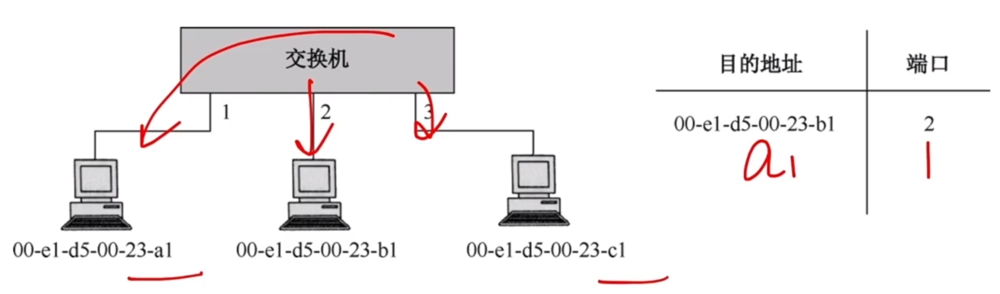

# 链路层设备

### 以太网交换机（多端口网桥）

### 以太网交换机的两种方式

1. 直通式交换机

   查完目的地址（6B）就立刻转发。

   延迟小，可靠性低，无法支持具有不同速率的端口的交换。

2. 存储转发式交换机

   将帧放入高速缓存，并检查是否正确，正确则转发，错误则丢弃。

   延迟大，可靠性高，可以支持具有不同速率的端口的交换。

### 冲突域&广播域

|                                    | 能否隔离冲突域 | 能否隔离广播域 |
| ---------------------------------- | -------------- | -------------- |
| 物理层设备 （中继器、集线器） | ×              | ×              |
| 链路层设备 （网桥、交换机）   | √              | ×              |
| 网络层设备 （路由器）         | √              | √              |

**2009** 以太网交换机进行转发决策时使用的PDU地址是

A 目的物理地址

B 目的IP地址

C 源物理地址

D 源IP地址

**2013** 对于100Mbps的以太网交换机，当输出端口无排队，以直通交换（cutthrough switching）方式转发一个以太网帧（不包括前导码）时，引发的转发延迟至少是

A 0us

B 0.48us

C 5.12us

D 121.44us

**2014** 某以太网拓扑及交换机当前转发表如下图所示，主机00-e1-d5-00-23-a1向主机00-e1-d5-00-23-c1发送1个数据帧，主机00-e1-d5-00-23-c1收到该帧后，向主机00-e1-d5-00-23-a1发送1个确认帧，交换机对这两个帧的转发端口分别是

A {3}和{1}

B {2, 3}和{1}

C {2, 3}和{1, 2}

D {1, 2, 3}和{1}

**2015** 下列关于交换机的叙述是，正确的是

A 以太网交换机本质上是一种多端口网桥

B 通过交换机互连的一组工作站构成一个冲突域

C 交换机每个端口所连网络构成一个独立的广播域

D 以太网交换机可实现采用不同网络层协议的网络互联

**2016** 若主机H2向H4发送1个数据帧，主机H4向主机H2立即发送一个确认帧，则除H4外，从物理层上能够收到该确认帧的主机还有

A 仅H2

B 仅H3

C 仅H1、H2

D 仅H2、H3