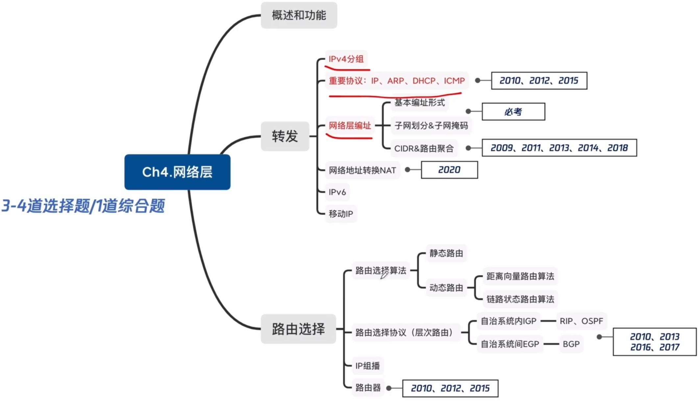
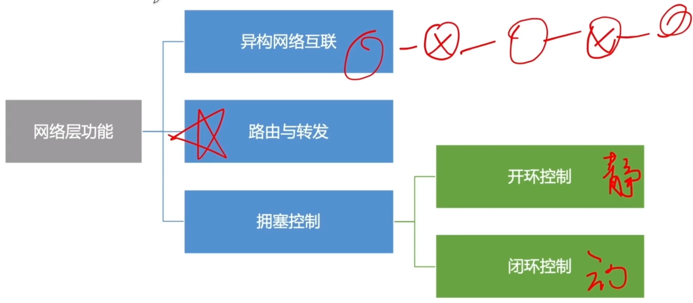
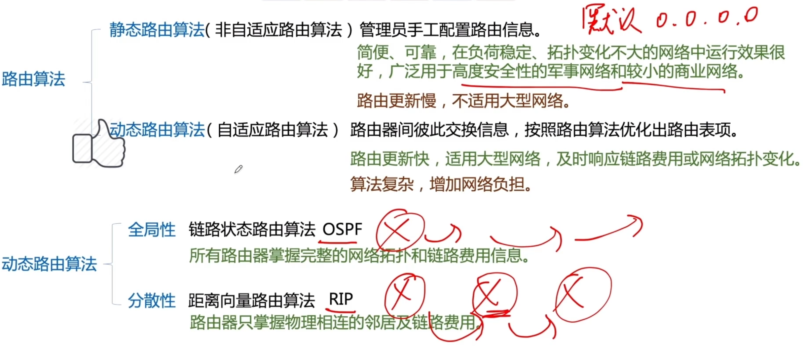
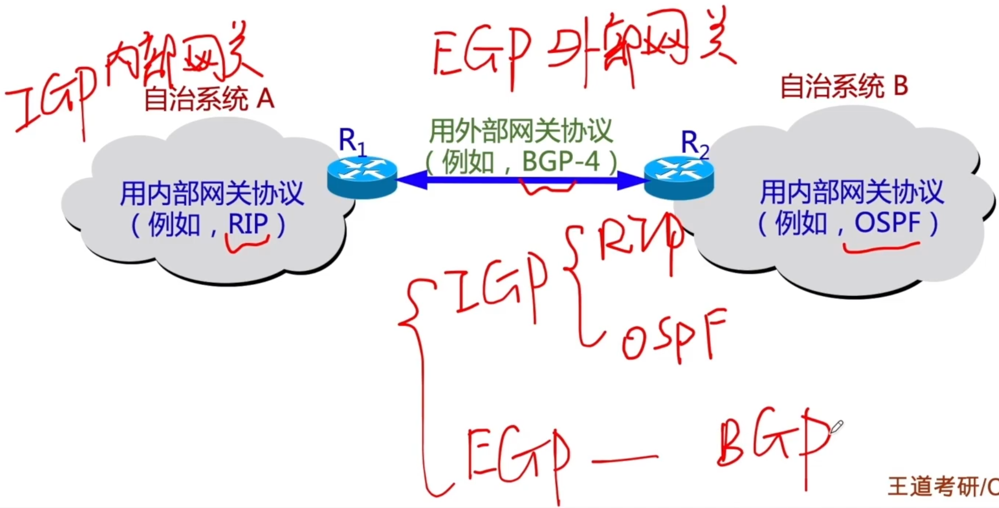

# 路由选择与算法

### 考点分布

### 网络层功能

### 路由算法的分类

### 分层次的路由选择协议

自治系统AS：在单一的技术管理下的一组路由器，而这些路由器使用一种AS内部的路由选择协议和共同的度量以确定分组在该AS内的路由，同时还使用一种AS之间的路由协议以确定在AS之间的路由。

一个AS内的所有网络都属于一个行政单位来管辖，一个自治系统的所有路由器在本自治系统内都必须连通。

