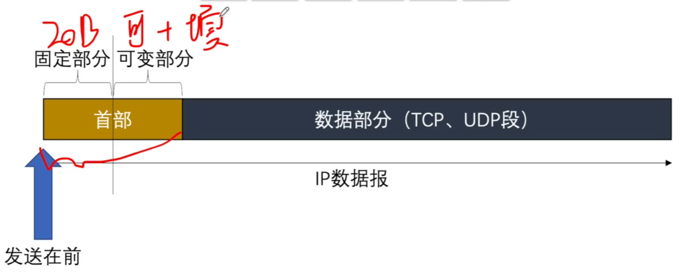
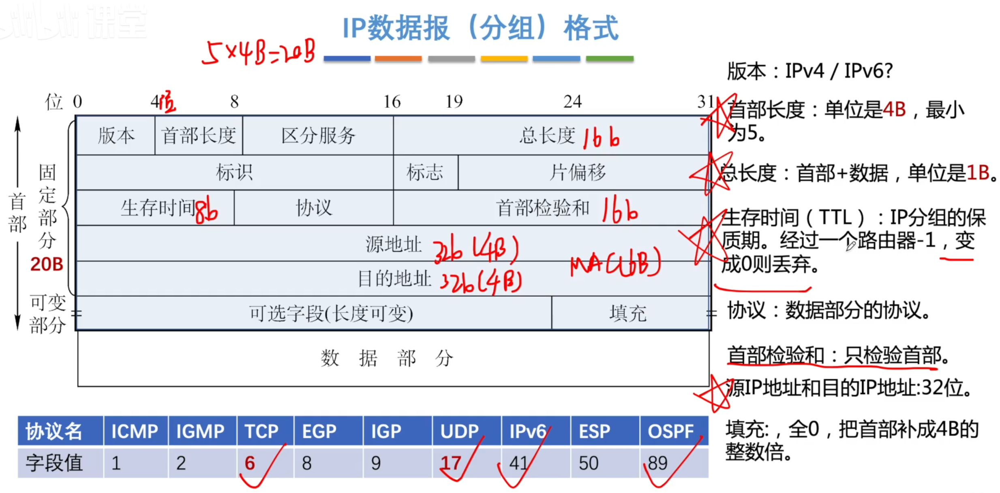
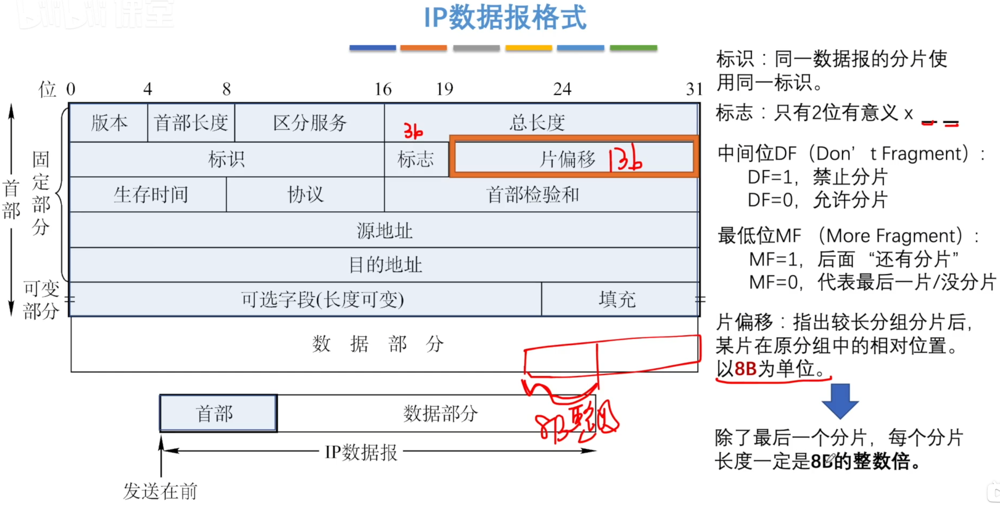
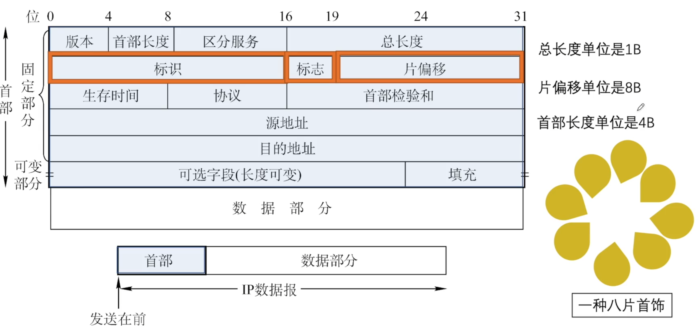
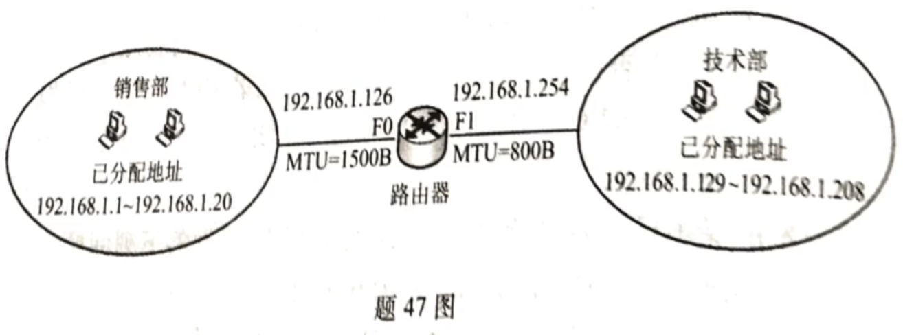

# IPv4分组

1. IP数据报
2. 分片

### IP数据报格式

某公司网络如图所示。IP地址空间192.168.1.0/24被均分给销售部和技术部两个子网，并已分别为部分主机和路由器接口分配了IP地址，销售部子网的MTU=1500B，技术部子网的MTU=800B。

1. 销售部子网的广播地址是什么？技术部子网的子网地址是什么？若每个主机仅分配一个IP地址，则技术部子网还可以连接多少台主机？
2. 假设主机192.168.1.1向主机192.168.1.208发送一个总长度为1500B的IP分组，IP分组的头部长度为20B，路由器在通过接口F1转发该IP分组时进行了分片。若分片时尽可能分为最大片，则一个最大IP分片封装数据的字节数是多少？至少需要分为几个分片，每个分片的片偏移量是多少？

### 最大传送单元MTU

链路层数据帧可封装数据的上限。

以太网的MTU是1500字节。

 