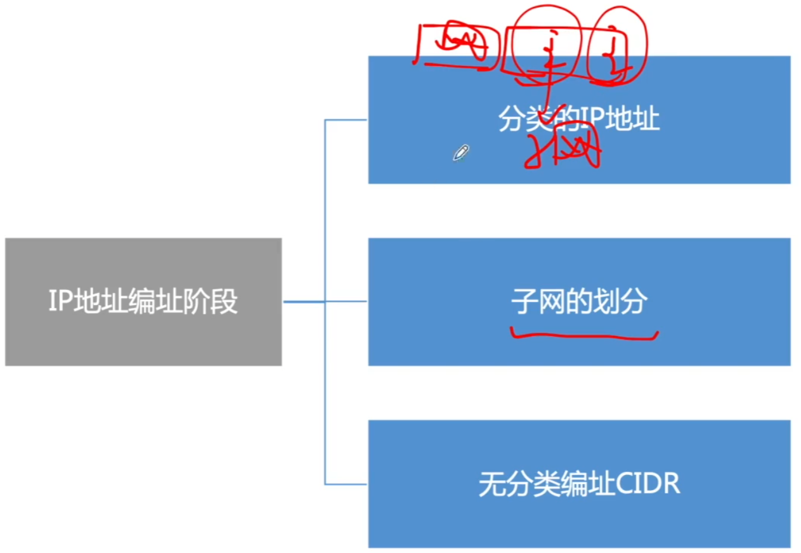
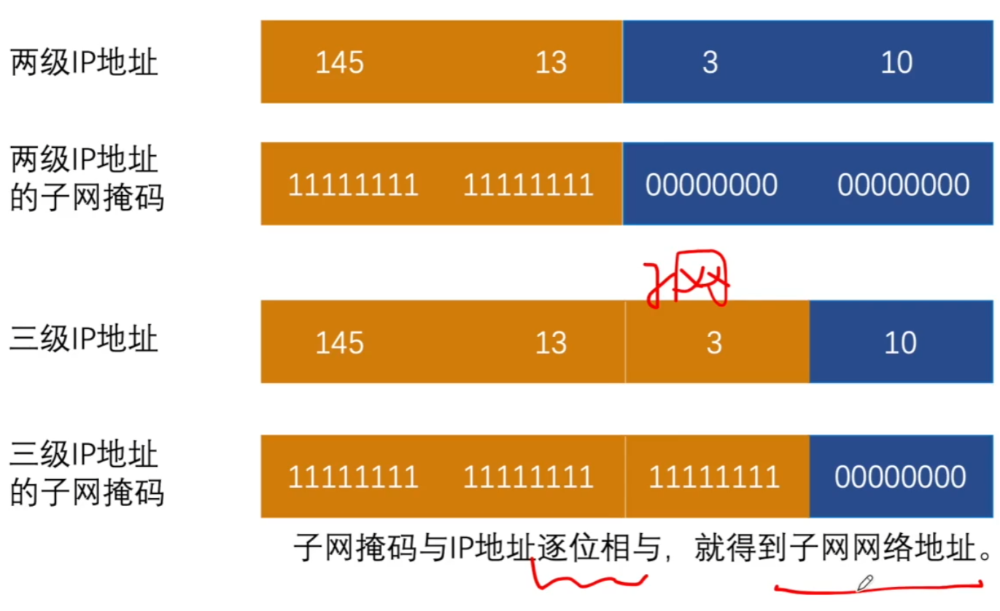
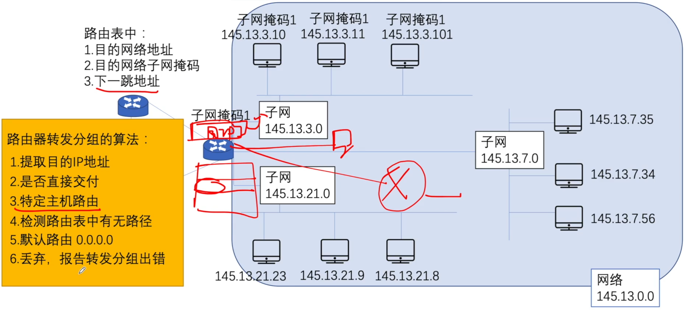

# 子网掩码&子网划分

### IP地址的演变

### 子网掩码&子网划分

### 使用子网时分组的转发

**2012** 某主机的IP地址为180.80.77.55，子网掩码为255.255.252.0。若该主机向其所在子网发送广播分组，则目的地址可以是

A 180.80.76.0

B 180.80.76.255

C 180.80.77.255

D 180.80.79.255

**2010** 某网络的IP地址空间192.168.5.0/24，采用定长子网划分，子网掩码为255.255.255.248，则该网络中的最大子网个数、每个子网内的最大可分配地址个数分别是

A 32, 8

B 32, 6

C 8, 32

D 8, 30

**2017** 若将网络21.3.0.0/16划分为128个规模相同的子网，则每个子网可分配的最大IP地址个数是

A 254

B 256

C 510

D 512

**2019** 若将101.200.16.0/20划分为5个子网，则可能的最小子网的可分配IP地址数是

A 126

B 254

C 510

D 1022

