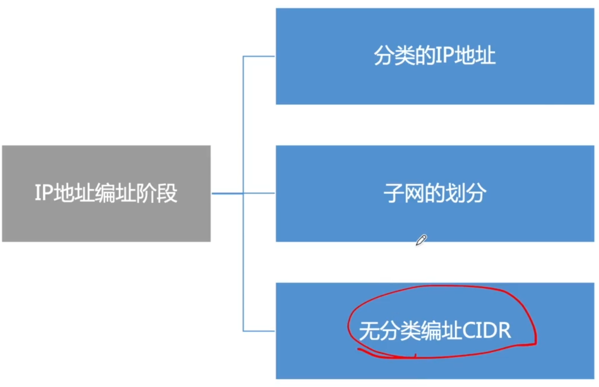
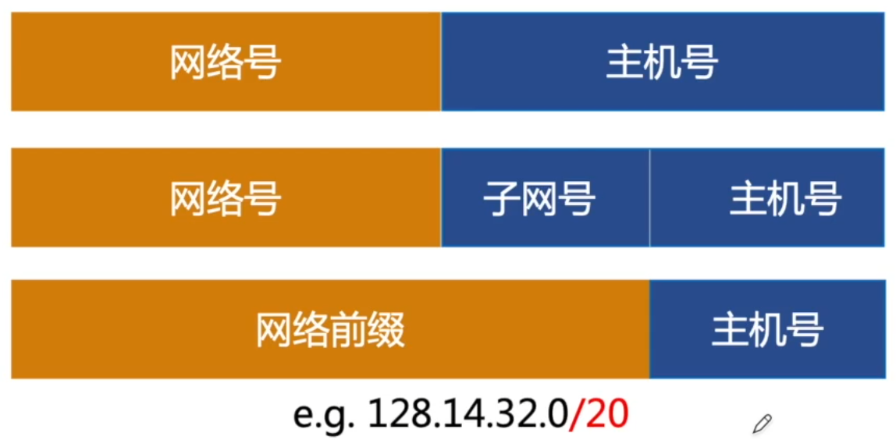
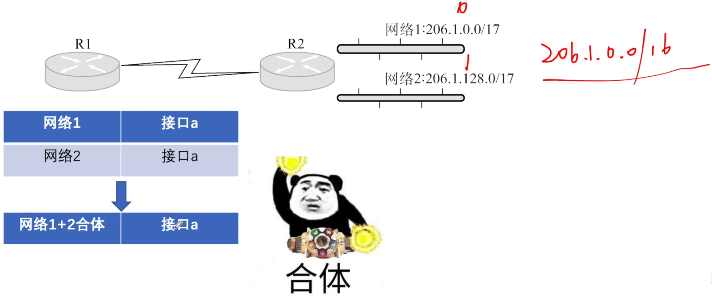
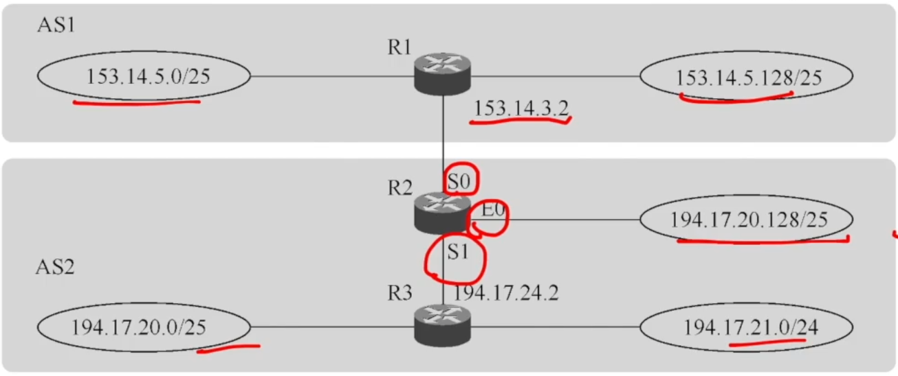
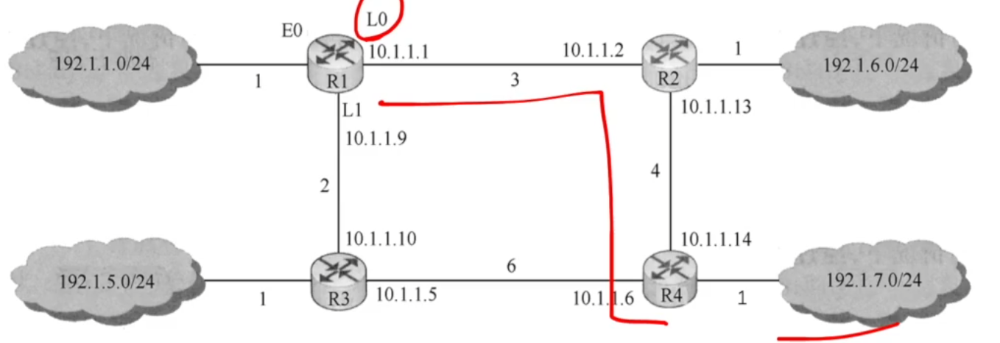

# CIDR&路由聚合

### IP地址的演变

### 无分类编制CIDR

CIDR把网络前缀都相同的连续的IP地址组成一个“CIDR地址块”

128.14.35.7/20是某CIDR地址块中的一个地址

二进制：10000000 00001110 00100011 00000111

地址掩码（子网掩码）：

11111111 11111111 11110000 00000000

### 构成超网

将多个子网聚合成一个较大的子网，叫做构成超网，或路由聚合。

方法：将网络前缀缩短（所有网络地址取交集）

### 最长前缀匹配

使用CIDR时，查找路由表可能得到几个匹配结果（跟网络掩码按位相与），应选择具有最长网络前缀的路由。前缀越长，地址块越小，路由越具体。

**2011** 某网络拓扑如下图所示，路由器R1只有到达子网192.168.1.0/24的路由。为使R1可以将IP分组正确地路由到图中所有的子网，则在R1中需要增加的一条路由（目的网络，子网掩码，下一跳）是

A 192.168.2.0 255.255.255.128 192.168.1.1

B 192.168.2.0 255.255.255.0      192.168.1.1 

C 192.168.2.0 255.255.255.128  192.168.1.2

D 192.168.2.0 255.255.255.0      192.168.1.2　

**2018** 某路由表中有转发接口相同的4路由表项，其目的网络地址分别为35.230.32.0/21、35.230.40.0/21、35.230.48.0/21和35.230.56.0/21，将该4条路由聚合后的目的网络地址为

A 35.230.0.0/19

B 35.230.0.0/20

C 35.230.32.0/19

D 35.230.32.0/20

**2012** 假设Internet的两个自治系统构成的网络如图所示，自治系统ASI由路由器R1连接两个子网构成；自治系统AS2由路由器R2、R3互联并连接3个子网构成。各子网地址、R2的接口名、R1与R3的部分接口IP地址如图所示。

1. 假设路由表结构如下图所示。请利用路由聚合技术，给出R2的路由表，要求包括到达图中所有子网的路由，且路由表中的路由项尽可能少。
2. 若R2收到一个目的IP地址为194.17.29.200的IP分组，R2会通过哪个接口转发该IP分组？
3. R1与R2之间利用哪个路由协议交换路由信息？该路由协议的报文被封装到哪个协议的分组中进行传输？

**2014** 

1. 假设路由表结构如下表所示，请给出图中R1的路由表，要求包括到达图中子网192.1.x.x的路由，且路由表中的路由项尽可能少
2. 当主机192.1.1.130向主机192.1.7.211发送一个TTL=64的IP分组时，R1通过哪个接口转发该IP分组？主机192.1.7.211收到的IP分组TTL是多少？
3. 若R1增加一条Metric为10的链路连接Internet，则表中R1的LSI需要增加哪些信息？

