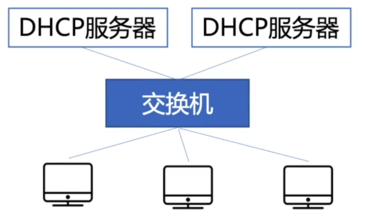
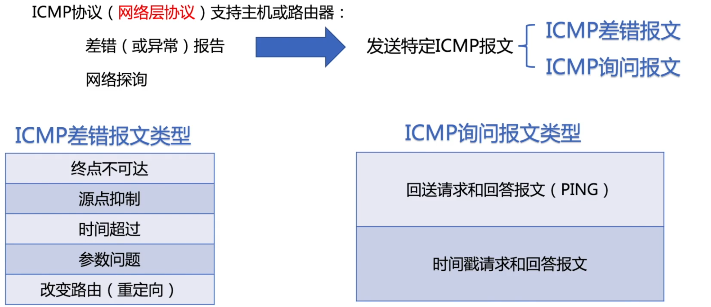
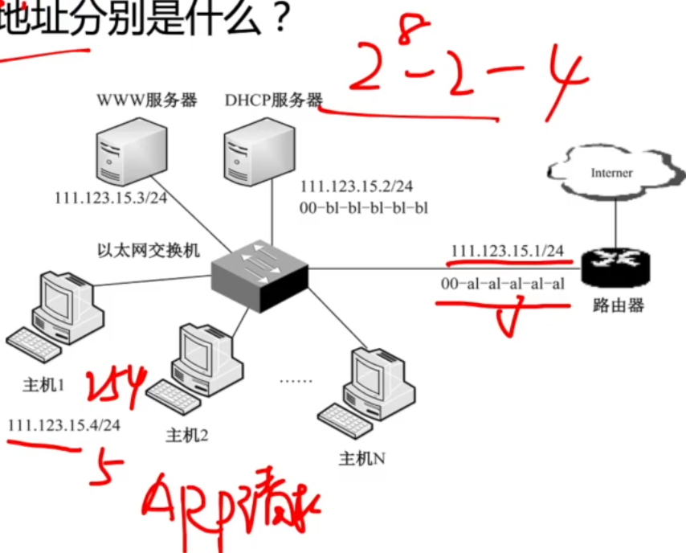

# ARP、DHCP、ICMP协议

### ARP协议

ARP协议：完成主机或路由器IP地址到MAC地址的映射，是工作在网络层的一个自动进行的协议。

解决下一跳走哪的问题

ARP协议使用过程：

检查ARP高速缓存，有对应表项则写入MAC帧，没有则用目的MAC地址为FF-FF-FF-FF-FF-FF的帧封装并广播ARP请求分组，同一局域网中所有主机都能收到该请求。目的主机收到请求后就会向源主机单播一个ARP响应分组，源主机收到后将此映射写入ARP缓存（10-20min更新一次）。

### DHCP协议

动态主机配置协议DHCP是应用层协议，使用客户/服务器方式，客户端和服务端通过广播方式进行交互，基于UDP。

1. 主机广播DHCP发现报文

   “有没有DHCP服务器呀？”

   试图找到网络中的服务器，服务器获得一个IP地址。

2. DHCP服务器广播DHCP提供报文

   “有！” ”有！“ ”有！“

   服务器拟分配给主机一个IP地址及相关配置，先到先得。

3. 主机广播DHCP请求报文

   ”我用你给我的IP地址啦？“

   主机向服务器请求提供IP地址。

4. DHCP服务器广播DHCP确认报文

   ”用吧！“

   正式将IP地址分配给主机。

### ICMP协议

ICMP协议（网络层协议）支持主机或路由器：

**2015** 某网络拓扑如图所示，其中路由器内网接口、DHCP服务器、WWW服务器与主机1均采用静态IP地址配置，相关地址信息如图；主机2~主机N通过DHCP服务器动态获取IP地址等配置信息。请回答下列问题：

1. DHCP服务器可为主机2~主机N动态分配IP地址的最大范围是什么？主机2使用DHCP协议获取IP地址的过程中，发送的封装DHCP Discover报文的IP分组的源IP地址和目的IP地址分别是什么？
2. 若主机2的ARP表为空，则该主句访问Internet时，发出的第一个以太网帧的目的MAC地址是什么？封装主机2发往Internet的IP分组的以太网帧的目的MAC地址是什么？
3. 若主机1的子网掩码和默认网关分别配置为255.255.255.0和111.123.15.2，则该主机是否能访问WWW服务器？是否能访问Internet？请说明理由。

