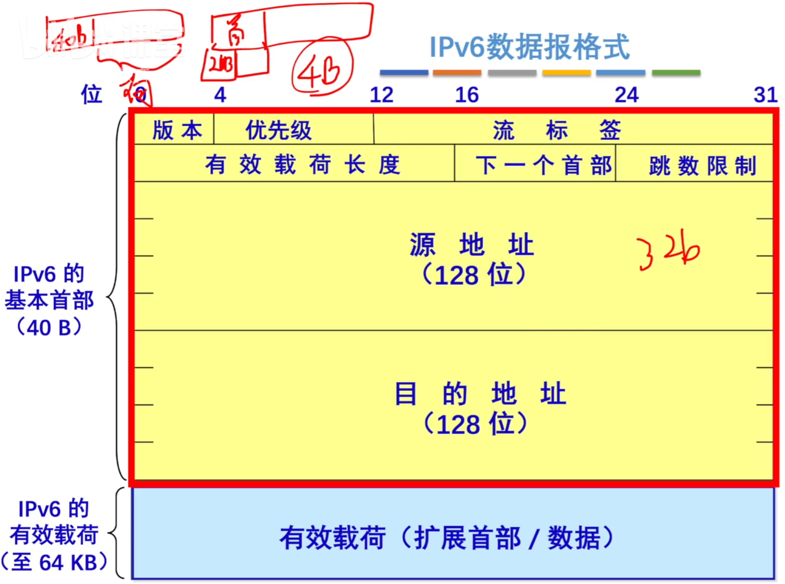
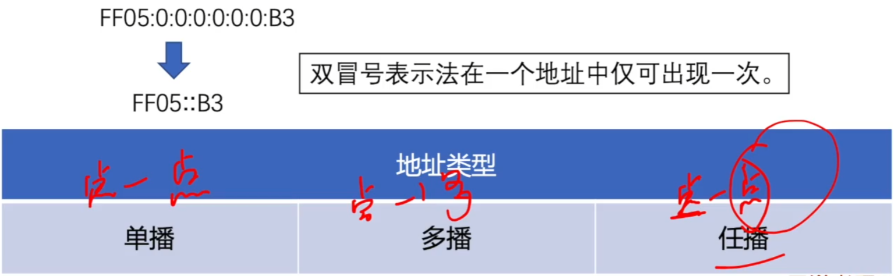

# IPv6

### IPv6数据报格式

IPv6首部长度必须是8B的整数倍，IPv4首部是4B的整数倍。

IPv6只能在主机处分片，IPv4可以在路由器和主机处分片。

### IPv6地址表示形式

1. 一般形式

   冒号十六进制记法：4BF5:AA12:0216:FEBC:BA5F:039A:BE9A:2170

2. 压缩形式

   4BF5:0000:0000:0000:BA 5F:039A:000A:2176

   4BF5:0:0:0:BA5F:39A:A:2176

   零压缩：一连串连续的0可以被一对冒号取代。

   