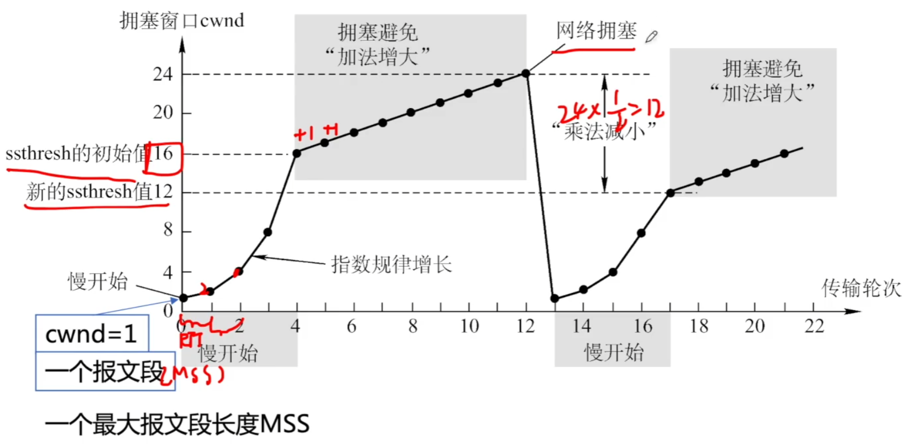

# 拥塞控制

### TCP拥塞控制

出现拥塞的条件：对资源需求的总和>可用资源

拥塞控制：防止过多的数据注入到网络中。全局性

- 接收窗口：由接收端维护，接收端当前的接收缓存大小。
- 拥塞窗口：由发送端维护，发送端根据当前网络的拥塞程度而确定的窗口值。
- 发送窗口：由发送端维护，发送端在接收到下一个确认前能够发送的最大字节数。
- 发送窗口=min(接收窗口，拥塞窗口)

慢开始 拥塞避免

快重传 快恢复

### 慢开始和拥塞避免

### 快重传和快恢复

**2019** 某客户通过一个TCP连接向服务器发送数据的部分过程如图所示。客户在t0时刻第一次收到确认序列号ack_seq=100的段，并发送序列号seq=100的段，但发生丢失。若TCP支持快速重传，则客户重新发送seq=100的时刻是

A t1

B t2

C t3

D t4

**2017** 若甲向乙发送一个TCP连接，最大段长MSS=1KB，RTT=5ms，乙开辟的接收缓存为64KB，则甲从连接建立成功至发送窗口达到32KB，需经过的时间至少是

A 25ms

B 30ms

C 160ms

D 165ms

**2014** 主机甲和主机乙已建立了TCP连接，甲始终以MSS=1KB大小的段发送数据，并一直由数据发送；乙每收到一个数据段都会发出一个接收窗口为10KB的确认段。若甲在t时刻发生超时时拥塞窗口为8KB，则从t时刻起，不再发生超时的情况下，经过10个RTT后，甲的发送窗口是

A 10KB

B 12KB

C 14KB

D 15KB