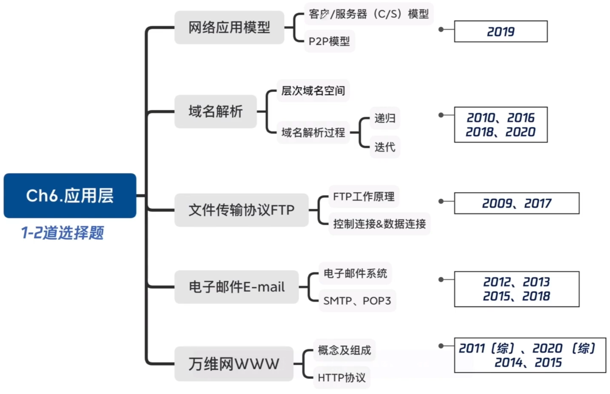
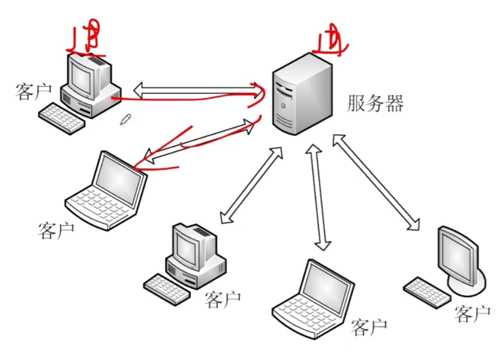
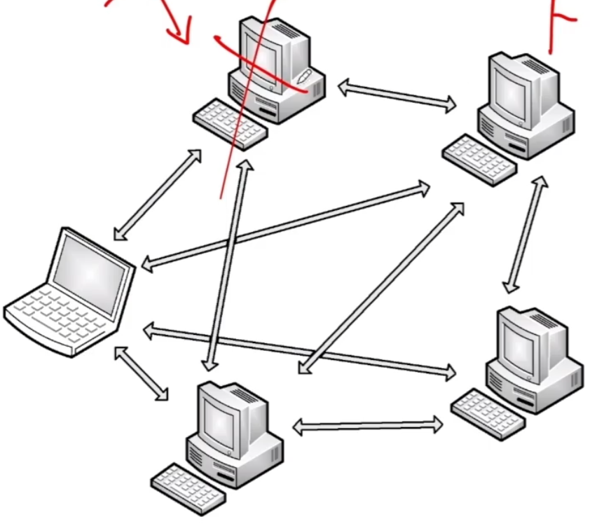

# 网络应用模型

### 考点分布

### 客户/服务器（C/S）模型

服务器：提供计算服务的设备

1. 永久提供服务
2. 永久性访问地址/域名

客户机：请求计算服务的主机。

1. 与服务器通信，使用服务器提供的服务
2. 间歇性接入网络
3. 不与其他客户机直接通信

应用：Web(HTTP协议)，文件传输FTP，远程登陆，电子邮件

### P2P模型 Peer to Peer

1. 主机既可以提供服务，也可以请求服务
2. 任意端系统/结点之间可以直接通讯
3. 可扩展性好，网络健壮性强

应用：QQ、迅雷、BItTorrent服务的协议、多媒体传输类Skype服务

**2019** 下列关于网络应用模型的叙述中，错误的是

A 在P2P模型中，结点之间具有对等关系

B 在客户/服务器（C/S）模型中，客户与客户之间可以直接通信

C 在C/S模型中，主动发起通信的是客户，被动通信的是服务器

D 在向多用户分发一个文件时，P2P模型通常比C/S模型所需时间短