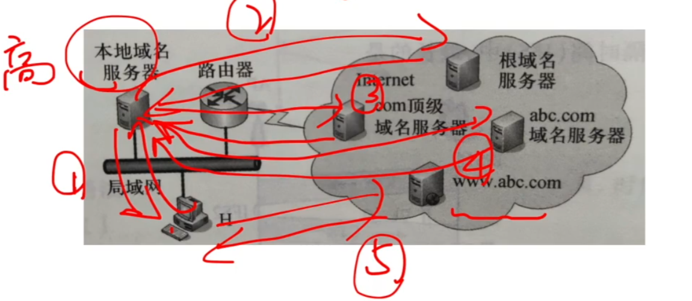

# 域名解析

### DNS系统

DNS服务的作用：将域名解析成IP地址。

DNS协议运行在UDP之上，使用C/S方式，使用的端口号是53。

### DNS (Domain Name System)

### 域名服务器 (Domain Name Server)

### 域名解析过程

**2020** 假设下图所示网络中的本地域名服务器只提供递归查询服务，其他域名服务器均只是提供迭代查询服务；局域网内主机访问Internet上各服务器的往返时间（RTT）均为10ms，忽略其他各种时延。若主机H通过超链接http://www.abc.com/index.html请求浏览纯文本Web页index.html，则从点击超链接开始到浏览器接收到index.html页面为止，所需的最短时间与最长时间分别是

A 10ms, 40ms

B 10ms, 50ms

C 20ms, 40ms

D 20ms, 50ms

**2018** 下列TCP/IP应用层协议中，可以使用传输层无连接服务的是

A FTP

B DNS

C SMTP

D HTTP