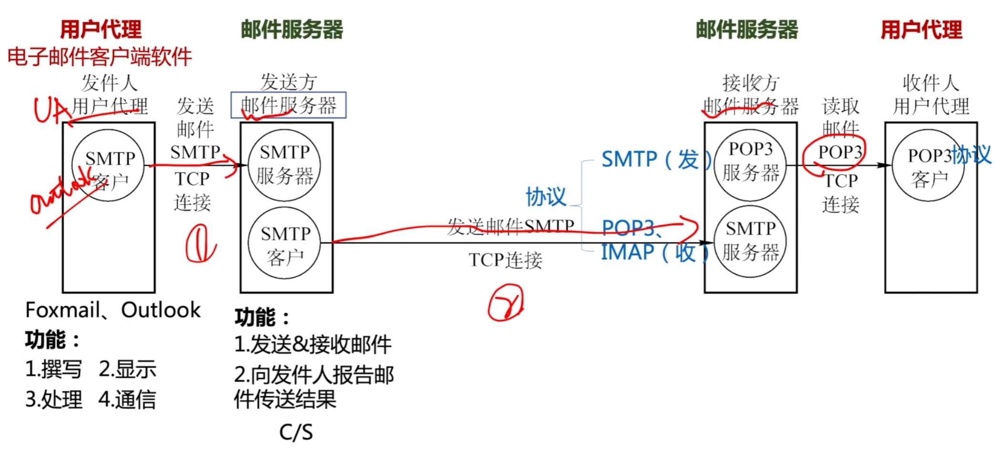
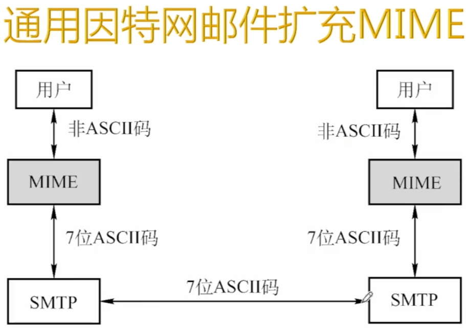
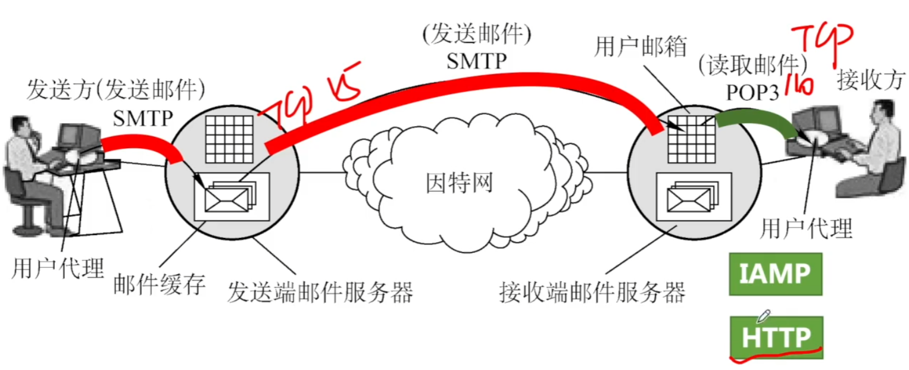

# 电子邮件系统及相关协议

### 电子邮件系统概述 组成结构

### MIME

SMTP的缺点：

1. SMTP不能传送可执行文件或者其他二进制对象。
2. SMTP仅限于传送7位ASCII码，不能传送其他非英语国家的文字
3. SMTP服务器会拒绝超过一定长度的邮件

使电子邮件系统可以支持声音、图像、视频、多种国家语言等等。

### 电子邮件系统

**2018** 无需转换即可由SMTP协议直接传输的内容是

A JPEG图像

B MPEG视频

C EXE文件

D ASCII文本

**2015** 通过POP3协议接收邮件时，使用的传输层服务类型是

A 无连接不可靠的数据传输服务

B 无连接可靠的数据传输服务

C 有连接不可靠的数据传输服务

D 有连接可靠的数据传输服务

**2013** 下列关于SMTP协议的叙述中，正确的是

1. 只支持传输7比特ASCII码内容
2. 支持在邮件服务器之间发送邮件
3. 支持从用户代理向邮件服务器发送邮件
4. 支持从邮件服务器向用户代理发送邮件

A 123

B 124

C 134

D 234