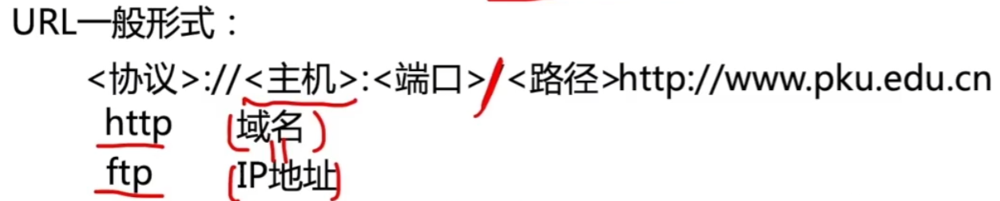
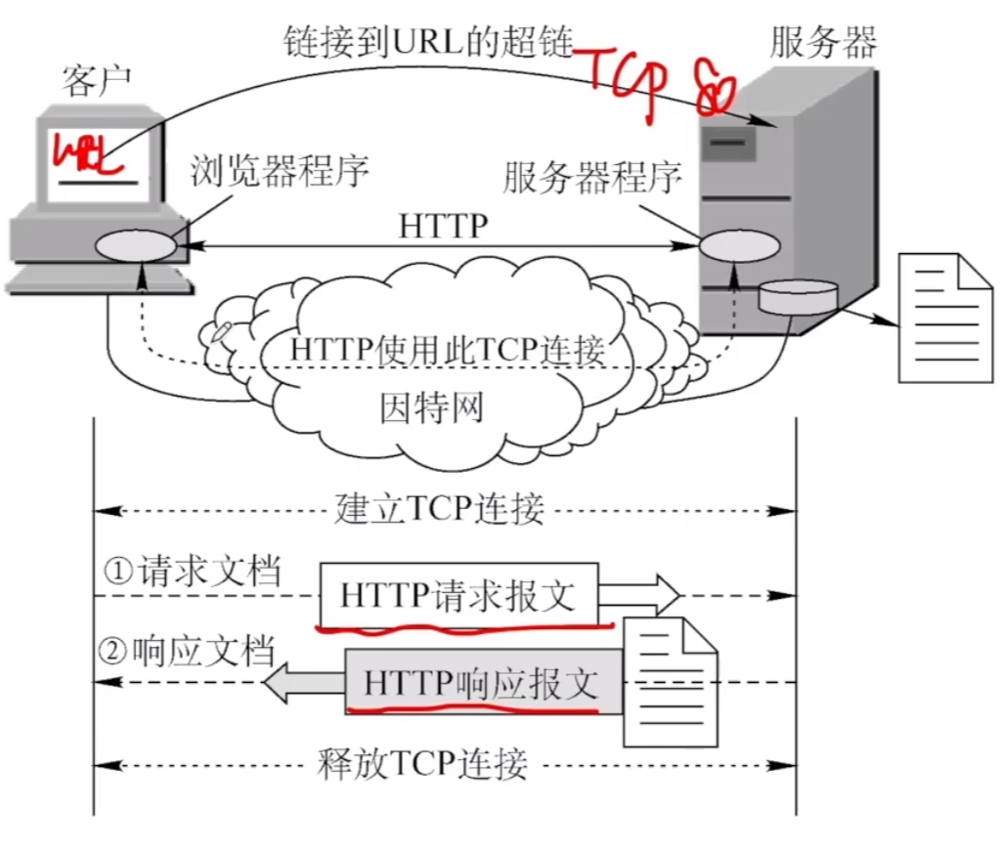
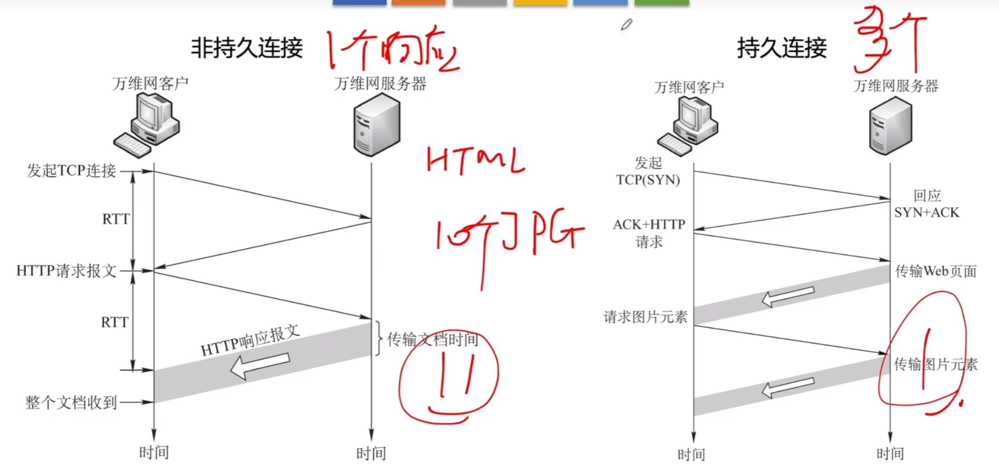

# WWW与HTTP协议

### 万维网概述

万维网WWW(World Wide Web)是一个大规模的、联机式的信息储藏所/资料空间，是无数个网络站点和网页统一资源定位符URL 唯一标识 资源（文字、视频、音频...）

用户通过点击超链接（http://www.baidu.com）获取资源，这些资源通过超文本传输协议（HTTP）传送给使用者。

万维网以客户/服务器方式工作，用户使用的浏览器就是万维网客户程序，万维网文档所驻留的主机运行服务器程序。

万维网使用超文本标记语言HTML，使得万维网页面设计者可以很方便地从一个界面的链接转到另一个界面，并能够在自己的屏幕上显示出来。

### 超文本传输协议HTTP

### HTTP协议的连接方式

**2014** 使用浏览器访问某大学Web网站主页时，不可能使用到的协议是

A PPP

B ARP

C UDP

D SMTP

**2015** 某浏览器发出的HTTP请求报文如下：下列叙述中，错误的是

A 该浏览器请求浏览index.html

B index.html存放在www.test.edu.cn上

C 该浏览器请求使用持续连接 

D 该浏览器曾经浏览过www.test.edu.cn

### 考点分布

