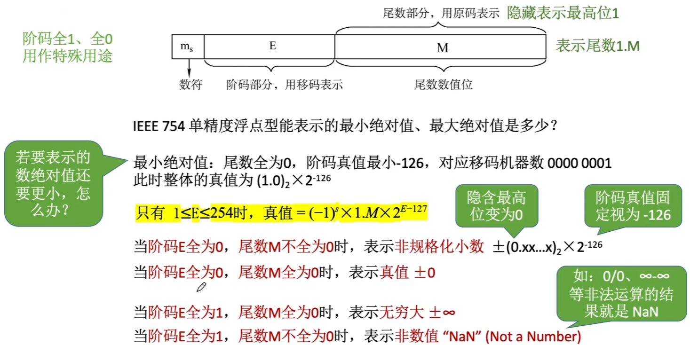

# 补码的除法运算

## 原码除法：加减交替法


## 补码除法：加减交替法


| 除法类型       | 符号位参与运算 | 加减次数 | 移位方向 | 移位次数 | 上商、加减原则     | 说明                       |
| -------------- | -------------- | -------- | -------- | -------- | ------------------ | -------------------------- |
| 原码加减交替法 | 否             | N+1或N+2 | 左       | N        | 余数的正负         | 若最终余数为负，需恢复余数 |
| 补码加减交替法 | 是             | N+1      | 左       | N        | 余数和除数是否同号 | 商末位恒置1                |

# C语言类型转换

C语言中定点整数是用“补码”存储的

x: 1110 1111 0001 1111

y: 1110 1111 1001 1111 真值 61215

无符号数与有符号数：不改变数据内容，改变解释方式。

长整数变短整数：高位截断，保留低位。

a: 0x000286a1

c: 0x86a1 真值 -31071

b: 0xffff7751

d: 0x7751 真值 30545

``` 
void main()
{
    short x = -4321; //short型占用2个字节
    unsigned short y = (unsigned short)x;

    int a = 165537, b = -34991; //int型占用4个字节
    short c = (short)a, d = (short)b; //short型占用2个字节
    
    short x = -4321;
    int m = x;
    unsigned short n = (unsigned short)x;
    unsigned int p = n;
}
```

短整数变长整数：符号扩展。

x: 1110 1111 0001 1111

0xef1f

m: 1111 1111 1111 1111 1110 1111 0001 1111

0xffffef1f 真值 -4321

n: 1110 1111 0001 0xef1f 真值 61215

p: 0000 0000 0000 0000 1110 1111 0001 1111

0x0000ef1f 真值 61215

# 数据的存储和排列

## 大小端模式


## 边界对齐

现代计算机通常是按字节编址，即每个字节对应1个地址

通常也支持按字、按半字、按字节寻址。

假设存储字长为32位，则1个字=32bit，半字=16bit。每次访存只能读/写1个字


# 浮点数的表示


## 定点数的局限性

定点数可表示的数字范围有限，但我们不能无限制地增加数据的长度。如何在位数不变的情况下增加数据表示范围。

## 从科学计数法理解浮点数


## 浮点数的表示

### 定点数

如纯小数0.1011 和纯整数11110

### 浮点数

阶码：常用补码或移码表示的定点整数

尾数：常用原码或补码表示的定点小数


#### 浮点数的真值

$$
N=r^E *M
$$

阶码E反映浮点数的表示范围及小数点的实际位置；尾数M的数值部分的位数n反映浮点数的精度。

## 浮点数尾数的规格化

规格化浮点数：规定尾数的最高数值位必须是一个有效值。

左规：当浮点数运算的结果为非规格化时要进行规格化处理，将尾数算术左移一位，阶码减1。

右规：当浮点数运算的结果尾数出现溢出（双符号位为01或10时），将尾数算术右移一位，阶码加1。

注：采用“双符号位”，当溢出发生时，可以挽救。更高的符号位是正确的符号位

## 规格化浮点数的特点


阶码、尾数用什么码？各取多少位比较合适？

# IEEE 754

## 移码

移码：补码的基础上将符号位取反。注意：移码只能用于表示整数。


移码的定义：
$$
移码=真值+偏置值
$$
偏置值一般取
$$
2^{n-1}
$$
偏置值可以取其他值


## IEEE 754 标准


 规格化的短浮点数的真值为
$$
(-1)^s*1.M*2^{E-127}
$$
规格化的长浮点数的真值为
$$
(-1)^s*1.M*2^{E-1023}
$$





