# SRAM和DRAM

Dynamic Random Access Memory， 即动态 RAM

Static Random Access Memory，即静态 RAM

DRAM用于主存、SRAM用于Cache

高频考点：DRAM和SRAM的对比

核心区别：存储元不一样

栅极电容 v.s. 双稳态触发器

## DRAM芯片 栅极电容

使用栅极电容存储信息

电容放电信息被破坏，是破坏性读出。读出后应有重写操作：也称“再生”

读写速度更慢

每个存储元制造成本更低，集成度高，功耗低

电容内的电荷只能维持2ms。即便不断电，2ms后信息也会消失。

2ms之内必须“刷新”一次（给电容充电）

1：电容内存储了电荷

0：电容内未存储电荷

读出1：MOS管接通，电容放电，数据线上产生电流

读出0：MOS管接通后，数据线上无电流

## SRAM芯片 双稳态触发器

使用双稳态触发器存储信息

读出数据，触发器状态保持稳定，是非破坏性读出，无需重写

读写速度更快

每个存储元制造成本高，集成度低，功耗大

只要不断电，触发器的状态就不会改变

双稳态

1：A高B低

0：A低B高

## DRAM v.s. SRAM

- SRAM常用作Cache
- DRAM常用作主存
- 现在的主存通常采用SDRAM芯片

| 类型特点                 | SRAM（静态RAM）        | DRAM（动态RAM）                                              |
| ------------------------ | ---------------------- | ------------------------------------------------------------ |
| 存储信息                 | 触发器                 | 电容                                                         |
| 破坏性读出               | 非                     | 是                                                           |
| 读出后需要重写？（再生） | 不用                   | 需要                                                         |
| 运行速度                 | 快                     | 慢                                                           |
| 集成度                   | 低                     | 高                                                           |
| 发热量                   | 大                     | 小                                                           |
| 存储成本                 | 高                     | 低                                                           |
| 易失/非易失性存储器？    | 易失（断电后信息消失） | 易失（断电后信息消失）                                       |
| 需要“刷新”？             | 不需要                 | 需要（分散、集中、异步） “刷新”由存储器独立完成，不需要CPU控制 |
| 送行列地址               | 同时送                 | 分两次送（地址线复用技术） 导致地址线、地址引脚减半     |

## DRAM的刷新

1. 多久刷新一次？

   刷新周期：一般为2ms

2. 每次刷新多少存储单元？

   以行为单位，每次刷新一行存储单元

   为什么要用行列地址？减少选通线的数量

   存储单元排列成
   $$
   2^{n/2}*2^{n/2}
   $$
   的矩阵

   

   

3. 如何刷新？

   有硬件支持，读出一行的信息后重新写入，占用1个读/写周期

4. 在什么时刻刷新？

   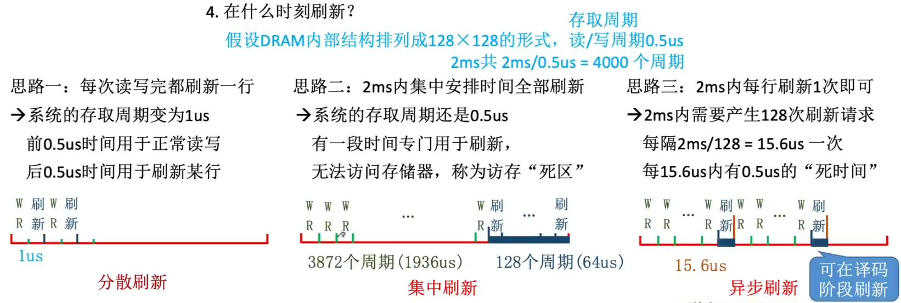

## DRAM的地址线复用技术

行、列地址分两次送，可使地址线更少，芯片引脚更少

# 只读存储器

RAM芯片 易失性，断电后数据消失

ROM芯片 非易失性，断电后数据不会丢失

**MROM** Mask Read-Only Memory 掩膜式只读存储器

厂家按照客户需求，在芯片生产过程中直接写入信息，之后任何人不可重写（只能读出）

可靠性高、灵活性差、生产周期长、只适合批量定制

**PROM** Programmable Read-Only Memory 可编程只读存储器

用户可用专门的PROM写入器写入信息，写一次之后就不可更改

**EPROM** Erasable Programmable Read-Only Memory 可擦除可编程只读存储器

允许用户写入信息，之后用某种方法擦除数据，可进行多次重写

**UVEPROM** ultraviolet rays 用紫外线照射8~20分钟，擦除所有信息

EEPROM 也常记为E2PROM 第一个E是Electrically 可用电擦除的方式，擦除特定的字

**Flash Memory** 闪速存储器（注：U盘、SD卡就是闪存）

每个存储元只需单个MOS管，位密度比RAM高

在EEPROM基础上发展而来，断电后也能保存信息，且可进行多次快速擦除重写

注意：由于闪存需要先擦除再写入，因此闪存的“写“速度要比”读“速度更慢。

**SSD** Solid State Drives 固态硬盘

由控制单元+存储单元（Flash芯片）构成，与闪存存储器的核心区别在于控制单元不一样，但存储介质都类似，可进行多次快速擦除重写。SSD速度快、功耗低、价格高。目前个人电脑上常用SSD取代传统的机械硬盘

## 计算机内的重要ROM

CPU的任务：到主存中取指令并执行指令

主板上的BIOS芯片（ROM），存储了”自举装入程序”，负责引导装入操作系统（开机）

注：我们常说“内存条”就是“主存”，但事实上，主板上的ROM芯片也是“主存”的一部分。

逻辑上，主存由RAM+ROM组成，且二者常统一编址

# 双口RAM&多模块存储器

## 存取周期

可以连续读/写的最短时间间隔

注：DRAM芯片的恢复时间比较长，有可能是存取时间的几倍（SRAM的恢复时间较短）

如：存取时间为r，存取周期为T，T=4r

多核CPU都要访存，怎么办？

CPU的读写速度比主存快很多，主存恢复时间太长怎么办？

## 双端口RAM

对比操作系统“读者-写者问题”

作用：优化多核CPU访问一根内存条的速度

需要有两组完全独立的数据线、地址线、控制线。CPU、RAM中也要有更复杂的控制电路。

两个端口对同一主存操作有以下4中情况：

1. 两个端口同时对不同的地址单元存取数据。
2. 两个端口同时对同一地址单元读出数据。
3. 两个端口同时对同一地址单元写入数据。
4. 两个端口同时对同一地址单元，一个写入数据，另一个读出数据。

解决方法：置“忙”信号为0，由判断逻辑决定暂时关闭一个端口（即被延时），未被关闭的端口正常访问，被关闭的端口延长一个很短的时间段后再访问。

## 多体并行存储器

### 高位交叉编址的多体存储器

### 低位交叉编址的多体存储器

每个存储体存取周期为T

存取时间为r，假设T=4r

### 应该取几个“体”？

采用“流水线”的方式并行存取（宏观上并行，微观上串行）

宏观上，一个存储周期内，m体交叉存储器可以提供的数据量为单个模块的m倍

存取周期为T，存取时间为r，为了使流水线不间断，应保证模块数
$$
m\geq T/r
$$

存取周期为T，总线传输周期为r，为了使流水线不间断，应保证模块数
$$
m\geq T/r
$$
思考：给定一个地址x，如何确定它属于第几个存储体

## 多模块存储器

### 多体并行存储器

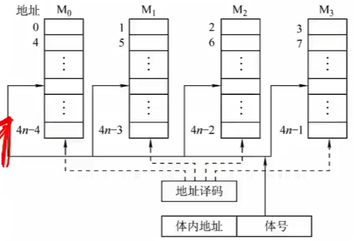

每个模块都有相同的容量和存取速度。各模块都有独立的读写控制电路、地址寄存器和数据寄存器。它们既能并行工作，又能交叉工作。

### 单体多字存储器

每个存储单元存储m个字

总线宽度也为m个字

一次并行读出m个字

每次只能同时取m个字，不能单独取其中某个字

指令和数据在主存内必须是连续存放的

# 主存储器与CPU的连接

## 单块存储芯片与CPU的连接

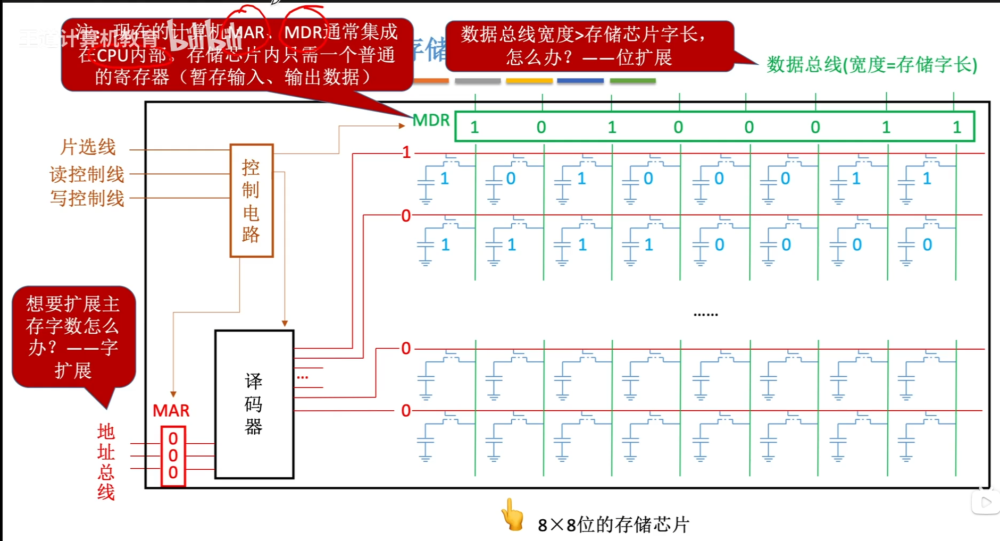

## 存储器芯片的输入输出信号

## 增加主存的存储字长

### 位扩展

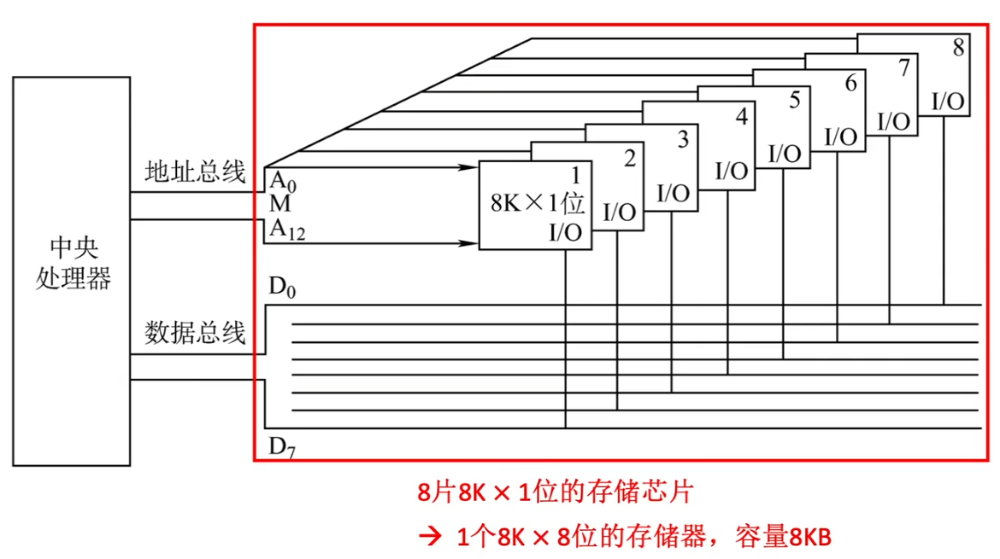

### 字扩展

线选法

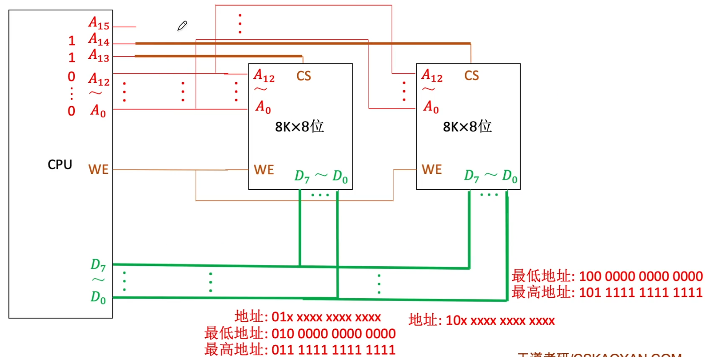

译码片选法

| 线选法             | 译码片选法           |
| ------------------ | -------------------- |
| n条线->n个选片信号 | n条线->2^n个选片信号 |
| 电路简单           | 电路复杂             |
| 地址空间不连续     | 地址空间可连续       |

### 字位同时扩展

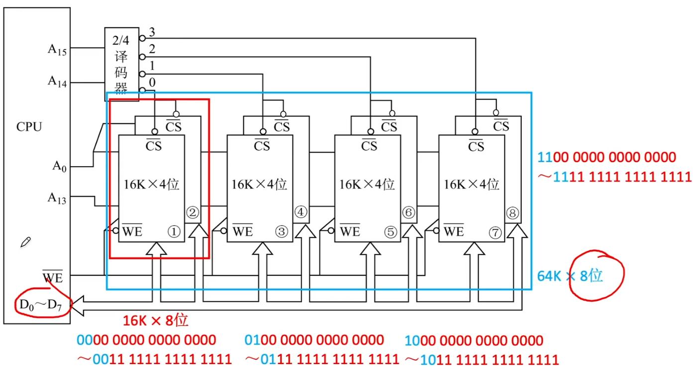

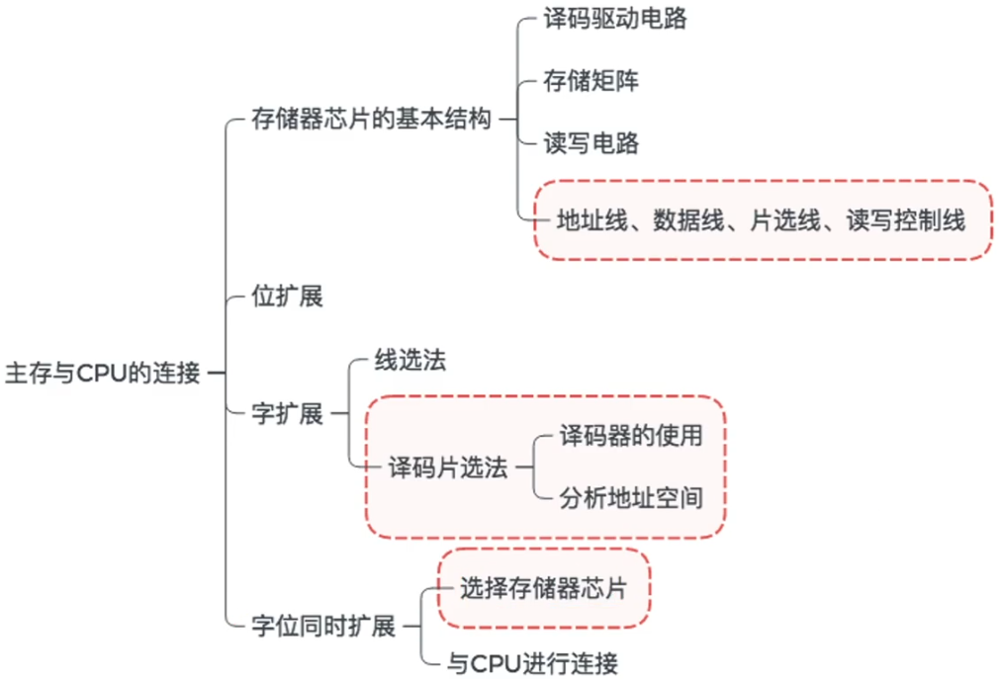

## 译码器

注：CPU可使用译码器的使能端控制片选信号的生效时间

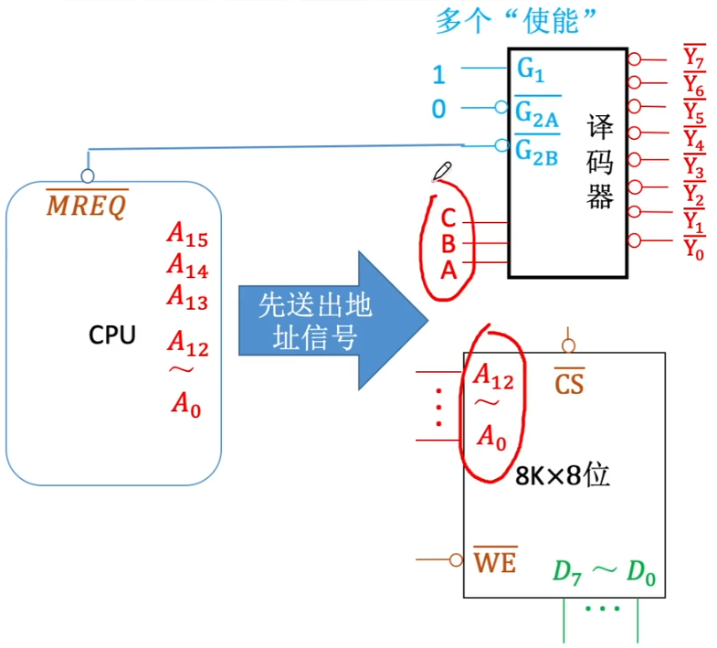

# 磁盘存储器

## 外存储器

计算机外存储器又称为辅助存储器，目前主要使用磁表面存储器。

所谓“磁表面存储”，是指把某些磁性材料薄薄地涂在金属铝或塑料表面上作为载磁体来存储信息。磁盘存储器、磁带存储器和磁鼓存储器均属于磁表面存储器。

磁表面存储器的优点：

1. 存储容量大，位价格低；
2. 记录介质可以重复使用；
3. 记录信息可以长期保存而不丢失，甚至可以脱机存档；
4. 非破坏性读出，读出时不需要再生。

磁表面存储器的缺点：

1. 存取速度慢；
2. 机械结构复杂；
3. 对工作环境要求较高。

外存储器既可以作为输入设备，也可以作为输出设备。（既可以存数据，也可以读数据）

## 磁盘存储器

### 磁盘设备的组成

1. 存储区域

   一块硬盘含有若干个记录面，每个记录面划分为若干条磁道，而每条磁道又划分为若干个扇区，扇区（也称块）是磁盘读写的最小单位，也就是说磁盘按块存取。

   磁头数（Heads）即记录面数，表示硬盘总共有多少个磁头，磁头用于读取/写入盘片上记录面的信息，一个记录面对应一个磁头。

   柱面数（Cylinders）表示硬盘每一面盘片上有多少条磁道。在一个盘组中，不同记录面的相同编号（位置）的诸磁道构成一个圆柱面。

   扇区数（Sectors）表示每一条磁道上有多少个扇区。

2. 硬盘存储器

   硬盘存储器由磁盘驱动器、磁盘控制器和盘片组成。

磁盘驱动器：核心部件是磁头组件和盘片组件，温彻斯特盘是一种可移动头固定盘片的硬盘存储器。

磁盘控制器：是硬盘存储器和主机的接口，主流的标准有IDE、SCSI、SATA等。

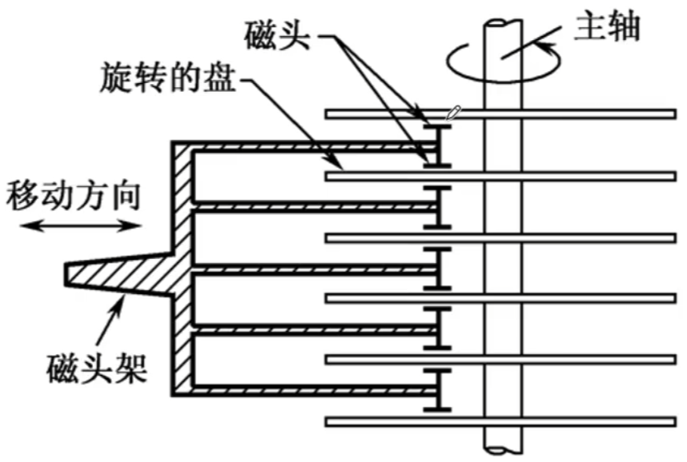

## 磁盘的性能指标

1. 磁盘的容量

   一个磁盘所能存储的字节总数称为磁盘容量。磁盘容量有非格式化容量和格式化容量之分。

   非格式化容量是指磁记录表面可以利用的磁化单元总数。

   格式化容量是指按照某种特定的记录格式所能存储信息的总量。

2. 记录密度

   

   记录密度是指盘片单位面积上记录的二进制的信息量，通常以道密度、位密度和面密度表示。

   道密度是沿磁盘半径方向单位长度上的磁道数；

   位密度是磁道单位长度上能记录的二进制代码位数；

   面密度是位密度和道密度的乘积。

   注意：磁盘所有磁道记录的信息量一定是相等的，并不是圆越大信息越多，故每个磁道的位密度都不同。

3. 平均存取时间
   $$
   平均存取时间=寻道时间(磁头移动到目的磁道)+旋转延迟时间(磁头定位到所在扇区)+传输时间(传输数据所花费的时间)
   $$
   

4. 数据传输率

   磁盘存储器在单位时间内向主机传送数据的字节数，称为数据传输率。

   假设磁盘转数为r(转/秒)，每条磁道容量为N个字节，则数据传输率为Dr=rN

## 磁盘地址

主机向磁盘控制器发送寻址信息，磁盘的地址一般如表所示：

| 驱动器号 | 柱面（磁道）号 | 盘面号 | 扇区号 |
| -------- | -------------- | ------ | ------ |

- 驱动器号：一台电脑可能有多个硬盘
- 柱面（磁道）号：移动磁头臂（寻道）
- 盘面号：激活某个磁头
- 扇区号：通过旋转将特定扇区划过磁头下方

若系统中有4个驱动器，每个驱动器带一个磁盘，每个磁盘256个磁道、16个盘面，每个盘面划分为16个扇区，则每个扇区地址要18位二进制代码；

| 驱动器号（2bit） | 柱面（磁道）号（8bit） | 盘面号（4bit） | 扇区号（4bit） |
| ---------------- | ---------------------- | -------------- | -------------- |

## 硬盘的工作过程

硬盘的主要操作是寻址、读盘、写盘。每个操作都对应一个控制字，硬盘工作时，第一步是取控制字，第二步是执行控制字。

硬盘属于机械式部件，其读写操作是串行的，不可能在同一时刻既读又写，也不可能在同一时刻读两组数据或写两组数据。

## 磁盘阵列

RAID（Redundant Array of Inexpensive Disks, 廉价冗余磁盘阵列）是将多个独立的物理磁盘组成一个独立的逻辑盘，数据在多个物理盘上分割交叉存储、并行访问，具有更好的存储性能、可靠性和安全性。

RAID的分级如下所示。在RAID1~RAID5的几种方案中，无论何时有磁盘损坏，都可以随时拔出受损的磁盘再插入好的磁盘，而数据不会损坏。

**RAID0** 无冗余和无校验的磁盘阵列

RAID0把连续多个数据块交替地存放在不同物理磁盘的扇区中，几个磁盘交叉并行读写，不仅扩大了存储容量，而且提高了磁盘数据存取速度，但RAID0没有容错能力。

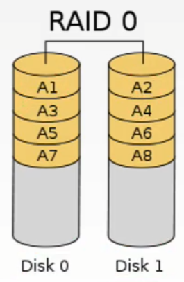

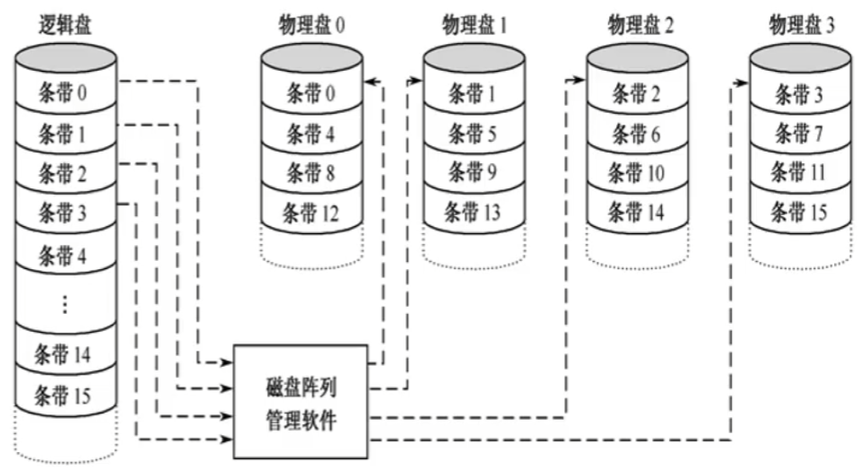

逻辑上相邻的两个扇区在物理上存到两个磁盘，类比第三章“低位交叉编址的多体存储器”

**RAID1** 镜像磁盘阵列

RAID1是为了提高可靠性，使两个磁盘同时进行读写，互为备份，如果一个磁盘出现故障，可从另一磁盘中读出数据。两个磁盘当一个磁盘使用，意味着容量减少一半。

很粗暴，存两份数据

**RAID2** 采用纠错的海明码的磁盘阵列

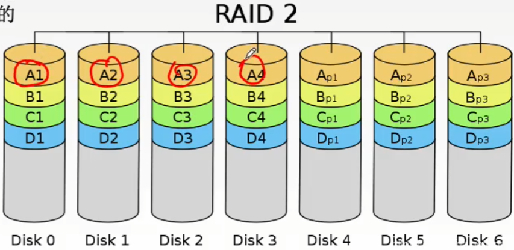

逻辑上连续的几个bit物理上分散存储在各个盘中4bit信息位+3bit海明校验位——可纠正一位错

**RAID3** 位交叉奇偶校验的磁盘阵列

**RAID4** 块交叉奇偶校验的磁盘阵列

**RAID5** 无独立校验的奇偶校验磁盘阵列

RAID通过同时使用多个磁盘，提高了传输率；通过在多个磁盘上并行存取来大幅提高存储系统的数据吞吐量；通过镜像功能，可以提高安全可靠性；通过数据校验，可以提供容错能力。

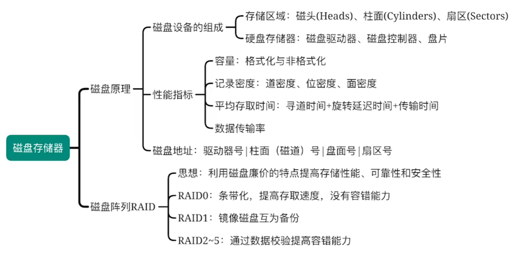

# 固态硬盘SSD

## 固态硬盘的结构

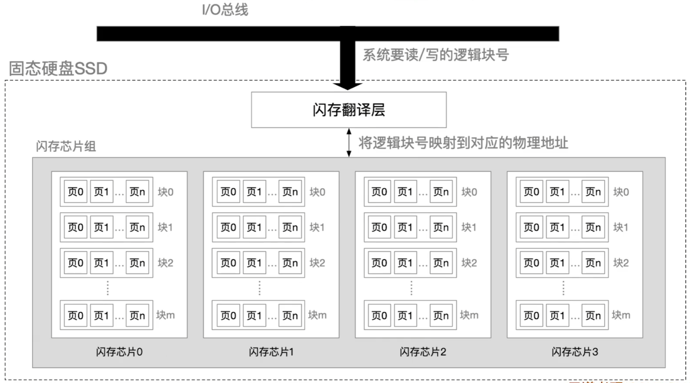

## 理想情况下，固态硬盘的寿命

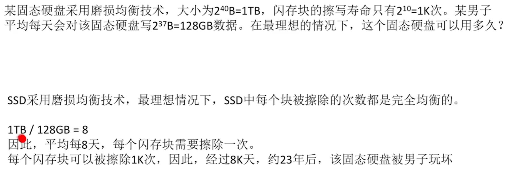

# Cache的基本概念和原理

## 存储系统存在的问题

双端口RAM、多模块存储器提高存储器的工作速度

优化后速度与CPU差距依然很大

更高速的存储单元设计

存储器价格↑容量↓

程序访问的局部性原理

存储体系的改善 “Cache-主存”层次

## Cache的工作原理

注：实际上，Cache被集成在CPU内部

Cache用SRAM实现，速度快，成本高

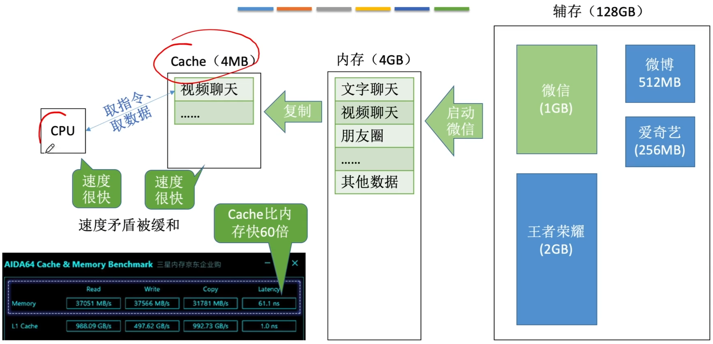

## 局部性原理

空间局部性：在最近的未来要用到的信息（指令和数据），很可能与现在正在使用的信息在存储空间上是邻近的。

数组元素、顺序执行的指令代码

时间局部性：在最近的未来要用到的信息，很可能是现在正在使用的信息

循环结构的指令代码

## 有待解决的问题

基于局部性原理，不难想到，可以把CPU目前访问的地址“周围”的部分数据放到Cache中。如何界定“周围”？

将主存的存储空间“分块”，如1kB为一块。主存与Cache之间以“块”为单位进行数据交换