# 连续分配管理方式

连续分配：指为用户进程分配的必须是一个连续的内存空间。

## 单一连续分配

在单一连续分配方式中，内存被分为系统区和用户区。系统区通常位于内存的低地址部分，用于存放操作系统相关数据；用户区用于存放用户进程相关数据。内存中只能有一道用户程序，用户程序独占整个用户区间。

优点：实现简单；无外部碎片；可以采用覆盖技术扩充内存；不一定需要采取内存保护（e.g. 早期的PC操作系统MS-DOS）。

缺点：只能用于单用户、单任务的操作系统中；有内部碎片；存储器利用率低。

内存碎片：分配给某进程的内存区域中，如果有些部分没有用上，就是“内部碎片”

有很大一部分用户区空闲，内存利用率低。

## 固定分区分配

20世纪60年代出现了支持多道程序的系统，为了能在内存中装入多道程序，且这些程序之间又不会相互干扰，于是将整个用户空间划分为若干个固定大小的分区，在每个分区中只装入一道作业，这样就形成了最早的、最简单的一种可运行多道程序的内存管理方式。

分区大小相等：缺乏灵活性，但是很适合用于用一台计算机控制多个相同对象的场合（比如：钢铁厂有n个相同的炼钢炉，就可把内存分为n个大小相等的区域存放n个炼钢炉控制程序）

分区大小不等：增加了灵活性，可以满足不同大小的进程需求。根据常在系统中运行的作业大小情况进行划分（比如：划分多个小分区、适量中等分区、少量大分区）

操作系统需要建立一个数据结构——分区说明表，来实现各个分区的分配与回收。每个表项对应一个分区，通常按分区大小排列。每个表项包括对应分区的大小、起始地址、状态（是否已分配）

用数据结构的数组（或链表）即可表示这个表

当某用户程序要装入内存时，由操作系统内核程序根据用户程序大小检索该表，从中找到一个能满足大小的、未分配的分区，将之分配给该程序，然后修改状态为“已分配”。

优点：实现简单，无外部碎片。

缺点：a.当用户程序太大时，可能所有的分区都不能满足需求，此时不得不采用覆盖技术来解决，但这又会降低性能；b.会产生内部碎片，内存利用率低。

## 动态分区分配

动态分区分配又称为可变分区分配。这种分配方式不会预先划分内存分区，而是在进程装入内存时，根据进程的大小动态地建立分区，并使分区的大小正好适合进程的需要。因此系统分区的大小和数目是可变的。（e.g. 假设某计算机内存大小为64MB，系统区8MB，用户区共56MB...）

1. 系统要用什么样的数据结构记录内存的使用情况？

   

   

   

   空闲分区表：每个空闲分区对应一个表项。表项中包含分区号、分区大小、分区起始地址等信息

   空闲分区链：每个分区的起始部分和末尾部分分别设置前向指针和后向指针。起始部分处还可记录分区大小等信息

   把一个新作业装入内存时，须按照一定的动态分区分配算法，从空闲分区表（或空闲分区链）中选出一个分区分配给该作业。由于分配算法对系统性能有很大的影响，因此人们对它进行了广泛的研究。

2. 当很多个空闲分区都能满足需求时，应该选择哪个分区进行分配？

   假设系统采用的数据结构是“空闲分区表”...

   如何分配？

   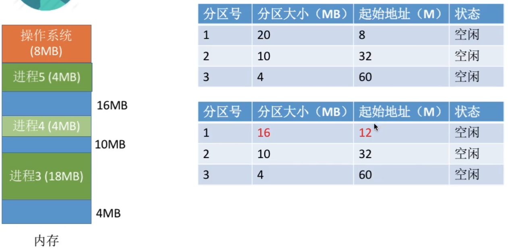

   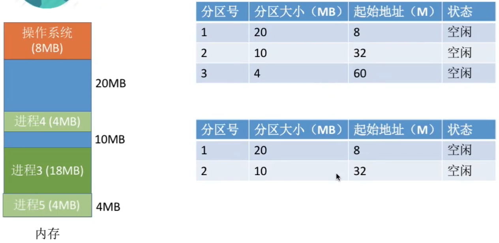

3. 如何进行分区的分配与回收操作？

   假设系统采用的数据结构是“空闲分区表”...

   如何回收？

   情况一：回收区的后面有一个相邻的空闲分区

   

   情况二：回收区的前面有一个相邻的空闲分区

   

   情况三：回收区的前、后各有一个相邻的空闲分区

   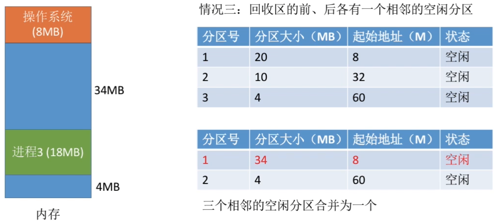

   情况四：回收区的前、后都没有相邻的空闲分区

   新增一个表项

   注：各表项的顺序不一定按照地址递增顺序排列，具体的排列方式需要依据动态分区分配算法来确定。

   

   动态分区分配没有内部碎片，但是有外部碎片。

   内部碎片：分配给某进程的内存区域中，如果有些部分没有用上。

   外部碎片：是指内存中的某些空闲分区由于太小而难以利用。

   如果内存中空闲空间的总和本来可以满足某些进程的要求，但由于进程需要的是一整块连续的内存空间，因此这些”碎片“不能满足进程的需求。

   可以通过紧凑（拼凑，Compaction）技术来解决外部碎片。

   1. 回忆交换技术，什么是换入/换出

      什么是中级调度（内存调度）？

   2. 思考动态分区分配应使用哪种装入方式？”紧凑“之后需要做什么处理？

# 指令系统

## 现代计算机的结构

操作码：指明了”做什么“

地址码：指明了”对谁动手“

有的指令不需要地址码（停机）

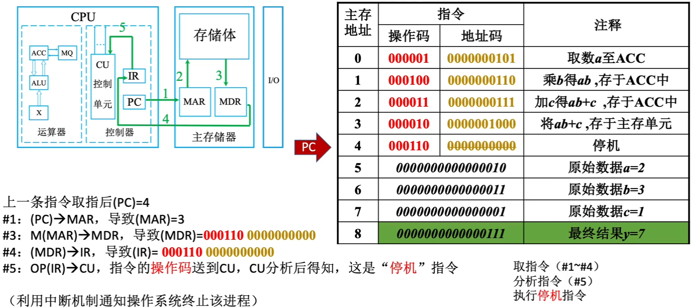

## 本节总览

## 指令的定义

指令（又称机器指令）：

是指计算机执行某种操作的命令，是计算机运行的最小功能单位。

一台计算机的所有指令的集合构成该机的指令系统，也称为指令集。

注：一台计算机只能执行自己指令系统中的指令，不能执行其他系统的指令。

e.g. x86架构、ARM架构

## 指令格式

一条指令就是机器语言的一个语句，它是一组有意义的二进制码

一条指令通常要包括操作码字段和地址码字段两部分

一条指令可能包含0个、1个、2个、3个、4个地址码...

根据地址码数目不同，可以将指令分为零地址指令、一地址指令、二地址指令...

## 零地址指令

零地址指令

1. 不需要操作数，如空操作、停机、关中断等指令
2. 堆栈计算机，两个操作数隐含存放在栈顶和次栈顶，计算结果压回栈顶

## 一地址指令

一地址指令

1. 只需要单操作数，如加1、减1、取反、求补等

   指令含义：OP(A1)->A1，完成一条指令需要3次访存：取指->读A1->写A1

2. 需要两个操作数，但其中一个操作数隐含在某个寄存器（如隐含在ACC）

   指令含义：(ACC)OP(A1)->ACC，完成一条指令需要2次访存：取指->读A1

注：A1指某个主存地址，(A1)表示A1所指向的地址中的内容

类比A1C语言指针 (A1)指针所指位置的内容

## 二、三地址指令

### 二地址指令

常用于需要两个操作数的算术运算、逻辑运算相关指令

指令含义：(A1)OP(A2)->A1

完成一条指令需要访存4次，取指->读A1->读A2->写A1

### 三地址指令

常用于需要两个操作数的算术运算、逻辑运算相关指令

指令含义：(A1)OP(A2)->A3

完成一条指令需要访存4次，取指->读A1->读A2->写A3

## 四地址指令

四地址指令

指令含义：(A1)OP(A2)->A3，A4=下一条将要执行指令的地址

完成一条指令需要访存4次，取指->读A1->读A2->写A3

正常情况下：取指令之后PC+1，指向下一条指令

四地址指令：执行指令后，将PC的值修改为A4所指地址

地址码的位数有什么影响？

n位地址码的直接寻址范围=2^n

若指令总长度固定不变，则地址码数量越多，寻址能力越差

## 指令-按地址码数目分类

## 指令-按指令长度分类

指令字长：一条指令的总长度（可能会变）

机器字长：CPU进行一次整数运算所能处理的二进制数据的位数（通常和ALU直接相关）

存储字长：一个存储单元中的二进制代码位数（通常和MDR位数相同）

半字长指令、单字长指令、双字长指令——指令长度是机器字长的多少倍

指令字长会影响取指令所需时间。如：机器字长=存储字长=16bit，则取一条双字长指令需要两次访存

定长指令字结构：指令系统中所有指令的长度都相等

变长指令字结构：指令系统中各种指令的长度不等

## 指令-按操作码长度分类

定长操作码：指令系统中所有指令的操作码长度都相同

n位->2^n条指令

控制器的译码电路设计简单，但灵活性较低

可变长操作码：指令系统中各指令的操作码长度可变

控制器的译码电路设计复杂，但灵活性较高

定长指令字结构+可变长操作码->扩展操作码指令格式

## 指令-按操作类型分类

1. 数据传送 数据传送类：进行主存与CPU之间的数据传送

   LOAD 作用：把存储器中的数据放到寄存器中

   STORE 作用：把寄存器中的数据放到存储器中

2. 算术逻辑操作 运算类

   算术：加、减、乘、除、增1、减1、求补、浮点运算、十进制运算

   逻辑：与、或、非、异或、位操作、位测试、位清除、位求反

3. 移位操作 运算类

   算术移位、逻辑移位、循环移位（带进位和不带进位）

4. 转移操作 程序控制类：改变程序执行的顺序

   无条件转移 JMP

   条件转移 JZ：结果为0

   JO：结果溢出

   JC：结果有进位

   调用和返回CALL和RETURN

   陷阱（Trap）与陷阱指令

5. 输入输出操作 输入输出类（I/O）：进行CPU和I/O设备之间的数据传送

   CPU寄存器与IO端口之间的数据传送（端口即IO接口中的寄存器）

# 扩展操作码指令格式

指令由操作码和若干个地址码组成。

定长指令字结构：指令系统中所有指令的长度都相等

变长指令字结构：指令系统中各种指令的长度不等

定长操作码：指令系统中所有指令的操作码长度都相同

可变长操作码：指令系统中各指令的操作码长度可变

定长指令字结构+可变长操作码->扩展操作码指令格式

不同地址数的指令使用不同长度的操作码

## 扩展操作码

**扩展操作码举例**

指令字长为16位，每个地址码占4位：

前4位为基本操作码字段OP，另有3个4位长的地址字段A1、A2和A3。

4位基本操作码若全部用于三地址指令，则有16条。

但至少须将1111留作扩展操作码之用，即三地址指令为15条；

1111 1111留作扩展操作码之用，二地址指令为15条；

1111 1111 1111留作扩展操作码之用，一地址指令为15条；

零地址指令为16条。

还有其他扩展操作码设计方法。

在设计扩展操作码指令格式时，必须注意以下两点：

1. 不允许短码是长码的前缀，即短操作码不能与长操作码的前面部分的代码相同。对比哈夫曼树”前缀编码“
2. 各指令的操作码一定不能重复。

通常情况下，对使用频率较高的指令，分配较短的操作码；对使用频率较低的指令，分配较长的操作码，从而尽可能减少指令译码和分析的时间。

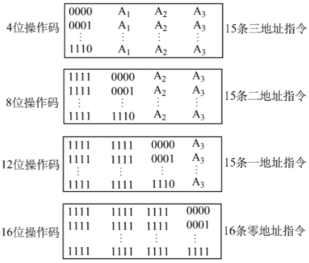

**扩展操作码举例**

设指令字长固定为16位，试设计一套指令系统满足：

设地址长度为n，上一层留出m种状态，下一层可扩展出mx2^n种状态

## 指令操作码

操作码指出指令中该指令应该执行什么性质的操作和具有何种功能。

操作码是识别指令、了解指令功能与区分操作数地址内容的组成和使用方法等的关键信息。例如，指出是算术加运算，还是减运算；是程序转移，还是返回操作。

操作码分类：

定长操作码：在指令字的最高位部分分配固定的若干位（定长）表示操作码。

1. 一般n位操作码字段的指令系统最大能够表示2^n条指令。
2. 优：定长操作码对于简化计算机硬件设计，提高指令译码和识别速度很有利；
3. 缺：指令数量增加时会占用更多固定位，留给表示操作数地址的位数受限。

扩展操作码（不定长操作码）：全部指令的操作码字段的位数不固定，且分散地放在指令字的不同位置上。

1. 最常见的变长操作码方法是扩展操作码，使操作码的长度随地址码的减少而增加，不同地址数的指令可以具有不同长度的操作码，从而在满足需要的前提下，有效地缩短指令字长。
2. 优：在指令字长有限的前提下仍保持比较丰富的指令种类；
3. 缺：增加了指令译码和分析的难度，使控制器的设计复杂化。

# 指令寻址

指令寻址：如何确定下一条指令的存放地址？

## 计算机的工作过程

程序计数器PC：指明下一条指令的存放地址

按字节编址怎么办？

采用变长指令字结构怎么办？

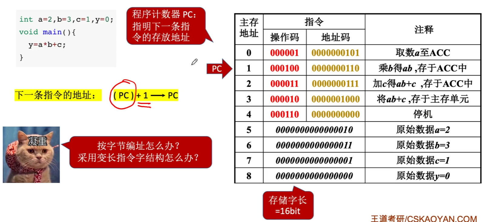

## 指令寻址

指令寻址 下一条欲执行指令的地址（始终由程序计数器PC给出）

该系统采用定长指令字结构

指令字长=存储字长=16bit=2B

主存按字编址

该系统采用定长指令字结构

指令字长=存储字长=16bit=2B

主存按字节编址

 

该系统采用变长指令字结构

指令字长=存储字长=16bit=2B

主存按字节编址

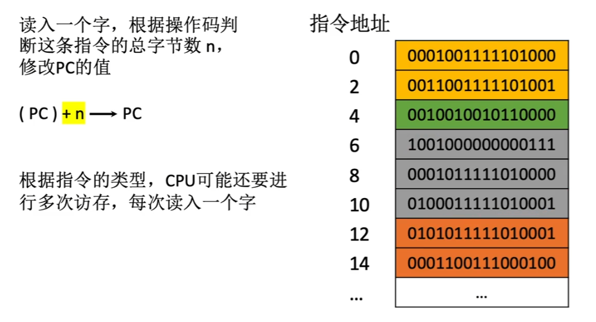

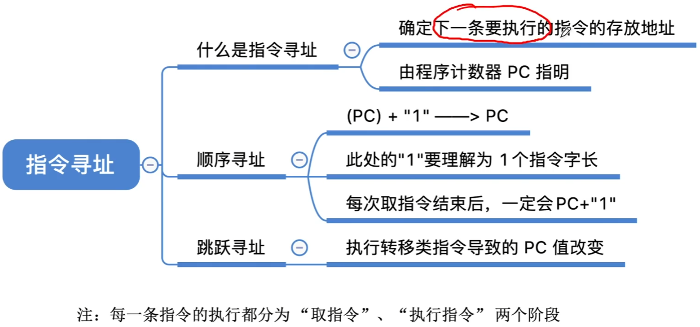

# 数据寻址

## 指令寻址v.s.数据寻址

寻址方式

指令寻址 下一条欲执行指令的指令地址 始终由程序计数器PC给出 顺序寻址 跳跃寻址

数据寻址 确定本条指令的地址码指明的真实地址

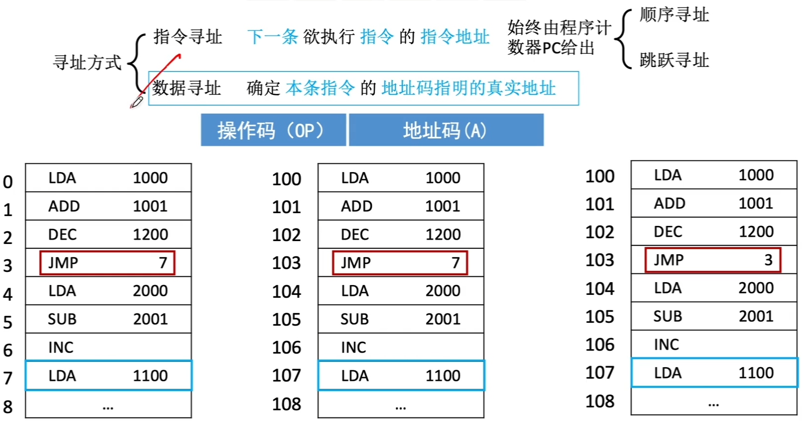

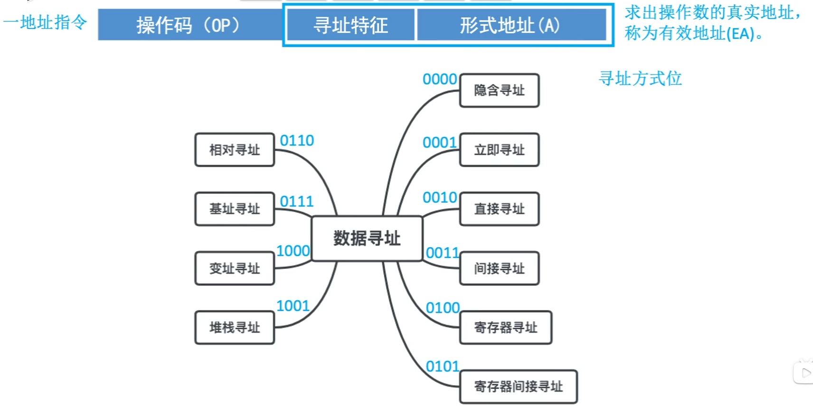

## 直接寻址

直接寻址：指令字中的形式地址A就是操作数的真实地址EA，即EA＝A。

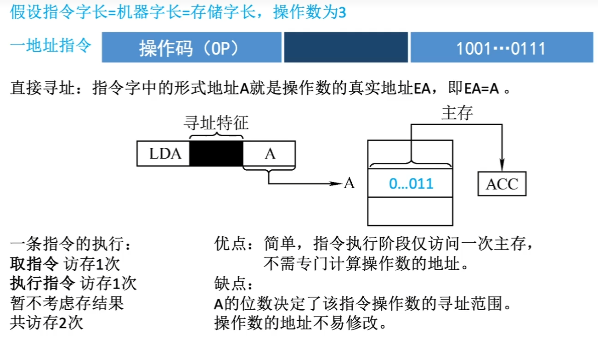

## 间接寻址

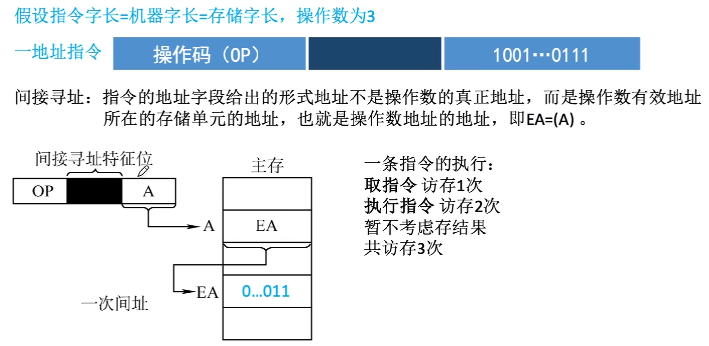

优点：

可扩大寻址范围（有效地址EA的位数大于形式地址A的位数）。

便于编址程序（用间接寻址可以方便地完成子程序返回）。

缺点：

指令在执行阶段要多次访存（一次间址需两次访存，多次寻址需根据存储字的最高位确定几次访存）。

## 寄存器寻址

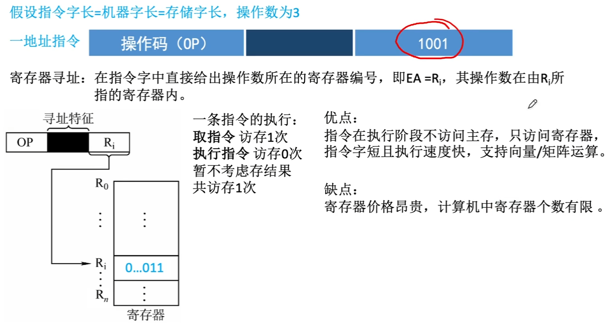

## 寄存器间接寻址

## 隐含寻址

隐含寻址：不是明显地给出操作数的地址，而是在指令中隐含着操作数的地址。

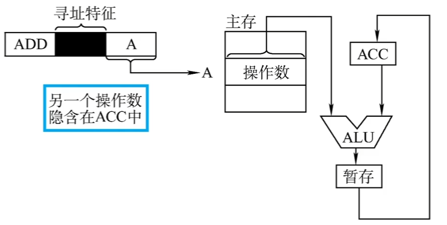

优点：有利于缩短指令字长。

缺点：需增加存储操作数或隐含地址的硬件。

## 立即寻址

| 寻址方式           | 有效地址    | 访存次数（指令执行期间） |
| ------------------ | ----------- | ------------------------ |
| 隐含寻址           | 程序指定    | 0                        |
| 立即寻址           | A即是操作数 | 0                        |
| 直接寻址           | EA=A        | 1                        |
| 一次间接寻址       | EA=(A)      | 2                        |
| 寄存器寻址         | EA=Ri       | 0                        |
| 寄存器间接一次寻址 | EA=(Ri)     | 1                        |

# 数据寻址 偏移寻址

## 基址寻址

注：BR——base address register

EA——effective address

基址寻址：将CPU中基址寄存器（BR）的内容加上指令格式中的形式地址A，而形成操作数的有效地址，即EA=(BR)+A

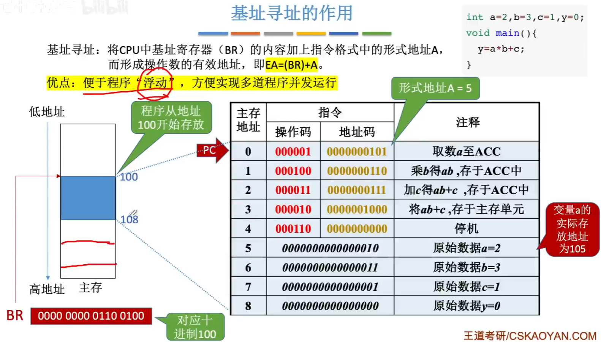

拓展：程序运行前，CPU将BR的值修改为该程序的起始地址（存在操作系统PCB中）

注：基址寄存器是面向操作系统的，其内容由操作系统或管理程序确定。在程序执行过程中，基址寄存器的内容不变（作为基地址），形式地址可变（作为偏移量）。

当采用通用寄存器作为基址寄存器时，可由用户决定哪个寄存器作为基址寄存器，但其内容仍由操作系统确定。

优点：可扩大寻址范围（基址寄存器的位数大于形式地址A的位数）；用户不必考虑自己的程序存于主存的哪一空间区域，故有利于多道程序设计，以及可用于编制浮动程序（整个程序在内存里边的浮动）。

## 变址寻址

IX index register

变址寻址有效地址EA等于指令字中的形式地址A与变址寄存器IX的内容相加之和，即EA=(IX)+A，其中IX可为变址寄存器（专用），也可用通用寄存器作为变址寄存器。

注：变址寄存器是面向用户的，在程序执行过程中，变址寄存器的内容可由用户改变（IX作为偏移量），形式地址A不变（作为基地址）。

基址寻址中，BR保持不变作为基地址，A作为偏移量

优点：在数组处理过程中，可设定A为数组的首地址，不断改变变址寄存器IX的内容，便可很容易形成数组中任一数据的地址，特别适合编制循环程序。

## 基址＆变址复合寻址

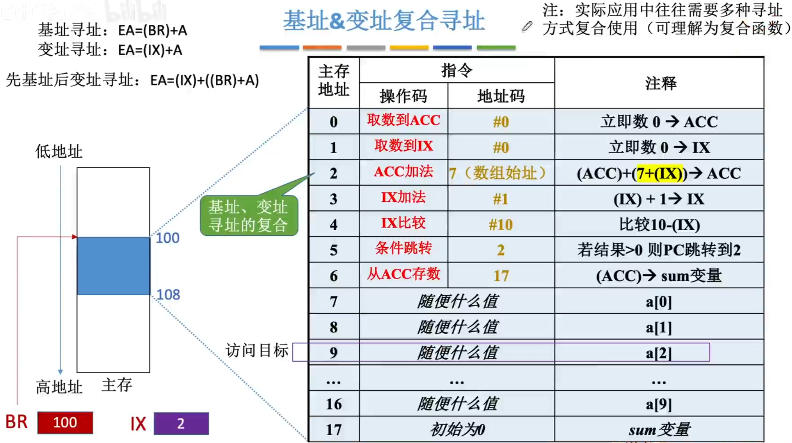

## 相对寻址

相对寻址：把程序计数器PC的内容加上指令格式中的形式地址A而形成操作数的有效地址，即EA=(PC)+A，其中A是相对于PC所指地址的位移量，可正可负，补码表示。

优点：操作数的地址不是固定的，它随着PC值的变化而变化，并且与指令地址之间总是相差一个固定值，因此便于程序浮动（一段代码在程序内部的浮动）。

相对寻址广泛应用于转移指令。

| 寻址方式                   | 有效地址    | 访存次数（指令执行期间） |
| -------------------------- | ----------- | ------------------------ |
| 隐含寻址                   | 程序指定    | 0                        |
| 立即寻址                   | A即时操作数 | 0                        |
| 直接寻址                   | EA=A        | 1                        |
| 一次间接寻址               | EA=(A)      | 2                        |
| 寄存器寻址                 | EA=Ri       | 0                        |
| 寄存器间接一次寻址         | EA=(Ri)     | 1                        |
| 转移指令 相对寻址          | EA=(PC)+A   | 1                        |
| 多道程序 基址寻址          | EA=(BR)+A   | 1                        |
| 循环程序 变址寻址 数组问题 | EA=(IX)+A   | 1                        |

注意：取出当前指令后，PC会指向下一条指令，相对寻址是相对于下一跳指令的偏移

# 数据寻址 堆栈寻址

SP Stack Pointer

堆栈寻址：操作数存放在堆栈中，隐含使用堆栈指针(SP)作为操作数地址。

堆栈是存储器（或专用寄存器组）中一块特定的按“后进先出（LIFO）”原则管理的存储区，该存储区中被读/写单元的地址是用一个特定的寄存器给出的，该寄存器成为堆栈指针（SP）。

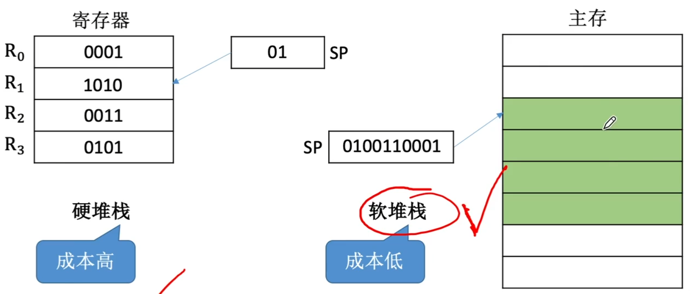

| 寻址方式                   | 有效地址                    | 访存次数（指令执行期间）    |
| -------------------------- | --------------------------- | --------------------------- |
| 隐含寻址                   | 程序指定                    | 0                           |
| 立即寻址                   | A即时操作数                 | 0                           |
| 直接寻址                   | EA=A                        | 1                           |
| 一次间接寻址               | EA=(A)                      | 2                           |
| 寄存器寻址                 | EA=Ri                       | 0                           |
| 寄存器间接一次寻址         | EA=(Ri)                     | 1                           |
| 转移指令 相对寻址          | EA=(PC)+A                   | 1                           |
| 多道程序 基址寻址          | EA=(BR)+A                   | 1                           |
| 循环程序 变址寻址 数组问题 | EA=(IX)+A                   | 1                           |
| 堆栈寻址                   | 入栈/出栈时EA的确定方式不同 | 硬堆栈不访存，软堆栈访存1次 |

