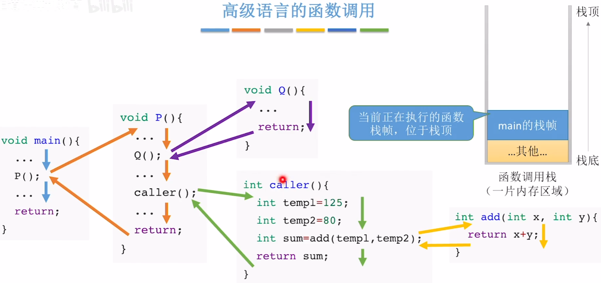
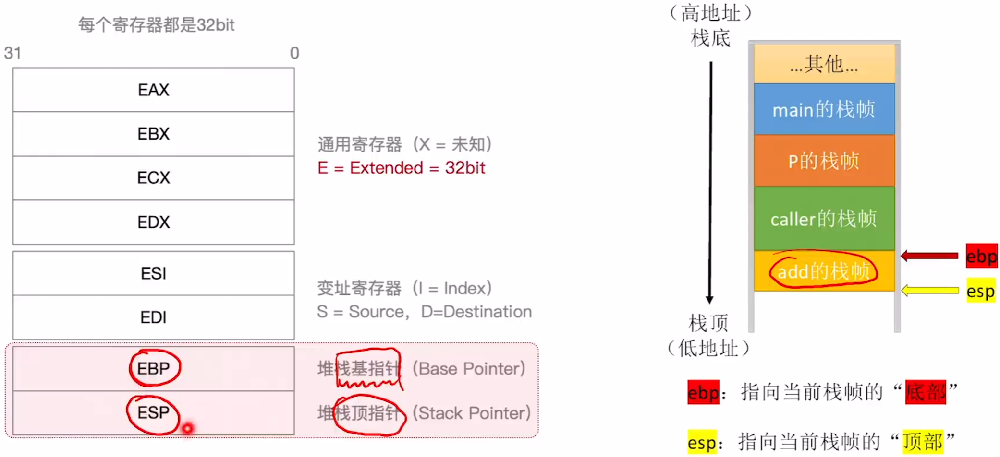
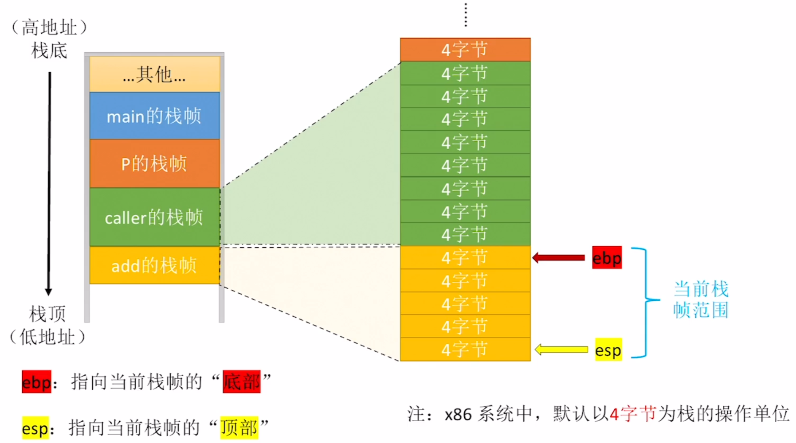
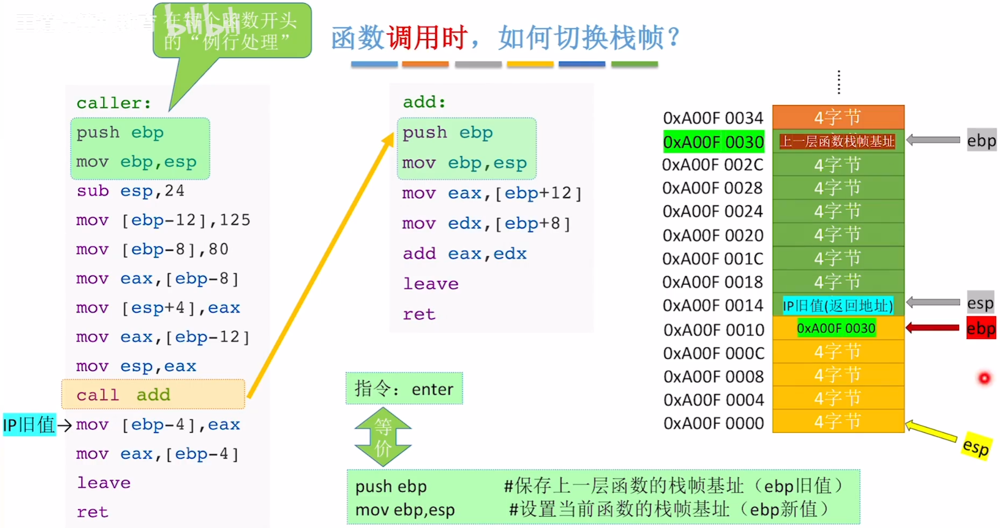
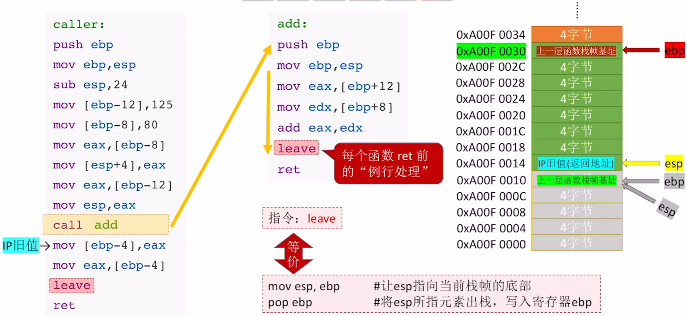
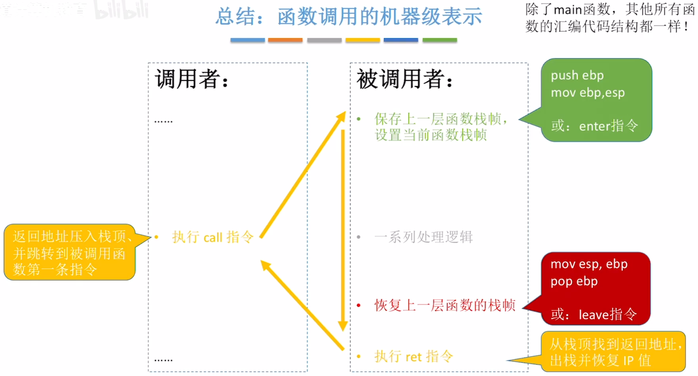
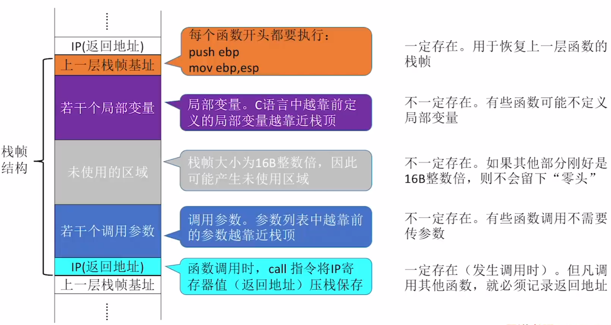
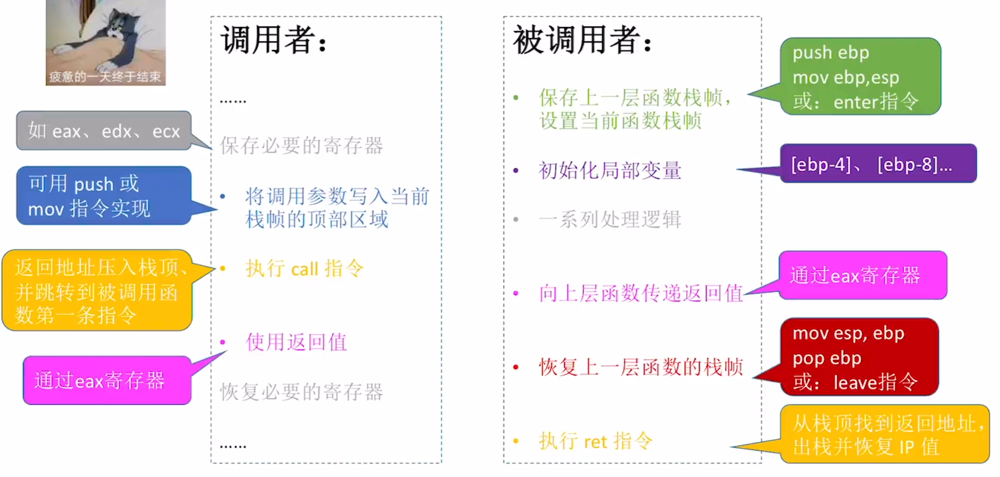

# 循环语句的机器级表示

## 用条件转移指令实现循环

```c++
int result = 0;
for(int i=0;i<=100;1++)
{
	result += i;    
} // 求 1+2+3+...+100
```

```c++
int i=1;
int result=0;
while(i<=100)
{
    result += i;
    i++;
}// 求 1+2+3+...+100
```

```assembly
mov eax, 0   #用eax保存result，初值为0
mov edx, 1   #用edx保存i，初始值为1
cmp edx, 100 #比较i和100
jg L2        #若i>100，转跳到L2执行
L1:          #循环主题
add eax, edx #实现 result += i
inc edx      #inc自增指令，实现i++
cmp edx, 100 #i和100
jle L1       #若i<=100，转跳到L1执行
L2:          #跳出循环主体
```

用条件转移指令实现循环，需要4个部分构成：

1. 循环前的初始化
2. 是否直接跳过循环？
3. 循环主体？
4. 是否继续循环？

## 用loop指令实现循环

```c++
for(int i=500;i>0;i--){
    做某些处理;
}//循环500轮
```

```assembly
mov ecx, 500 #用ecx作为循环计数器
Looptop:     #循环的开始
...
做某些处理
...
loop Looptop #ecx--，若ecx!=0，跳转到Looptop
#等价于
dec ecx
cmp ecx, 0
jne Looptop
```

理论上，能用loop指令实现的功能一定能用条件转移指令实现

使用loop指令可能会使代码更清晰简洁

补充：loopx指令——如loopnz，loopz

loopnz——当ecx!=0&&ZF==0时，继续循环

loopz——当ecx!=0&&ZF==1时，继续循环

# call和ret指令（函数调用的机器级表示）

## 高级语言的函数调用



函数的栈帧（Stack Frame）：保存函数大括号内定义的局部变量、保存函数调用相关的信息

## x86汇编语言的函数调用


## call、ret指令

注：x86处理器中

程序计数器PC（Program Counter）

通常被称为IP（Instruction Pointer）

函数调用指令：call<函数名>

函数返回指令：ret

call指令的作用：

1. 将IP旧值压栈保存（保存在函数的栈帧顶部）
2. 设置IP新值，无条件转移至被调用函数的第一条指令


## 总结：函数调用的机器级表示


如何传递调用参数、返回值？

如何访问栈帧里的数据？

栈帧内可能包含哪些内容？

为什么倒过来了？


# 如何访问栈帧（函数调用的机器级表示）

## 函数调用栈在内存中的位置


## 标记栈帧范围：EBP、ESP寄存器

ebp: 指向当前栈帧的“底部”

esp: 指向当前栈帧的“顶部”



注：x86系统中，默认以4字节为栈的操作单位


对栈帧内数据的访问，都是基于ebp、esp进行的

## 访问栈帧数据：push、pop指令


## 访问栈帧数据：mov指令

 

## 总结：如何访问栈帧？

### 方法一

Push 立即数/寄存器/主存地址 //先让esp减4，再压入

Pop 寄存器/主存地址 //栈顶元素出栈写入，再让esp加4

### 方法二

mov指令，结合esp、ebp指针访问栈帧数据

注：可以用减法/加法指令，即sub/add修改栈帧指针esp的值


# 如何切换栈帧（函数调用的机器级表示）

## 标记栈帧范围：EBP、ESP寄存器

注：x86系统中，默认以4字节为栈的操作单位



## 函数调用时，如何切换栈帧？

call指令的作用：

1. 将IP旧值压栈保存（效果相当于push IP）
2. 设置IP新值，无条件转移至被调用函数的第一条指令（效果相当于jmp add）



注：每个栈帧底部，用于保存上一层栈帧的基址



ret指令的作用：从函数的栈帧顶部找到IP旧值，将其出栈并恢复IP寄存器

## 总结：函数调用的机器级表示



# 如何传递参数和返回值（函数调用的机器级表示）

- gcc编译器将每隔栈帧大小设置为16B的整数倍（当前函数的栈帧除外），因此栈帧内可能出现空闲未使用的区域。
- 通常将局部变量几种存储在栈帧底部区域
- 通常将调用参数集中存储在栈帧顶部区域

- 栈帧最底部一定是上一层栈帧基址（ebp旧值）

- 栈帧最顶部一定是返回地址（当前函数的栈帧除外）


## 一个栈帧内可能包含哪些内容？



## 汇编代码实战

1. 访问局部变量
2. 传递参数
3. 函数调用
4. 切换栈帧
5. 访问参数
6. 传递返回值
7. 使用返回值

## 总结：函数调用的机器级表示




# CISC和RISC


80-20规律：典型程序中80%的语句仅仅使用处理中20%的指令

比如设计一套能实现整数、矩阵加/减/乘运算的指令集：

CISC的思路：除了提供整数的加减乘指令之外，还提供矩阵的加法指令、矩阵的减法指令、矩阵的乘法指令

一条指令可以由一个专门的电路完成

采用“存储程序”的设计思想，由一个比较通用的电路配合存储部件完成一条指令

RISC的思路：只提供整数的加减乘指令

一条指令一个电路，电路设计相对简单，功耗更低

“并行”、“流水线”

## CISC

Complex Instruction Set Computer

设计思路：一条指令完成一个复杂的基本功能

代表：x86架构，主要用于笔记本、台式机等

## RISC

Reduced Instruction Set Computer

设计思路：一条指令完成一个基本“动作”；

多条指令组合完成一个复杂的基本功能。

代表：ARM架构，主要用于手机、平板等

|                  | CISC                               | RISC                                 |
| ---------------- | ---------------------------------- | ------------------------------------ |
| 指令系统         | 复杂，庞大                         | 简单，精简                           |
| 指令数目         | 一般大于200条                      | 一般小于100条                        |
| 指令字长         | 不固定                             | 定长                                 |
| 可访存指令       | 不加限制                           | 只有Load/Store指令                   |
| 各种指令执行时间 | 相差较大                           | 绝大多数在一个周期内完成             |
| 各种指令使用频度 | 相差很大                           | 都比较常用                           |
| 通用寄存器数量   | 较少                               | 多                                   |
| 目标代码         | 难以优化编译生成高效的目标代码程序 | 采用优化的编译程序，生成代码较为高效 |
| 控制方式         | 绝大多数为微程序控制               | 绝大多数为组合逻辑控制               |
| 指令流水线       | 可以通过一定方式实现               | 必须实现                             |

# 扩展操作码指令格式

指令由操作码和若干个地址码组成

定长指令字结构：指令系统中所有指令的长度都相等

变长指令字结构：指令系统中各种指令的长度不等

定长操作码：指令系统中所有指令的操作码长度都相同

可变长操作码：指令系统中各指令的操作码长度可变

定长指令字结构+可变长操作码->扩展操作码指令格式

不同地址数的指令使用不同长度的操作码

## 扩展操作码举例

指令字长为16位，每个地址码占4位：

前4位为基本操作码字段OP，另有3个4位长的地址字段A1、A2和A3。

4位基本操作码若全部用于三地址指令，则有16条。

但至少须将1111留作扩展操作码之用，即三地址指令为15条；

1111 1111留作扩展操作码之用，二地址指令为15条；

1111 1111 1111留作扩展操作码之用，一地址指令为15条；

零地址指令为16条。

还有其他扩展操作码设计方法。


- 在设计扩展操作码指令格式时，必须注意以下两点：

  1. 不允许短码是长码的前缀，即短操作码不能与长操作码的前面部分的代码相同。
  2. 各指令的操作码一定不能重复。

  通常情况下，对使用频率较高的指令，分配较短的操作码；对使用频率较低的指令，分配较长的操作码，从而尽可能减少指令译码和分析的时间。

设指令字长固定为16位，试设计一套指令系统满足：

1. 有15条三地址指令 
2. 有12条二地址指令
3. 有62条一地址指令
4. 有32条零地址指令
