# 微程序控制器的基本原理

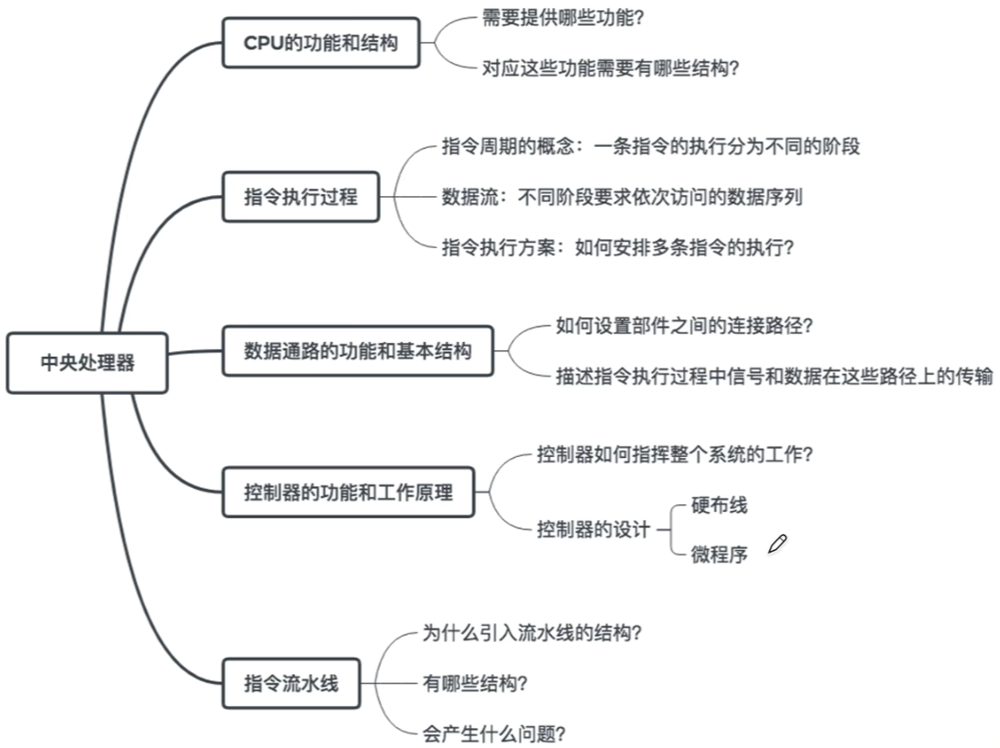

## 微程序控制器的设计思路

指令是对程序的执行步骤的描述

微指令是对指令执行步骤的描述

采用“存储程序”的思想，CPU出厂前将所有指令的“微程序”存入“控制器存储器”中

微命令与微操作一一对用

微指令中可能包含多个微命令

指令是对微指令功能的“封装”

## 微程序控制器的基本结构

## 微程序控制器的工作原理

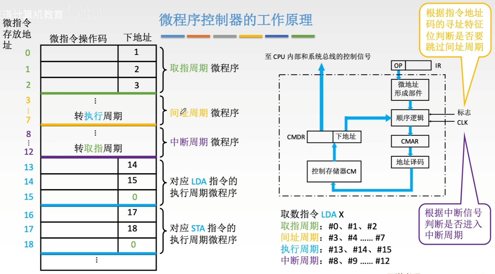

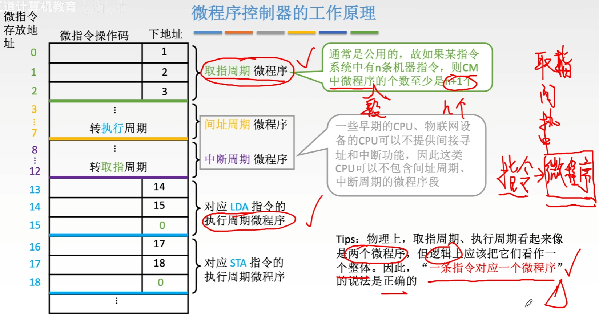

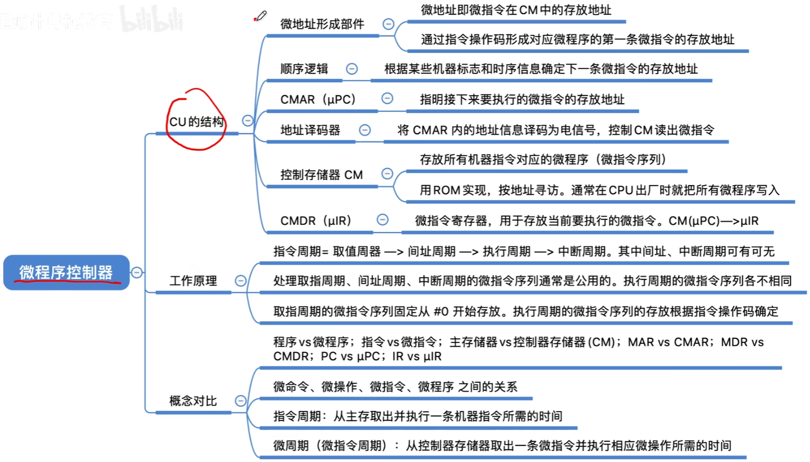

# 微指令的设计

## 微指令的格式

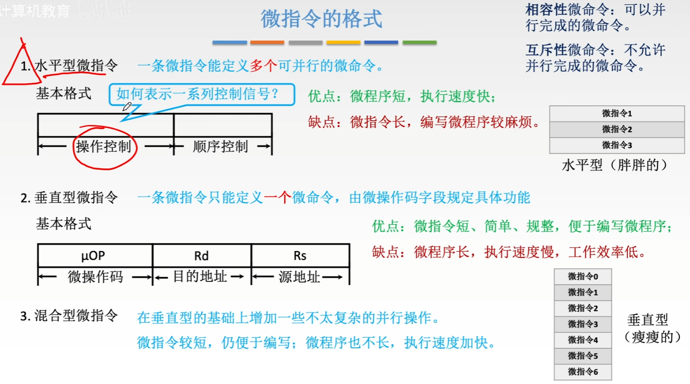

1. 水平型微指令 一条微指令能定义多个可并行的微命令

   

2. 垂直型微指令 一条微指令只能定义一个微命令，由微操作码字段规定具体功能

   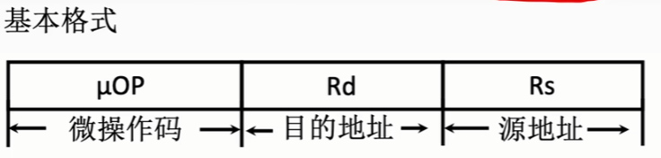

3. 混合型微指令

相容性微命令：可以并行完成的微命令。

互斥性微命令：不允许并行完成的微命令。

## 微指令的编码方式

1. 水平型微指令 一条微指令能定义多个可并行的微命令。

   

   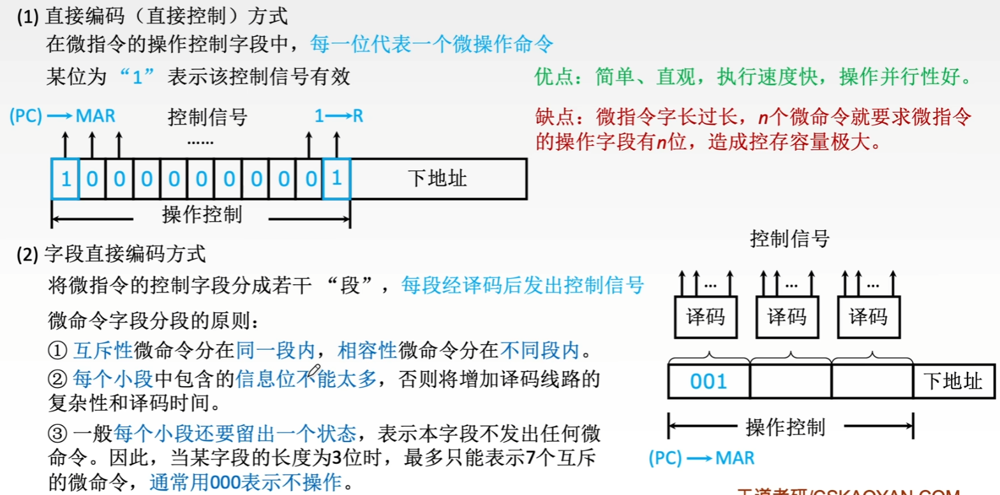

   

## 微指令的地址形成方式

1. 微指令的下地址字段指出

   微指令格式中设置一个下地址字段，由微指令的下地址字段直接指出后继微指令的地址，这种方式又称为断定方式。

2. 根据机器指令的操作码形成

   当机器指令取至指令寄存器后，微指令的地址由操作码经微地址形成部件形成。

3. 增量计数器法 (CMAR)+1 -> CMAR

4. 分支转移 转移方式：指明判别条件；转移地址：指明转移成功后的去向。

   

5. 通过测试网络

6. 由硬件产生微程序入口地址

   第一条微指令地址 由专门硬件产生（用专门的硬件记录取指周期微程序首地址）

   中断周期 由硬件产生中断周期微程序首地址（用专门的硬件记录）

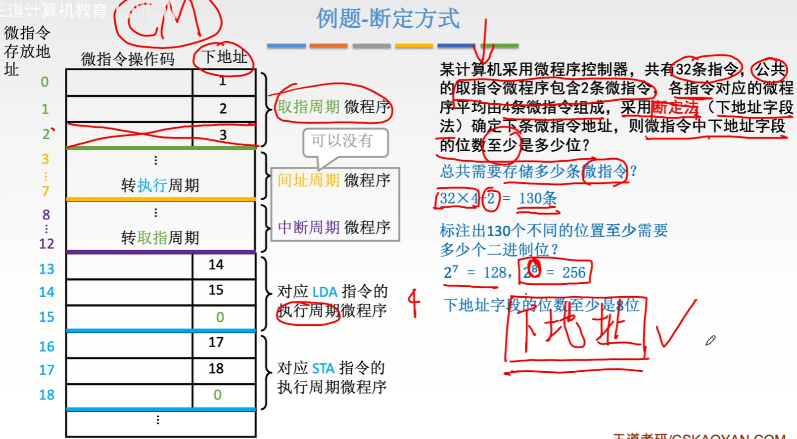

# 微程序控制单元的设计

设计步骤：

1. 分析每个阶段的微操作序列

2. 写出对应机器指令的微操作命令及节拍安排

   - 写出每个周期所需要的微操作（参照硬布线）

   - 补充微程序控制器特有的微操作：

     a. 取指周期：

     每条指令结束之后都需要进行

     ​    Ad(CMDR)->CMAR

     ​    OP(IR)->微地址形成部件->CMAR

     ​    取指周期的最后一条微指令完成后，要根据指令操作码指定其执行周期的微程序首地址

     b. 执行周期：

     ​    Ad(CMDR)->CMAR

     ​    每条微指令结束之后都需要进行

3. 确定微指令格式

   根据微操作个数决定采用何种编码方式，以确定微指令的操作控制字段的位数。

   根据CM中存储的微指令总数，确定微指令的顺序控制字段的位数。

   最后按操作控制字段位数和顺序控制字段位数就可以确定微指令字长。

4. 编写微指令码点

## 微程序设计分类

1. 静态微程序设计和动态微程序设计

   静态 微程序无需改变，采用ROM

   动态 通过改变微指令和微程序改变机器指令

   ​         有利于仿真，采用EPROM

2. 毫微程序设计

   毫微程序设计的基本概念

   微程序设计用微程序解释机器指令

   毫微程序设计用毫微程序解释微程序

   毫微指令与微指令的关系好比微指令与机器指令的关系

3. 硬布线与微程序的比较

   |          | 微程序控制器                                                 | 硬布线控制器                                                 |
   | -------- | ------------------------------------------------------------ | ------------------------------------------------------------ |
   | 工作原理 | 微操作控制信号以微程序的形式存放在控制存储器中，执行指令时读出即可 | 微操作控制信号由组合逻辑电路根据当前的指令码、状态和时序，即时产生 |
   | 执行速度 | 慢                                                           | 快                                                           |
   | 规整性   | 较规整                                                       | 繁琐、不规整                                                 |
   | 应用场合 | CISC CPU                                                     | RISC CPU                                                     |
   | 易扩充性 | 易扩充修改                                                   | 困难                                                         |

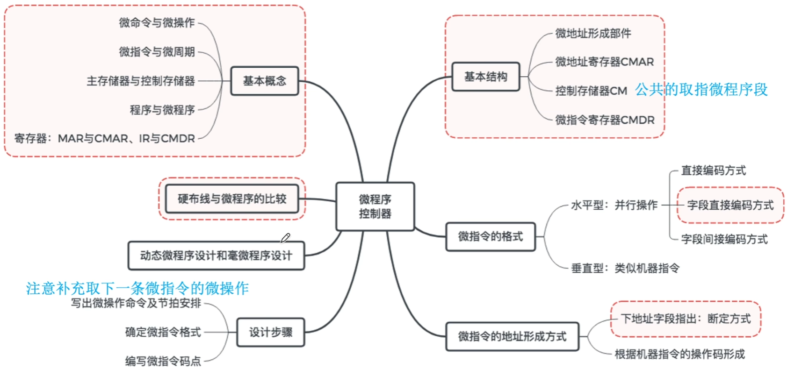

# 指令流水线的基本概念

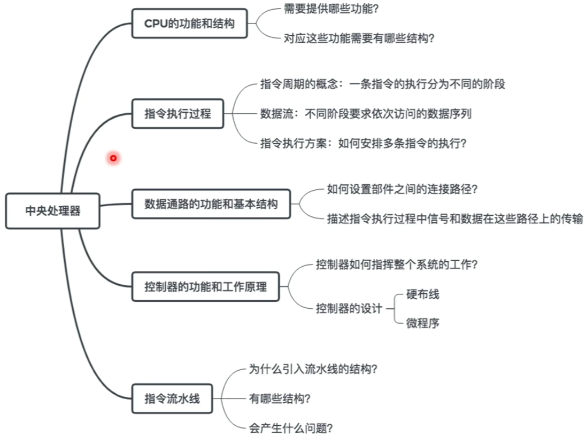

## 指令流水线的定义

一条指令的执行过程可以分为多个阶段（或过程）。根据计算机的不同，具体的分法也不同。

取指：根据PC内容访问主存储器，取出一条指令送到IR中。

分析：对指令操作码进行译码，按照给定的寻址方式和地址字段中的内容形成操作数的有效地址EA，并从有效地址EA中取出操作数。

执行：根据操作码字段，完成指令规定的功能，即把运算结果写到通用寄存器或主存中。

特点：每个阶段用到的硬件不一样。

设取指、分析、执行3个阶段的时间都相等，用t表示，按以下几种执行方式分析n条指令的执行时间：

1. 顺序执行方式 总耗时T=nx3t=3nt

   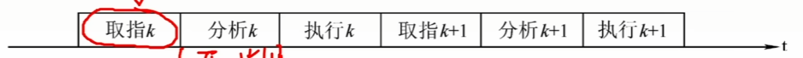

   传统冯诺依曼机采用顺序执行方式，又称串行执行方式。

   优点：控制简单，硬件代价小。

   缺点：执行指令的速度较慢，在任何时刻，处理机中只有一条指令在执行，各功能部件的利用率很低。

2. 一次重叠执行方式 总耗时T=3t+(n-1)x2t=(1+2n)t

   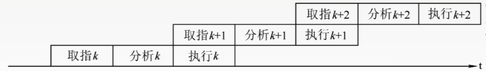

   优点：程序的执行时间缩短了1/3，各功能部件的利用率明显提高。

   缺点：需要付出硬件上较大开销的代价，控制过程也比顺序执行复杂了。

3. 二次重叠执行方式 总耗时T=3t+(n-1)xt=(2+n)t

   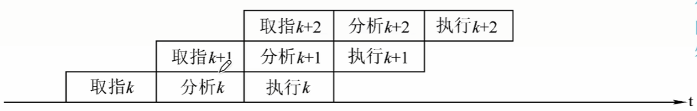

   与顺序执行方式相比，指令的执行时间缩短近2/3。这是一种理想的指令执行方式，在正常情况下，处理机中同时有3条指令在执行。

注：也可以把每条指令的执行过程分成4个或5个阶段，分成5个阶段是比较常见的做法。

## 流水线的表示方法

1. 指令执行过程图

   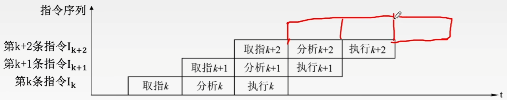

   主要用于分析指令执行过程以及影响流水线的因素

2. 时空图

   空间：不同的阶段所对应的不同的硬件资源

   主要用于分析流水线的性能

   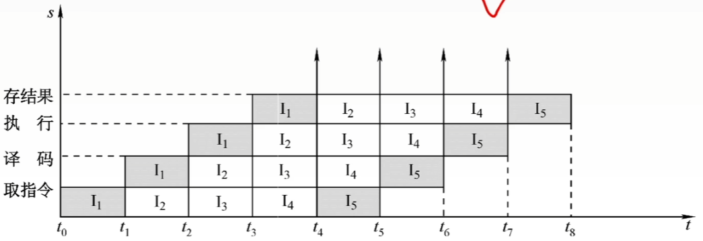

## 流水线的性能指标

1. 吞吐率

   吞吐率是指在单位时间内流水线所完成的任务数量，或是输出结果的数量。

   设任务数为n；处理完成n个任务所用的时间Tk

   则计算流水线吞吐率（TP）的最基本的公式为
   $$
   \begin{align}
   TP&=\frac{n}{T_k}\\
   T_k&=(k+n-1)\Delta t
   \end{align}
   $$
   流水线的实际吞吐率为
   $$
   TP=\frac{n}{(k+n-1)\Delta t}
   $$
   理想情况下，流水线的时空图如下：

   

   一条指令的执行分为k个阶段，每个阶段耗时deltat，一般去deltat=一个时钟周期

   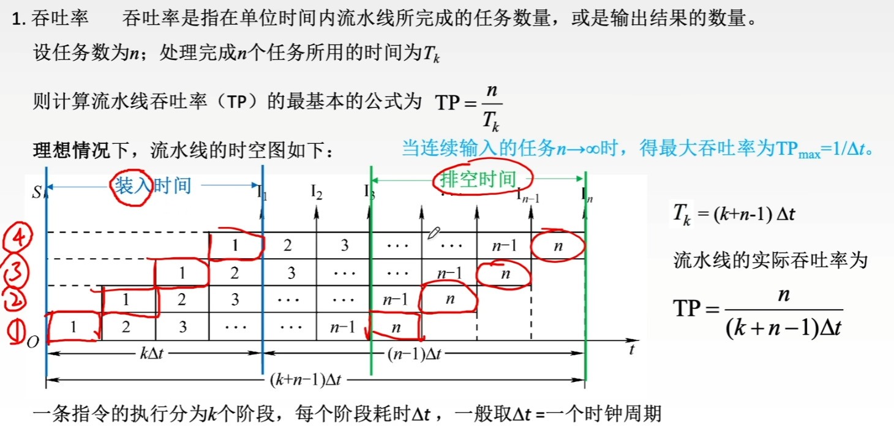

2. 加速比

   完成同样一批任务，不适用流水线所用的时间与使用流水线所用的时间之比。

   设T0表示不使用流水线时的执行时间，即顺序执行所用的时间；Tk表示使用流水线时的执行时间

   则计算流水线加速比(S)的基本公式为
   $$
   S=\frac{T_0}{T_k}
   $$
   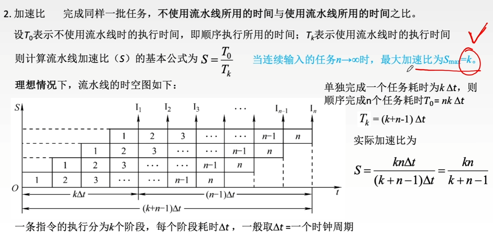

3. 效率

   流水线的设备利用率称为流水线的效率。

   在时空图上，流水线的效率定义为完成n个任务占用的时空区有效面积与n个任务所用的时间与k个流水段所围成的时空区总面积之比。

   

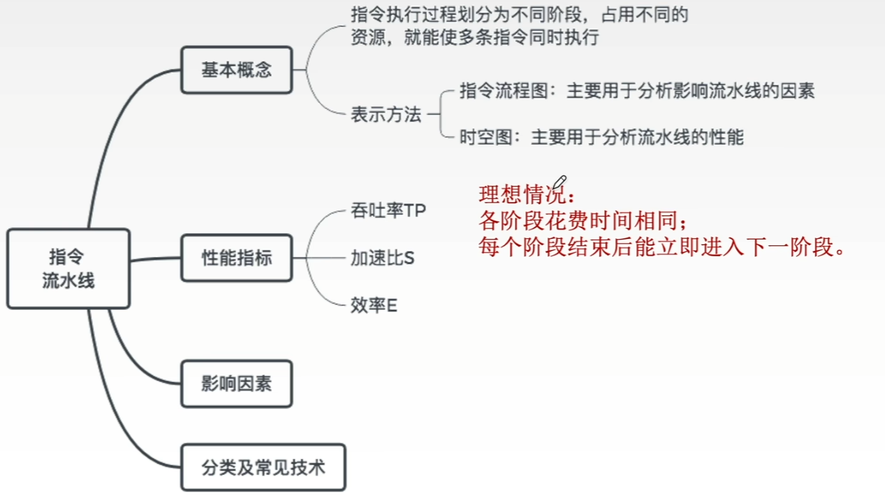

# 指令流水线的影响因素和分类

## 机器周期的设置

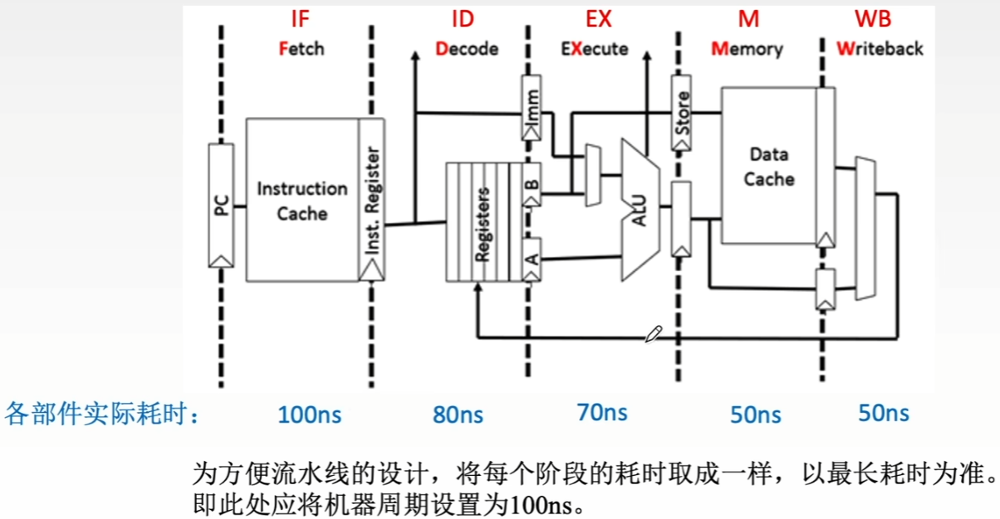

流水线每一个功能段部件后面都要有一个缓冲寄存器，或称为锁存器，其作用是保存本流水段的执行结果，提供给下一流水段使用。

## 影响流水线的因素

1. 结构相关（资源冲突）

   由于多条指令在同一时刻争用同一资源而形成的冲突称为结构相关。

   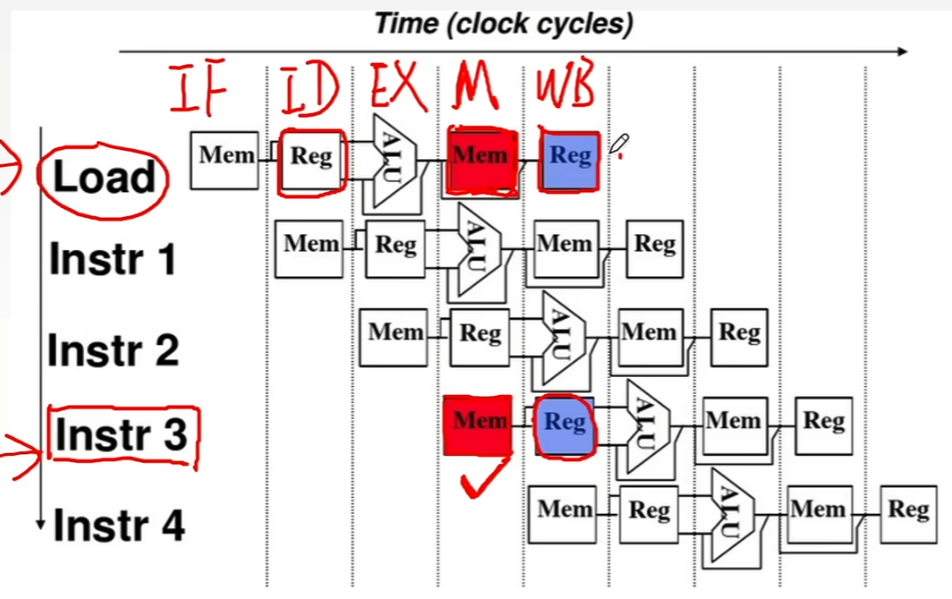

   解决方法：

   1. 后一相关指令暂停一周期

   2. 资源重复配置：

      数据存储器+指令存储器

   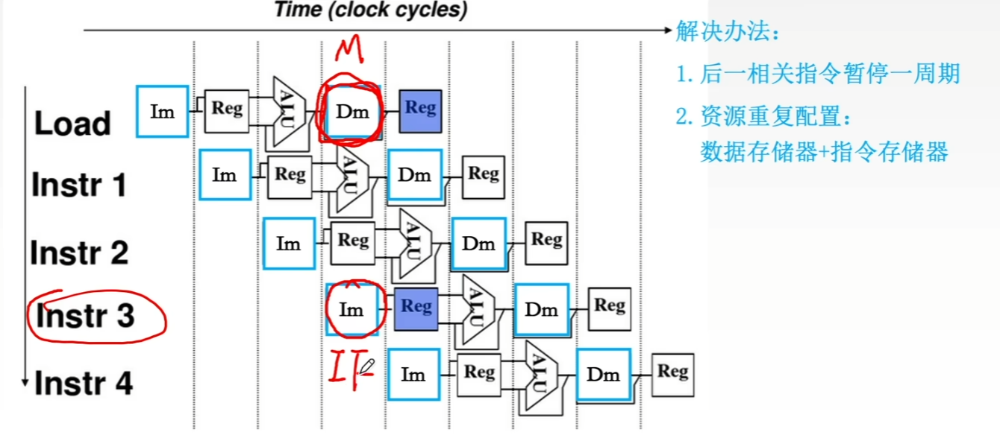

2. 数据相关（数据冲突）

   数据相关指在一个程序中，存在必须等前一条指令执行完才能执行后一条指令的情况，则这两条指令即为数据相关。

   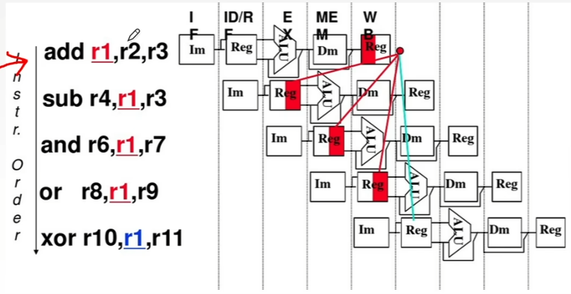

   解决方法：

   1. 把遇到数据相关的指令及其后续指令都暂停一至几个时钟周期，直到数据相关问题消失再继续执行。可分为硬件阻塞(stall)和软件插入”NOP“两种方法。

      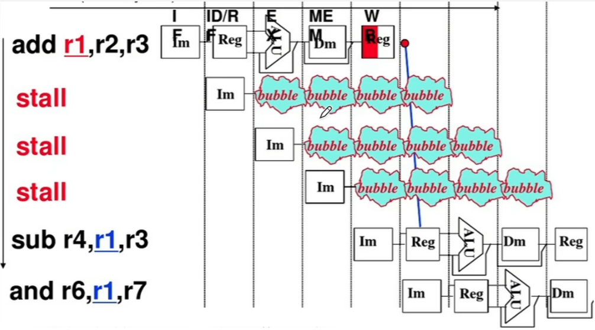

   2. 数据旁路技术。

   3. 编译优化：通过编译器调整指令顺序来解决数据相关。

3. 控制相关（控制冲突）

   当流水线遇到转移指令和其他改变PC值的指令而造成断流时，会引起控制相关。

   解决方法：

   1. 转移指令分支预测。简单预测（永远猜true或false）、动态预测（根据历史情况动态调整）
   2. 预取转移成功和不成功两个控制流方向上的目标指令
   3. 加快和提前形成条件码
   4. 提高转移方向的猜准率

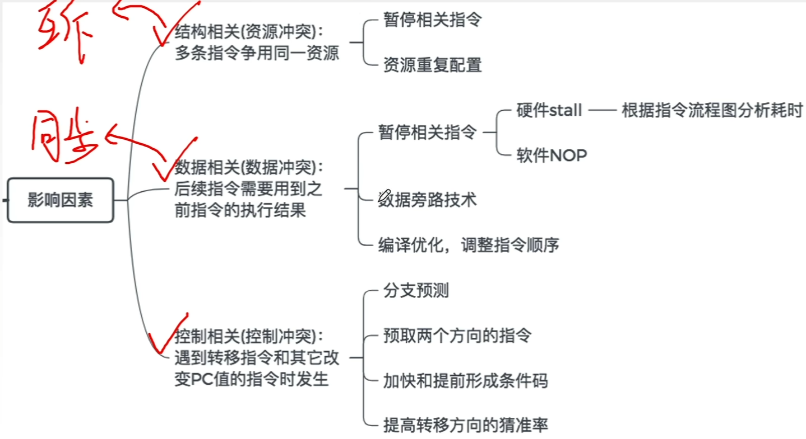

## 流水线的分类

1. 部件功能级、处理机级和处理机间级流水线

   根据流水线使用的级别的不同，流水线可分为部件功能级流水线、处理机级流水线和处理机间流水线。

   部件功能级流水就是将复杂的算术逻辑运算组成流水线工作方式。例如，可将浮点加法操作分成求阶差、对阶、尾数相加以及结果规格化等4个子过程。

2. 
