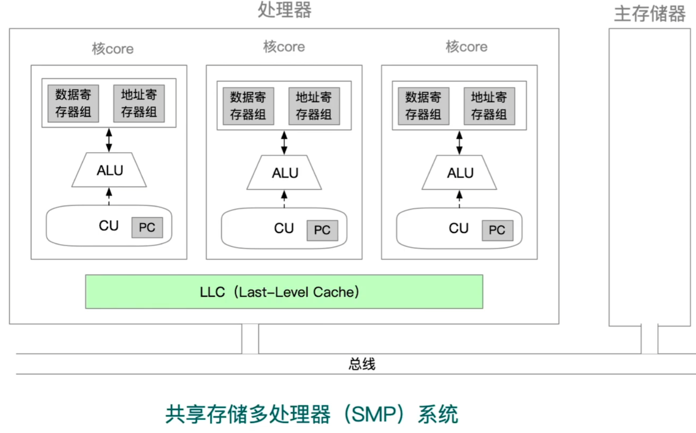

# 五段式指令流水线

考试中常见的五类指令：

运算类指令、LOAD指令、STORE指令、条件转移指令、无条件转移指令

## 运算类指令的执行过程

## LOAD指令的执行过程

## STORE指令的执行过程

## 条件转移指令的执行过程

## 无条件转移指令的执行过程

# 多处理器系统的基本概念

## SISD、SIMD、MIMD的基本概念

基于指令流的数量和数据流的数量，对计算机体系结构分为SISD、SIMD、MISD和MIMD四类。常规的单处理器属于SISD，而常规的多处理器属于MIMD。

1. 单指令流单数据流（SISD）结构

   SISD是传统的串行计算机结构，这种计算机通常仅包含一个处理器和存储器，处理器在一段时间内仅执行一条指令，按指令流规定的顺序串行执行指令流中的若干条指令。为了提高速度，有些SISD计算机采用流水线的方式，因此，SISD处理器有时会设置多个功能部件，并采用多模块交叉方式组织存储器。

2. 单指令流多数据流（SIMD）结构

   SIMD是指一个指令流同时对多个数据流进行处理，一般称为数据级并行技术。这种结构的计算机通常由一个指令控制部件、多个处理单元组成。每个处理单元虽然都执行的是同一条指令，但每个单元都有自己的地址寄存器，这样每个单元都有不同的数据地址，因此，不同处理单元执行的同一条指令所处理的数据是不同的。一个顺序应用程序编译后，可能按SISD组织并运行于串行硬件上，也可能按SIMD组织并运行于并行硬件上。

   SIMD在使用for循环处理数组时最有效，比如，一条分别对16对数据进行运算的SIMD指令如果在16个ALU中同时运算，则仅需一次运算时间就能完成运算。SIMD在使用case或switch语句时效率最低，此时每个执行单元必须根据不同的数据执行不同的操作。

3. 多指令流单数据流（MISD）结构

   MISD是指同时执行多条指令，处理同一个数据，实际上不存在这样的计算机。

## SISD

计组课程一直在学的就是SISD，每条指令可以处理一两个数据

## SIMD

key：对结构类似的大量数据进行相同处理。一条指令处理很多个数据

eg1：某些显卡常采用SIMD，图像处理时，常对每个像素点进行完全一样的渲染（比如加个粉红色滤镜）

eg2：可用于优化for循环中对数组元素的重复处理

## MIMD 共享存储多处理器系统

intel i5 i7 处理器

## MIMD 多计算机系统

eg：多台计算机组成的“分布式计算系统”

## 向量处理器

eg：向量处理机的LOAD指令，可以将一个向量取到向量寄存器中；加法指令，可以实现两个向量相加应用于：向量计算、大量浮点数计算、空气动力学、核物理学、巨型矩阵计算问题

很多超级计算机如中国的“银河”就是向量处理器

# 硬件多线程的基本概念

## 三种硬件多线程

|              | 细粒度多线程                         | 粗粒度多线程                                                 | 同时多线程（SMT）                      |
| ------------ | ------------------------------------ | ------------------------------------------------------------ | -------------------------------------- |
| 指令发射     | 各个时钟周期，轮流发射多个线程的指令 | 连续几个时钟周期，都发射同一线程的指令序列，流水线阻塞时，切换另一个线程 | 一个时钟周期内，同时发射多个线程的指令 |
| 线程切换频率 | 每个时钟周期切换一次线程             | 只有流水线阻塞时才切换一次线程                               | NULL                                   |
| 线程切换代价 | 低                                   | 高，需要重载流水线                                           | NULL                                   |
| 并行性       | 指令级并行，线程间不并行             | 指令级并行，线程间不并行                                     | 指令级并行，线程级并行                 |

