# 数据通信基础知识2

## 码元

码元是指用一个固定时长的信号波形（数字脉冲），代表不同离散数值的基本波形，是数字通信中数字信号的计量单位，这个时长内的信号称为k进制码元，而该时长称为码元宽度。当码元的离散状态有M个时（M大于2），此时码元为M进制码元。

1码元可以携带多个比特的信息量。例如，在使用二进制编码时，只有两种不同的码元，一种代表0状态，另一种代表1状态。

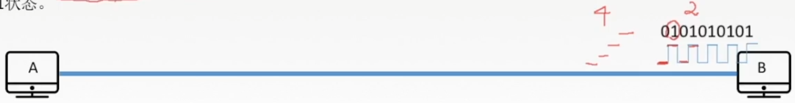

k进制码元 4进制码元 > 码元的离散状态有4个 > 4种高低不同的信号波形 00、01、10、11

## 数字通信系统数据传输速率的两种表示方法

速率也叫数据率，是指数据的传输速率，表示单位时间内传输的数据量。可以用码元传输速率和信息传输速率表示。

1. 码元传输速率：别名码元速率、波形速率、调制速率、符号速率等，它表示单位时间内数字通信系统所传输的码元个数（也可称为脉冲个数或信号变化的次数），单位是波特（Baud）。1波特表示数字通信系统每秒传输一个码元。1s传输多少个码元

   例：若2秒内传4800个码元，码元传输速率是多少？2400Baud

   数字信号有多进制和二进制之分，但码元速率与进制数无关，只与码元长度T有关。
   $$
   R_B=\frac{1}{T}(B)
   $$

2. 信息传输速率：别名信息速率、比特率等，表示单位时间内数字通信系统传输的二进制码元个数（即比特数），单位是比特/秒 (b/s)。

   1s传输多少个比特

   关系：若一个码元携带n bit的信息量，则M Baud的码元传输速率所对应的信息传输速率为Mxn bit/s。

## 带宽 Bandwidth

1. 模拟信号系统中：当输入的信号频率高或低到一定程度，使得系统的输出功率成为输入功率的一半时，最高频率和最低频率间的差值就代表了系统的通频带宽，其单位为赫兹(Hz)。
2. 数字设备中：表示在单位时间内从网络中的某一点到另一点所能通过的“最高数据率”/单位时间内通过链路的数量，常用来表示网络的通信线路所能传输数据的能力。单位是比特每秒(bps)。 

拥有更宽的带宽，也就是有更大的信息运送能力。

# 奈氏准则和香农定理

## 失真

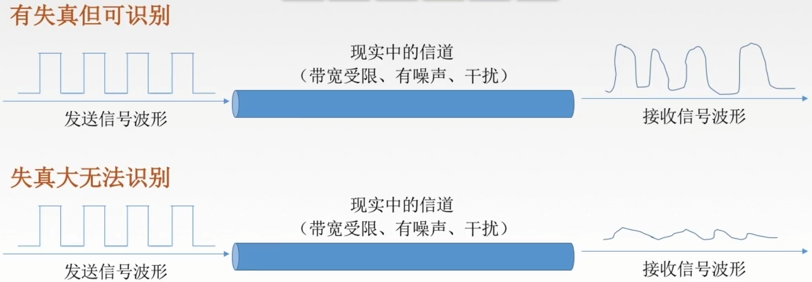

影响失真程度的因素：

1. 码元传输速率
2. 信号传输距离
3. 噪声干扰
4. 传输媒体质量

## 失真的一种现象 码间串扰

 信道带宽是信道能通过的最高频率和最低频率之差。

码间串扰：接收端收到的信号波形失去了码元之间清晰界限的现象。

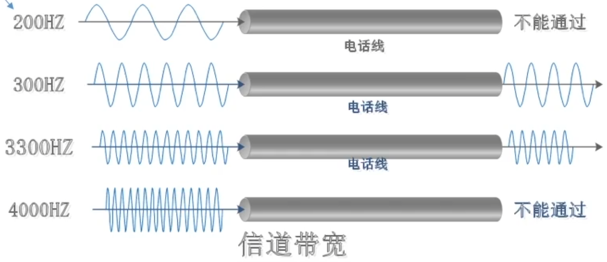

## 奈氏准则（奈奎斯特定理）

奈氏准则：在理想低通（无噪声、带宽受限）条件下，为了避免码间串扰，极限码元传输速率为2W Baud，W是信道带宽，单位是Hz。

只有在这两个公式这带宽采用Hz

理想低通信道下的极限数据传输率
$$
2Wlog_2{V}(b/s)
$$
V：几种码元/码元的离散电平数目

1. 在任何信道中，码元传输的速率是有上限的。若传输速率超过此上限，就会出现严重的码间串扰问题，使接收端对码元的完全正确识别成为不可能。
2. 信道的频带越宽（即能通过的信号高频分量越多），就可以用更高的速率进行码元的有效传输。
3. 奈氏准则给出了码元传输速率的限制，但没有对信息传输速率给出限制。
4. 由于码元的传输速率受奈氏准则的制约，所以要提高数据的传输速率，就必须设法使每个码元能携带更多个比特的信息量，这就需要采用多元制的调制方法。

## 香农定理

噪声存在于所有的电子设备和通信信道中。由于噪声随机产生，它的瞬时值有时会很大，因此噪声会使接收端对码元的判决产生错误。但是噪声的影响是是相对的，若信号较强，那么噪声影响相对较小。因此，信噪比就很重要。

信噪比=信号的平均功率/噪声的平均功率，常记为S/N，并用分贝(dB)作为度量单位，即：
$$
信噪比(dB)=10log_{10}S/N
$$
数值等价

香农定理：在带宽受限且有噪声的信道中，为了不产生误差，信息的数据传输速率有上限值。

信道的极限数据传输速率
$$
Wlog_2(1+S/N)(b/s)
$$
W 带宽(Hz)

信噪比

S是信道所传信号的平均功率

N是信道内的高斯噪声功率

1. 信道的带宽或信道中的信噪比越大，则信息的极限传输速率就越高。
2. 对一定的传输带宽和一定的信噪比，信息传输速率的上限就确定了。
3. 只要信息的传输速率低于信道的极限传输速率，就一定能找到某种方法来实现无差错的传输。
4. 香农定理得出的为极限信息传输速率，实际信道能达到的传输速率要比它低不少。
5. 从香农定理可以看出，若信道带宽W或信噪比S/N没有上限（不可能），那么信道的极限传输速率也就没有上限。

## 奈氏准则和香农定理

### 内忧 奈氏准则

带宽受限无噪声条件下，为了避免码间串扰，码元传输速率的上限2W Baud。

理想低通信道下的极限数据传输率
$$
2Wlog_2 V
$$
要想提高数据率，就要提高带宽/采用更好的编码技术。

### 外患 香农定理

带宽受限有噪声条件下的信息传输速率。

信道的极限数据传输速率
$$
Wlog_2 (1+S/N)
$$
要想提高数据率，就要提高带宽/信噪比。

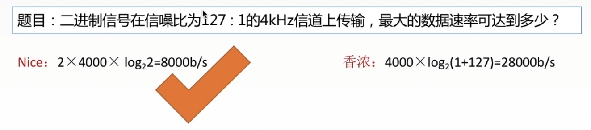

# 编码与调制1

## 基带信号与宽带信号

信道：信号的传输媒介。一般用来表示向某一个方向传送信息的介质，因此一条通信线路往往包含一条发送信道和一条接收信道。

基带信号：将数字信号1和0直接用两种不同的电压表示，再送到数字信道上去传输（基带传输）。来自信源的信号，像计算机输出的代表各种文字或图像文件的数据信号都属于基带信号。基带信号就是发出的直接表达了要传输的信息的信号，比如我们说话的声波就是基带信号。

宽带信号：将基带信号进行调制后形成的频分复用模拟信号，再传送到模拟信道上去传输（宽带传输）。把基带信号经过载波调制后，把信号的频率范围搬移到较高的频段以便在信道中传输（即仅在一段频率范围内能够通过信道）。

在传输距离较近时，计算机网络采用基带传输方式（近距离衰减小，从而信号内容不易发生变化）

在传输距离较远时，计算机网络采用宽带传输方式（远距离衰减大，即使信号变大也能最后过滤出来基带信号）

## 编码与调制

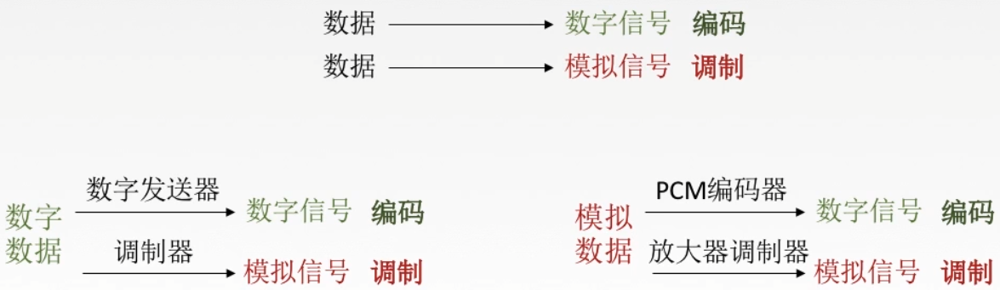

# 编码与调制2

## 数字数据编码为数字信号

1. 非归零编码 NRZ

   编码容易实现，但没有检错功能，且无法判断一个码元的开始和结束，以至于收发双方难以保持同步。

2. 曼彻斯特编码

   将一个码元分成两个相等的间隔，前一个间隔为低电平后一个间隔为高电平表示码元1；码元0则正好相反。也可以采用相反的规定。该编码的特点是在每一个码元的中间出现电平跳变，位中间的跳变既作时钟信号（可用于同步），又作数据信号，但它所占的频带宽度是原始的基带宽度的两倍。

3. 差分曼彻斯特编码

   同1异0

   常用于局域网传输，其规则是：若码元为1，则前半个码元的电平与上一个码元的后半个码元的电平相同，若为0，则相反。该编码的特点是，在每个码元的中间，都有一次电平的跳转，可以实现自同步，且抗干扰性强于曼彻斯特编码。

4. 归零编码 RZ

   信号电平在一个码元之内都要恢复到零的这种编码成编码方式。

5. 反向不归零编码 NRZI

   信号电平翻转表示0，信号电平不变表示1。

6. 4B/5B编码

   比特流中插入额外的比特以打破一连串的0或1，就是用5个比特来编码4个比特的数据，之后再传给接收方，因此称为4B/5B。编码效率为80%。

   只采用16种对应16种不同的4位码，其他的16种作为控制码（帧的开始和结束，线路的状态信息等）或保留。

## 数字数据调制为模拟信号

数字数据调制技术在发送端将数字信号转换为模拟信号，而在接收端将模拟信号还原为数字信号，分别对应于调制解调器的调制和解调过程。

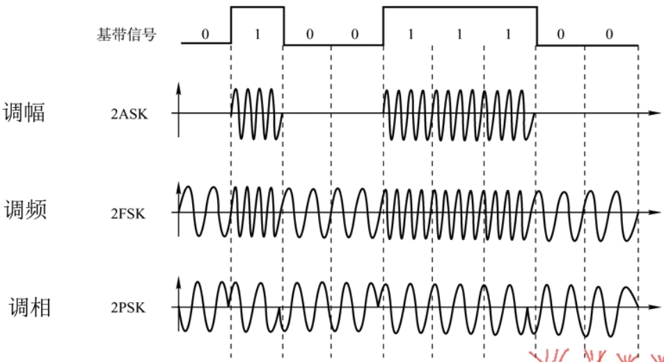

## 模拟数据编码为数字信号

计算机内部处理的是二进制数据，处理的都是数字音频，所以需要将模拟音频通过采样、量化转换成有限个数字表示的离散序列（即实现音频数字化）。

最典型的例子就是对音频信号进行编码的脉码调制（PCM），在计算机应用中，能够达到最高保真水平的就是PCM编码，被广泛用于素材保存及音乐欣赏，CD、DVD以及我们常见的WAV文件中均有应用。它主要包括三步：抽样、量化、编码。

1. 抽样：对模拟信号周期性扫描，把时间上连续的信号变成时间上离散的信号。为了使所得的离散信号能无失真地代表被抽样的模拟数据，要使用采样定理进行采样：
   $$
   f_{采样频率}\geq 2f_{信号最高频率}
   $$

2. 量化：把抽样取得的电平幅值按照一定的分级标度转化为对应的数字值，并取整数，这就把连续的电平幅值转换为离散的数字量。

3. 编码：把量化的结果转换为与之对应的二进制编码。

## 模拟数据调制为模拟信号

为了实现传输有效性，可能需要较高的频率。这种调制方式还可以使用频分复用技术，充分利用带宽资源。在电话机和本地交换机所传输的信号是采用模拟信号传输模拟数据的方式；模拟的声音数据是加载到模拟的载波信号中传输的。

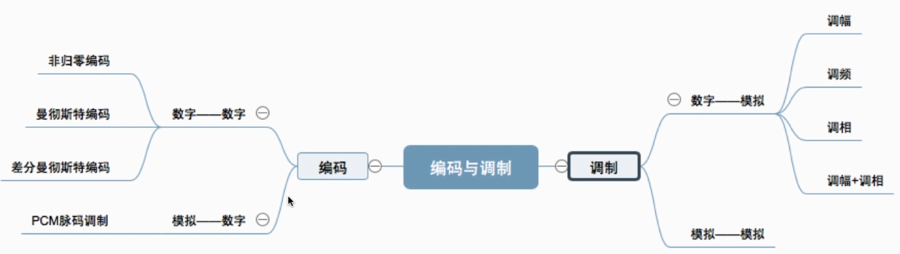

# 数据交换方式

## 为什么要数据交换？

交换是通过某些交换中心将数据进行集中和传送。

传输线路为各个用户共用，从而大大节省通信线路，降低系统费用。

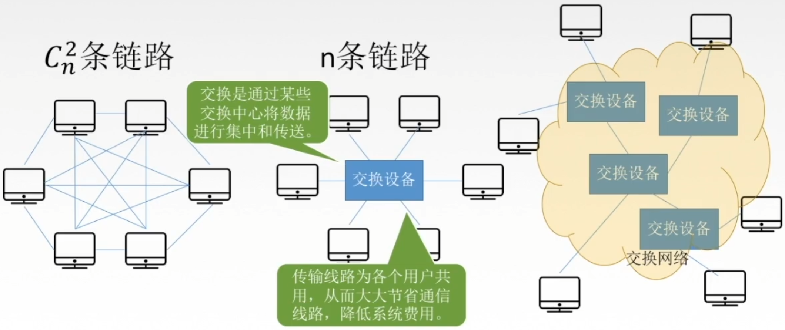

## 数据交换方式

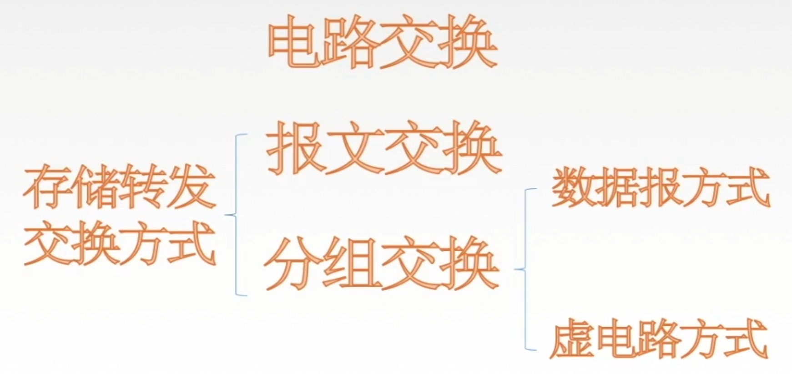

1. 电路交换 Circuit Exchanging

   电路交换的原理：在数据传输期间，源结点与目的结点之间有一条由中间结点构成的专用物理连接线路，在数据传输结束之前，这条线路一直保持。

   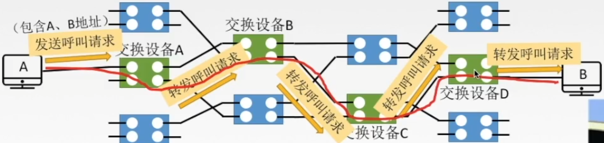

   

   特点：独占资源，用户时钟占用端到端的固定传输带宽。适用于远程批处理信息传输或系统间实时性要求高的大量数据传输的情况。

   电路交换的优缺点

   | 电路交换优点                                                 | 电路交换缺点                                                 |
   | ------------------------------------------------------------ | ------------------------------------------------------------ |
   | 传输时延小                                                   | 建立连接时间长                                               |
   | 数据顺序传送，无失序问题                                     | 线路独占，即使通信线路空闲，也不能供其他用户使用，信道使用效率低 |
   | 实时性强，双方一旦建立物理通路，便可以实时通信，适用于交互式会话类通信。 | 灵活性差，双方连接通路中的任何一点除了故障，必须重新拨号建立新连接，不适应突发性通信。 |
   | 全双工通信，没有冲突，通信双方有不同的信道，不会争用物理信道 | 无数据存储能力，难以平滑通信量。                             |
   | 适用于模拟信号和数字信号                                     | 电路交换时，数据直达，不同类型、不同规格、不同速率的终端很难相互进行通信 |
   | 控制简单，电路的交换设备及控制较简单                         | 无法发现与纠正传输差错，难以在通信过程中进行差错控制。       |

2. 报文交换 存储转发交换方式

   报文：报文（message）是网络中交换与传输的数据单元，即站点一次性要发送的数据块。报文包含了将要发送的完整的数据信息，其长短很不一致，长度不限且可变。

   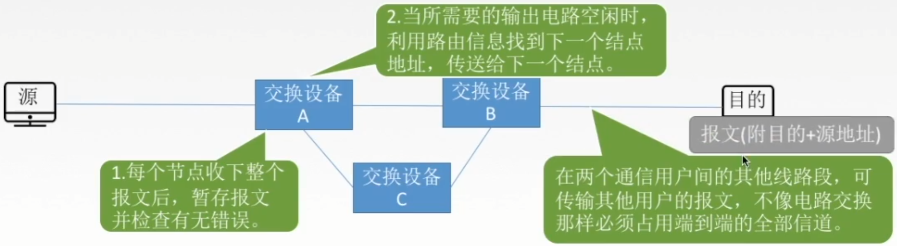

   - 每个节点收下整个报文后，暂存报文并检查有无错误。
   - 当所需要的输出电路空闲时，利用路由信息找到下一个结点地址，传送给下一个结点。
   - 在两个通信用户间的其他线路段，可传输其他用户的报文，不像电路交换那样必须占用端到端的全部信道。

   报文交换的原理：

   无需在两个站点之间建立一条专用通路，其数据传输的单位是报文，传送过程采用存储转发方式。

   | 报文交换优点                                                 | 报文交换缺点                                                 |
   | ------------------------------------------------------------ | ------------------------------------------------------------ |
   | 无需建立连接，无建立连接时延，用户可随时发送报文。           | 实时性差，不适合传送实时或交互式业务的数据。数据进入交换结点后要经历存储转发过程，从而引起转发时延。 |
   | 动态分配线路，动态选择报文通过的最佳路径，可以平滑通信量。   | 只适用于数字信号。                                           |
   | 提高线路可靠性，某条传输路径发生故障，可重新选择另一条路径传输。 提高线路利用率，通信双方在不同的时间一段一段地部分占有这条物理通道，多个报文可共享信道。 提供多目标服务：一个报文可同时发往多个目的地址。 在存储转发中容易实现代码转换和速率匹配，甚至收发双方可以不同时处于可用状态。这样就便于类型、规格和速度不同的计算机之间进行通信。 | 由于报文长度没有限制，而每个中间结点都要完整地接收传来的整个报文，当输出路线不空闲时，还可能要存储几个完整报文等待转发，要求网络中每个结点有较大的缓冲区。为了降低成本，减少结点的缓冲存储器的容量，有时要把等待转发的报文存在磁盘上，进一步增加了传送时延。 |

3. 分组交换 存储转发交换方式 Packet Exchanging

   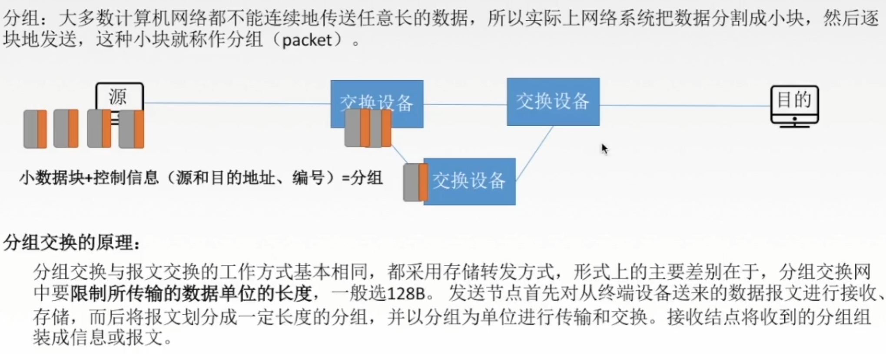

   分组：大多数计算机网络不能连续地传送任意长的数据，所以实际上网络系统把数据分割成小块，然后逐块地发送，这种小块就称作分组（packet）。

   分组交换的原理：

   分组交换与报文交换的工作方式基本相同，都采用存储转发方式，形式上的主要差别在于，分组交换网中限制所传输的数据单位的长度，一般选128B。发送结点首先对从终端设备送来的数据报文进行接收、存储，而后将报文划分成一定长度的分组，并以分组为单位进行传输和交换。接收结点将收到的分组组装成信息或报文。

   | 分组交换优点                                                 | 分组交换缺点                                                 |
   | ------------------------------------------------------------ | ------------------------------------------------------------ |
   | 无建立时延，无需为通信双方预先建立一条专用通信线路，用户可随时发送分组。 | 尽管分组交换比报文交换的传输时延少，但仍存在存储转发时延，而且其结点交换机必须具有更强的处理能力。 |
   | 线路利用率高，通信双方在不同的时间一段一段地部分占有这条物理通道，多个分组可共享信道。 | 每个分组都要加控制信息，一定程度上降低了通信效率，增加了处理的时间。 |
   | 简化了存储管理。因为分组的长度固定，相应的缓冲区的大小也固定，在交换结点中存储器的管理通常被简化为对缓冲区的管理，相对比较容易。 加速传输，后一个分组的存储可以和前一个分组的转发并行操作；传输一个分组比一份报文所需缓冲区小，减少等待发送时间。 减少出错几率和重发数据量，提高可靠性，减少传输时延。 分组短小，适用于计算机之间突发式数据通信。 | 当分组交换采用数据报服务时，可能出现失序、丢失或重复分组，分组到达目的结点时，要对分组按编号进行排序等工作，增加了麻烦。若采用虚电路服务，虽无失序问题，但有呼叫建立、数据传输和虚电路释放三个过程。 |

   - 数据报方式
   - 虚电路方式

## 数据交换方式的选择

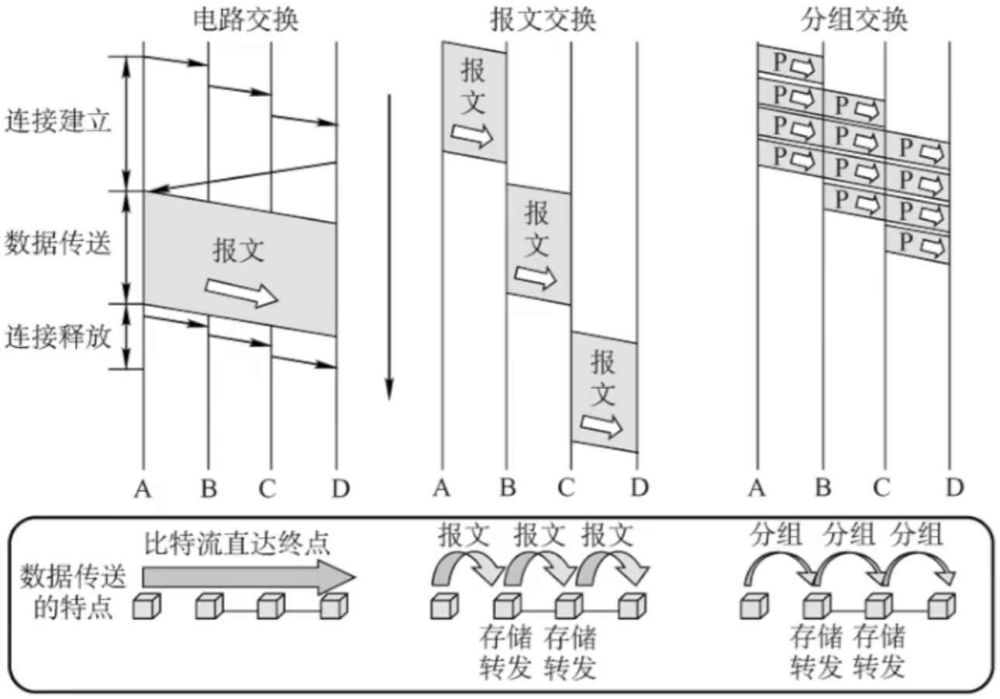

1. 传送数据量大，且传送时间远大于呼叫时，选择电路交换。电路交换传输时延最小。
2. 当端到端的通路有很多段的链路组成时，采用分组交换传送数据较为合适。
3. 从信道利用率上看，报文交换和分组交换优于电路交换，其中分组交换比报文交换的时延小，尤其适合于计算机之间的突发式的数据通信。

## 数据报方式

1. 源主机（A）将报文分成多个分组，依次发送到直接相连的结点（A）。
2. 结点A收到分组后，对每个分组差错检测和路由选择，不同分组的下一跳结点可能不同。
3. 结点C收到分组P1后，对分组P1进行差错检测，若正确则向A发送确认信息，A收到C确认后则丢弃分组P1副本。
4. 所有分组到达主机（B）。

## 数据报方式的特点

1. 数据报方式为网络层提供无连接服务。发送方可随时发送分组，网络中的结点可随时接收分组。

   无连接服务：不事先为分组的传输确定传输路径，每个分组独立确定传输路径，不同分组传输路径可能不同。

2. 同一报文的不同分组达到目的重点时可能发生乱序、重复与丢失。

3. 每个分组在传输过程中都必须携带源地址和目的地址，以及分组号。

4. 分组在交换结点存储转发时，需要排队等候处理，这会带来一定的时延。当通过交换结点的通信量较大或网络发生拥塞时，这种时延会大大增加，交换结点还可根据情况丢弃部分分组。

5. 网络具有冗余路径，当某一交换结点或一段链路出现故障时，可相应地更新转发表，寻找另一条路径转发分组，对故障的适应能力强，适用于突发性通信，不适于长报文、会话式通信。

## 虚电路方式

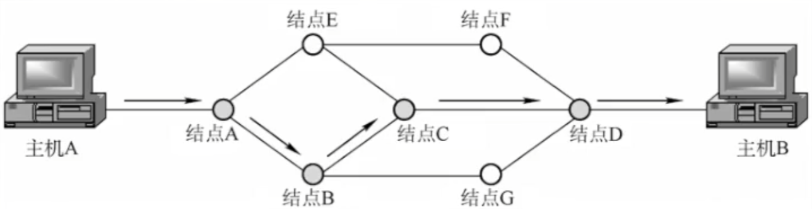

虚电路将数据报方式和电路交换方式结合，以发挥两者优点。

虚电路：一条源主机到目的主机类似于电路的路径（逻辑连接），路径上所有结点都要维持这条虚电路的建立，都维持一张虚电路表，每一项记录了一个打开的虚电路的信息。

- 源主机发送“呼叫请求”分组并收到”呼叫应答“分组后才算建立连接。
- 每个分组携带虚电路号，分组号、检验和等控制信息。
- 源主机发送”释放请求“分组以拆除虚电路。

## 虚电路方式的特点

1. 虚电路方式为网络层提供连接服务。源节点与目的结点之间建立一条逻辑连接，而非实际物理连接。

   连接服务：首先为分组的传输确定传输路径（建立连接），然后沿该路径（连接）传输系列分组，系列分组传输路径相同，传输结束后拆除连接。

2. 一次通信的所有分组都通过虚电路顺序传送，分组不需携带源地址、目的地址等信息，包括虚电路号，相对数据报方式开销小，同一报文的不同分组到达目的结点时不会乱序、重复或丢失。

3. 分组通过虚电路上的每个结点时，结点只进行差错检测，不需进行路由选择。

4. 每个结点可能与多个结点之间建立多条虚电路，每条虚电路支持特定的两个端系统之间的数据传输，可以对两个数据端点的流量进行控制，两个端系统之间也可以有多条虚电路为不同的进程服务。

5. 致命弱点：当网络中的某个结点或某条链路出故障而彻底失效时，则所有经过该结点或该链路的虚电路将遭到破坏。

## 数据报&虚电路

|                    | 数据报服务                                                 | 虚电路服务                                               |
| ------------------ | ---------------------------------------------------------- | -------------------------------------------------------- |
| 连接的建立         | 不要                                                       | 必须有                                                   |
| 目的地址           | 每个分组都有完整的目的地址                                 | 仅在建立连接阶段使用，之后每个分组使用长度较短的虚电路号 |
| 路由选择           | 每个分组独立地进行路由选择和转发                           | 属于同一条虚电路的分组按照同一路由转发                   |
| 分组顺序           | 不保证分组的有序到达                                       | 保证分组的有序到达                                       |
| 可靠性             | 不保证可靠通信，可靠性由用户主机来保证                     | 可靠性由网络保证                                         |
| 对网络故障的适应性 | 出故障的结点丢失分组，其他分组路径选择发生变化，可正常传输 | 所有经过故障结点的虚电路均不能正常工作                   |
| 差错处理和流量控制 | 由用户主机进行流量控制，不保证数据报的可靠性               | 可由分组交换网络负责，也可由用户主机负责                 |

# 物理层传输介质

## 传输介质及分类

传输介质也称传输媒体/传输媒介，它就是数据传输系统中在发送设备和接收设备之间的物理通路。

传输媒体并不是物理层。传输媒体在物理层的下面，因为物理层是体系结构的第一层，因此有时称传输媒体为0层。在传输媒体中传输的是信号，但传输媒体并不知道所传输的信号代表什么意思。但物理层规定了电气特性，因此能够识别所传送的比特流。

物理层是傻瓜，传输媒体连傻瓜都不如

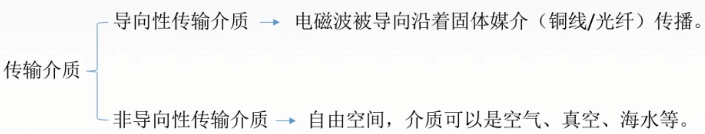

## 导向性传输介质 1.双绞线

双绞线是古老、又最常用的传输介质，它由两根采用一定规则并排绞合的、相互绝缘的铜导线组成。

绞合可以减少对相邻导线的电磁干扰。

为了进一步提高抗电磁干扰能力，可在双绞线的外面再加上一个由金属丝编织成的屏蔽层，这就是屏蔽双绞线（STP），无屏蔽层的双绞线就称为非屏蔽双绞线（UTP）。

双绞线价格便宜，是最常用的传输介质之一，在局域网和传统电话网中普遍使用。模拟传输和数字传输都可以使用双绞线，其通信距离一般为几公里到数十公里。距离太远时，对于模拟传输，要用放大器放大衰减的信号；对于数字传输，要用中继器将失真的信号整形。

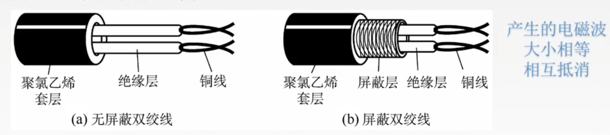

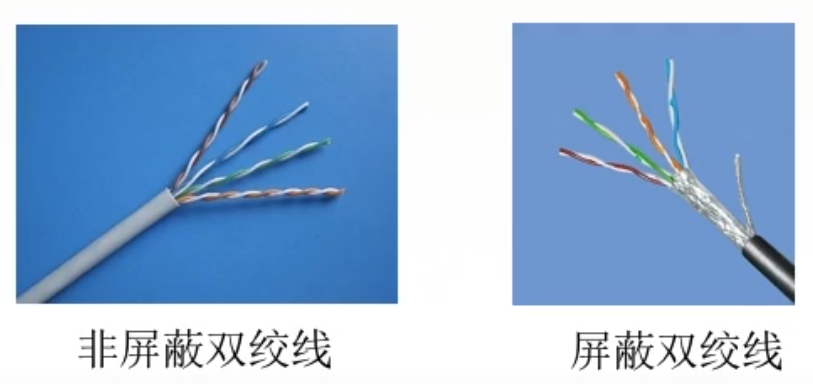

## 导向性传输介质 2.同轴电缆

同轴电缆由导体铜质芯线、绝缘层、网状编制屏蔽层和塑料外层构成。按特性阻抗数值的不同，通常将同轴电缆分为两类：50Ω同轴电缆和75同轴电缆。其中，50Ω同轴电缆主要用于传送基带数字信号，又称基带同轴电缆，它在局域网中得到广泛应用；75Ω同轴电缆主要用于传送宽带信号，又称为宽带同轴电缆，它主要用于有线电视系统。

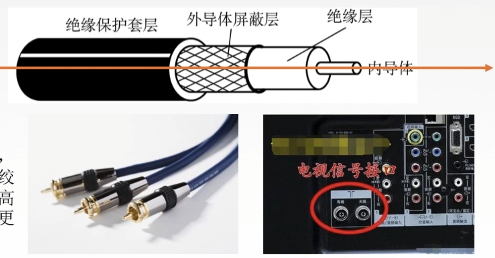

同轴电缆vs双绞线

由于外导体屏蔽层的作用，同轴电缆抗干扰特性比双绞线好，被广泛用于传输较高速率的数据，其传输距离更远，但价格较双绞线贵。

## 导向性传输介质 3.光纤

光纤通信就是利用光导纤维（简称光纤）传递光脉冲来进行通信。有光脉冲表示1，无光脉冲表示0。而可见光的频率大约是10的8次方MHz，因此光纤通信系统的带宽远远大于目前其他各种传输媒体的带宽。

光纤在发送端有光源，可以采用发光二极管或半导体激光器，它们在电脉冲作用下能产生出光脉冲；在接收端用光电二极管做成光检测器，在检测到光脉冲时可还原出电脉冲。

光纤主要由纤芯（实心）和包层构成，光波通过纤芯进行传导，包层纤芯有较低的折射率。当光纤从高折射率的介质射向低折射率的介质时，其折射角将大于入射角。因此，如果入射角足够大，就会出现全反射，即光纤碰到包层时候就会折射回纤芯、这个过程不断重复，光也就沿着光纤传输下去。

超低损耗，传送超远距离

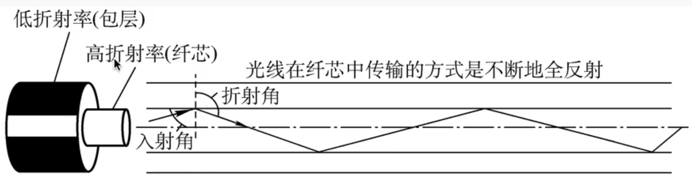

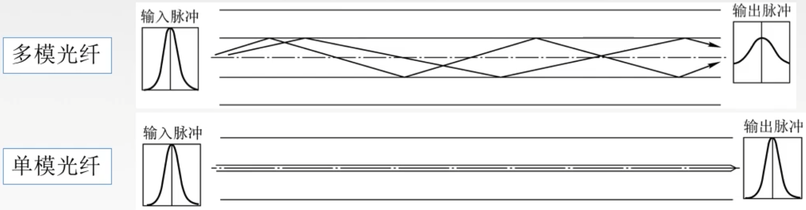

|          | 定义                               | 光源                   | 特点                   | 外观        |
| -------- | ---------------------------------- | ---------------------- | ---------------------- | ----------- |
| 单模光纤 | 一种在横向模式直接传输光信号的光纤 | 定向性很好的激光二极管 | 衰耗小，适合远距离传输 | 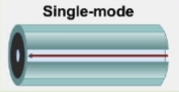 |
| 多模光纤 | 有多种传输光信号模式的光纤         | 发光二极管             | 易失真，适合近距离传输 | 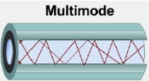 |

光纤的特点：

1. 传输损耗小，中继距离长，对远距离传输特别经济。
2. 抗雷电和电磁干扰性能好。
3. 无串音干扰，保密性好，也不易被窃听或截取数据。
4. 体积小，重量轻。

## 非导向性传输介质

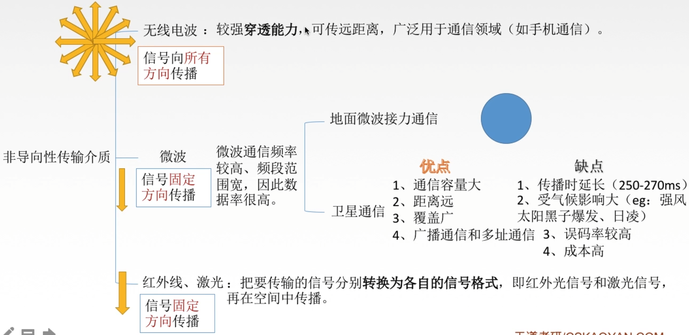

1. 无线电波

   信号向所有方向传播

   较强穿透能力，可传远距离，广泛用于通信领域（如手机通信）。

2. 微波

   信号固定方向传播

   微波通信频率高、频段范围宽，因此数据率很高。

   地面微波接力通信

   卫星通信

3. 红外线、激光

   信号固定方向传播

   把要传输的信号分别转换为各自的信号格式，即红外光信号和激光信号，再在空间中传播。

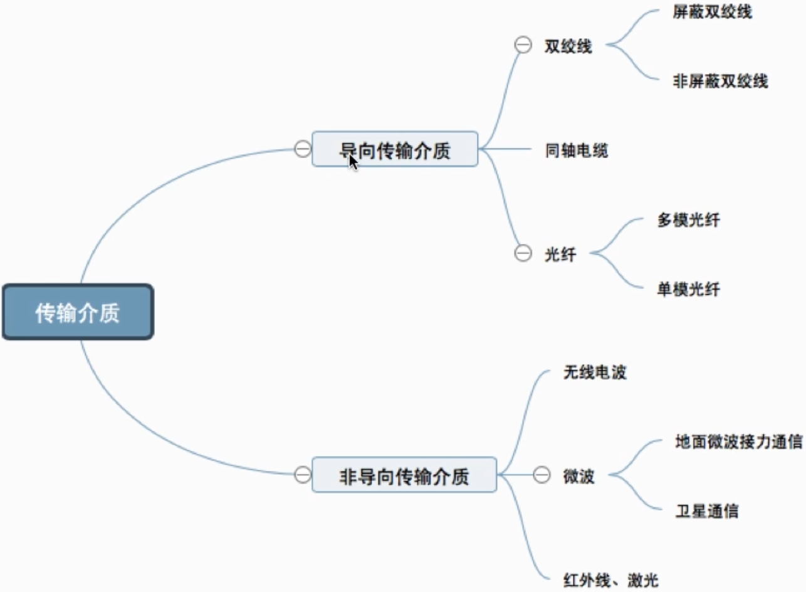

# 物理层设备

## 中继器

诞生原因：由于存在损耗，在线路上传输的信号功率会逐渐衰减，衰减到一定程度时将造成信号失真，因此会导致接收错误。

中继器的功能：对信号进行再生和还原，对衰减的信号进行放大，保持与原数据相同，以增加信号传输的距离，延长网络的长度。

中继器的两端：两端的网络部分是网段，而不是子网，适用于完全相同的两类网络的互连，且两个网段速率要相同。中继器只将任何电缆段上的数据发送到另一段电缆上，它仅作用于信号的电气部分，并不管数据中是否有错误数据或不适于网段的数据。两端可连相同媒体，也可连不同媒体。中继器两端的网段一定要是同一个协议。（中继器不会存储转发）

5-4-3规则：网络标准中都对信号的延迟范围作了具体的规定，因而中继器只能在规定的范围内进行，否则会网络故障。

## 集线器（多口中继器）

再生，放大信号

集线器的功能：对信号进行再生放大转发，对衰减的信号进行放大，接着转发到其他所有（除输入端口外）处于工作状态的端口上，以增加信号传输额距离，延长网络的长度。不具备信号的定向传送能力，是一个共享式设备。

集线器不能分割冲突域 > 连在集线器上的工作主机平分带宽