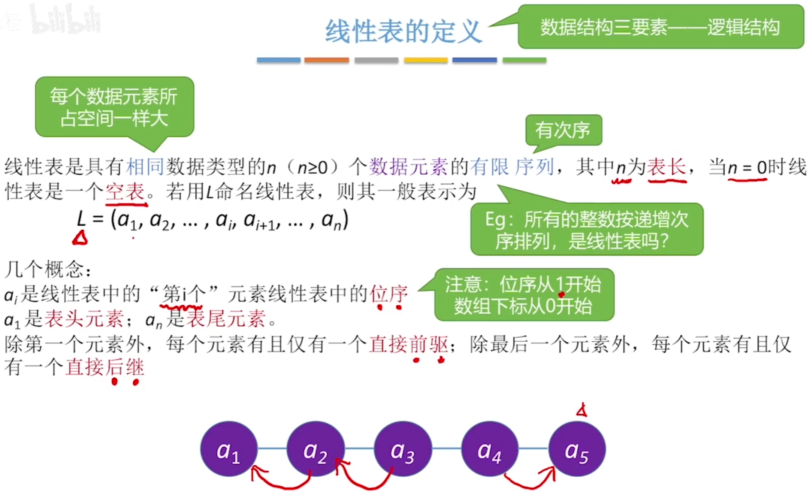
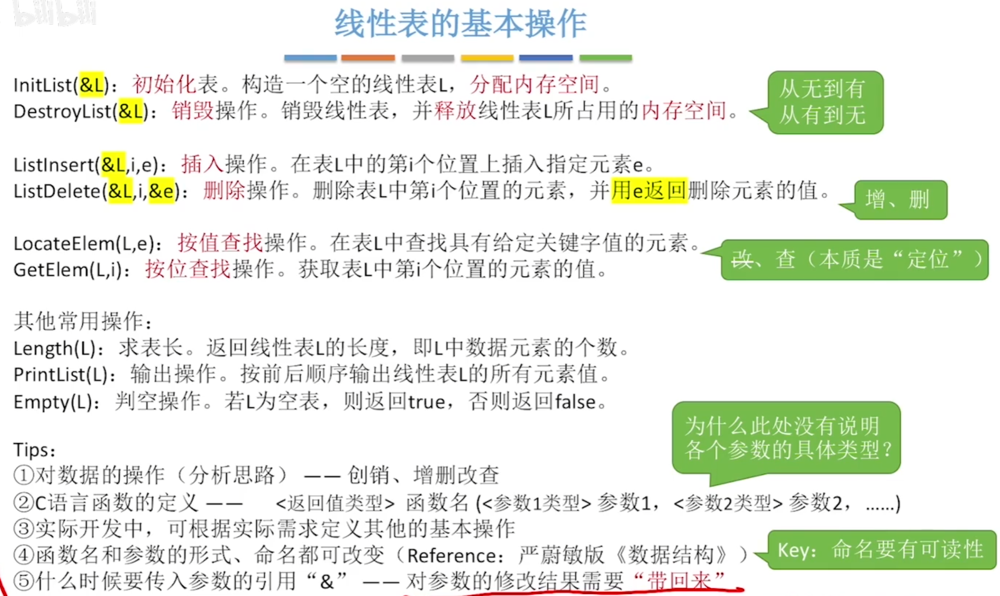
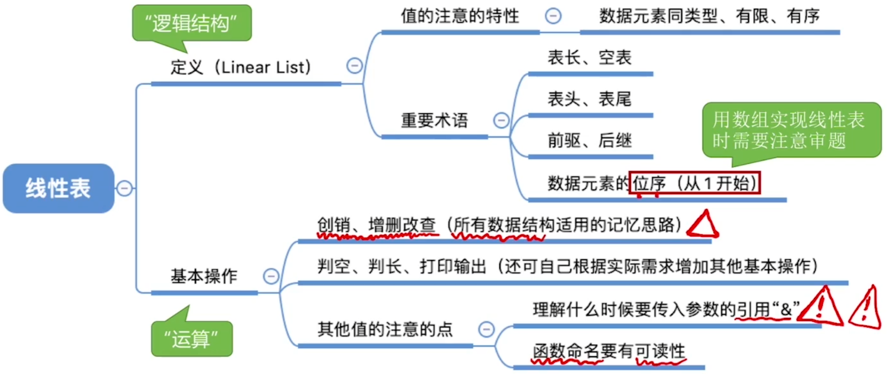

# 线性表的定义和基本操作

注：数据结构三要素——逻辑结构、数据的运算、存储结构（物理结构）

## 线性表的定义

##  线性表的基本操作

初始化表。构造一个空的线性表L，分配内存空间。

销毁操作。销毁线性表，从释放线性表L所占用的内存空间。

从无到有 从有到无

插入操作。在表L中的第i个位置上插入指定元素e。

删除操作。删除表L中第i个位置的元素，并用e返回删除元素的值。

按值查找操作。在表L中查找具有给定关键字值的元素。

按位查找操作。获取表L中第i个位置的元素的值。

其他常用操作：

求表长。返回线性表L的长度，即L中数据元素的个数。

输出操作。按前后顺序输出线性表L的所有元素值。

判空操作。若L为空表，则返回true，否则返回false。

tips:

1. 对数据的操作 创销、增删改查
2. C语言函数的定义 <返回值类型>函数名(<参数1类型>参数1， <参数2类型>参数2, ......)
3. 实际开发中，可根据实际需求定义其他的基本操作
4. 函数名和参数的形式、命名都可改变
5. 什么时候要传入引用”&“ 对参数的修改结果需要”带回来“

为什么要实现对数据结构的基本操作？

1. 团队合作编程，你定义的数据结构要让别人能够很方便的使用（封装）
2. 将常用的操作/运算封装成函数，避免重复工作，降低出错风险

