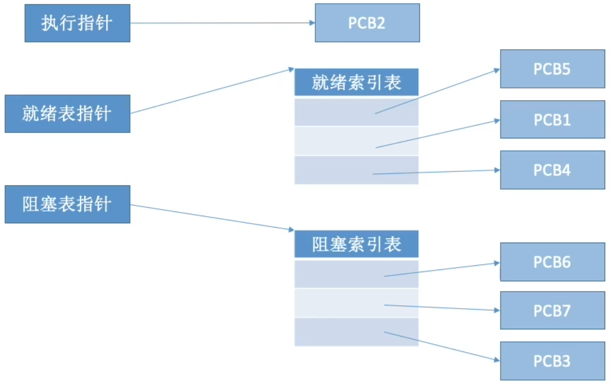

# 进程的概念、组成、特征

## 进程的概念

程序：是静态的，就是个存放在磁盘里的可执行文件，就是一系列的指令集合。

进程（Process）：是动态的，是程序的一次执行过程

同一个程序多次执行会对应多个进程

思考：操作系统是这些进程的管理者，它要怎么区分各个进程？

## 进程的组成 PCB

当进程被创建时，操作系统会为该进程分配一个唯一的、不重复的“身份证号” PID（Process ID，进程ID）

操作系统要记录PID、进程所属用户ID（UID）

基本的进程描述信息，可以让操作系统区分各个进程

还要记录给进程分配了哪些资源（如：分配了多少内存、正在使用哪些I/O设备、正在使用哪些文件）

可用于实现操作系统对资源的管理

还要记录进程的运行情况（如：CPU使用时间、磁盘使用情况、网络流量使用情况等）

可用于实现操作系统对进程的控制、调度

这些信息都被保存在一个数据结构PCB（Process Control Block）中，即进程控制块

操作系统需要对各个并发运行的进程进行管理，但凡管理时所需要的信息，都会被放在PCB中

PCB是进程存在的唯一标志，当进程被创建时，操作系统为其创建PCB，当进程结束时，会回收其PCB。

操作系统对进程进行管理工作所需的信息都存在PCB中

## 进程的组成 程序段、数据段

PCB是给操作系统用的。

程序段、数据段是给进程自己用的。

一条高级语言的代码翻译过来可能会对应多条机器指令

程序运行的过程其实就是CPU执行一条一条的机器指令的过程

运行前需要把程序放入内存

一个程序开始运行前，需要创建对应的进程，也就要创建相应的PCB

程序段 包含程序指令

CPU从内存中取出指令

数据段 包含运行过程中产生的各种数据

一个进程实体（进程映像）由PCB、程序段、数据段组成。

进程是动态的，进程实体（进程映像）是静态的。

进程实体反应了进程在某一时刻的状态（如：x++后，x=2）

## 进程的组成

程序段、数据段、PCB三部分组成了进程实体（进程映像）

引入进程实体的概念后，可把进程定义为：

进程是进程实体的运行过程，是系统进行资源分配和调度的一个独立单位。

注意：PCB是进程存在的唯一表示！

同时挂三个QQ号，会对应三个QQ进程，它们的PCB、数据段各不相同，但程序段的内容都是相同的（都是运行着相同的QQ程序）

一个进程被”调度“，就是指操作系统决定让这个进程上CPU运行

## 进程的特征

程序是静态的，进程是动态的，相比于程序，进程拥有以下特征：

# 进程的状态与转换、进程的组织

## 进程的状态

进程的整个生命周期中，大部分时间都处于三种基本状态

单CPU情况下，同一时刻只会有一个进程处于运行态，多核CPU情况下，可能有多个进程处于运行态

进程PCB中，会有一个变量state来表示进程的当前状态。如：1表示创建态、2表示就绪态、3表示运行态...

为了对同一个状态下的各个进程进行统一的管理，操作系统会将各个进程的PCB组织起来。

### 创建态、就绪态

进程正在被创建时，它的状态是”创建态“，在这个阶段操作系统会为进程分配资源、初始化PCB

当进程创建完成后，便进入”就绪态“，处于就绪态的进程已经具备运行条件，但由于没有空闲CPU，就暂时不能运行

### 运行态

系统中可能有很多个进程都处于就绪态

当CPU空闲时，操作系统就会选择一个就绪进程，让它上处理机运行

如果一个进程此时在CPU上运行，那么这个进程处于”运行态“。

CPU会执行该进程对应的程序（执行指令序列）

在获得所需资源之前，进程无法再往下执行

在进程运行的过程中，可能会请求等待某个事件的发生（如等待某种系统资源的分配，或者等待其他进程的相应）。

在这个事件发生之前，进程无法继续往下执行，此时操作系统会让这个进程下CPU，并让它进入”阻塞态“

### 终止态

一个进程可以执行exit系统调用，请求操作系统终止该进程。

此时该进程会进入”终止态“，操作系统会让该进程下CPU，并回收内存空间等资源，最后还要回收该进程的PCB。当终止进程的工作完成之后，这个进程就彻底消失了。

### 进程状态的转换

进程用”系统调用“的方式申请某种系统资源，或者请求等待某个事件发生 

注意：不能由阻塞态直接转换为运行态，也不能由就绪态直接转换为阻塞态（因为进入阻塞态是进程主动请求的，必然需要进程在运行时才能发出这种请求）

## 进程的组织

### 进程的组织 链接方式

- 执行指针

  指向当前处于运行态（执行态）的进程

  单CPU计算机中，同一时刻只会有一个进程处于运行态

- 就绪队列指针

  指向当前处于就绪态的进程

  通常会把优先级高的进程放在队头

- 阻塞队列指针

  指向当前处于阻塞态的进程

  很多操作系统还会根据阻塞原因不同，再分为多个阻塞队列

### 进程的组织 索引方式

# 进程控制

进程控制的主要功能是对系统中的所有进程实施有效的管理，它具有创建新进程、撤销已有进程、实现进程状态转换等功能。

## 如何实现进程控制？

用“原语”实现

原语是一种特殊的程序，它的执行具有原子性。也就是说，这段程序的运行必须是一气呵成，不可中断

思考：为何进程控制（状态转换）的过程要”一气呵成“？

eg. 假设PCB中的变量state表示进程当前所处状态，1表示就绪态，2表示阻塞态...

假设此时进程2等待的时间发生，则操作系统中，负责进程控制的内核程序至少需要做这样两件事：

1. 将PCB2的state设为1
2. 将PCB2从阻塞队列放到就绪队列

完成了第一步后收到中断信号，那么PCB2的state=1，但是它却被放在阻塞队列里

如果不能”一气呵成“，就有可能导致操作系统中的某些关键数据结构不同意的情况，这回影响操作系统进行别的管理工作

## 如何实现原语的”原子性“？

原语的执行具有原子性，即执行过程只能一气呵成，期间不允许被中断。

可以用”关中断指令“和”开中断指令“这两个特权指令实现原子性

正常情况：CPU每执行完一条指令都会例行检查是否有中断信号需要处理，如果有，则暂停运行当前这段程序，转而执行相应的中断处理程序。

CPU执行了关中断指令之后，就不再例行检查中断信号，直到执行开中断指令之后才会恢复检查。

这样，关中断、开中断之间的这些指令序列就是不可被中断的，这就实现了“原子性”

思考：如果这两个特权指令允许用户程序使用的话，会发生什么情况？

## 进程控制相关的原语

