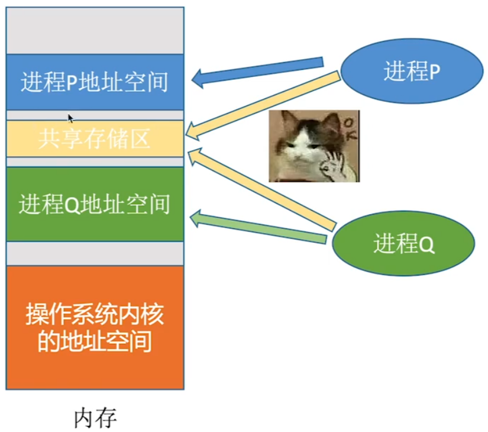
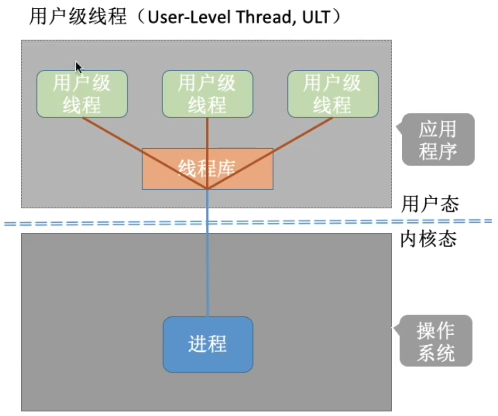

# 进程控制

## 进程控制相关的原语

CPU中会设置很多“寄存器”，用来存放程序运行过程中所需的某些数据

PSW：程序状态字寄存器

PC：程序计数器，存放当前正在执行的指令

IR：指令寄存器，存放当前正在执行的指令

通用寄存器：其他一些必要信息

这些指令顺序执行的过程中，很多中间结果是放在各种寄存器中的

思考：执行完指令3后，另一个进程开始上CPU运行。

注意：另一个进程在运行过程中也会使用各个寄存器

解决方法：在进程切换时先在PCB中保存这个进程的运行环境（保存一些必要的寄存器信息）

PSW：xxxxx

PC：指令4的地址

通用寄存器：2

（保存一些必要的寄存器信息）

当原来的进程再次投入运行时，可以通过PCB恢复它的运行环境

无论哪个进程控制原语，要做的无非三类事情：

1. 更新PCB中的信息

   修改进程状态（state）

   保存/恢复运行环境

2. 将PCB插入合适的队列

3. 分配/回收资源

# 进程通信

## 什么是进程间通信？

进程间通信（Inter-Process Communication, IPC）是指两个进程之间产生数据交互。

## 为什么进程通信需要操作系统支持？

进程是分配系统资源的单位（包括内存地址空间），因此各进程拥有的内存地址空间相互独立。

为了保证安全，一个进程不能直接访问另一个进程的地址空间。

## 共享存储

注：通过”增加页表项/段表项“即可将同一片共享内存区映射到各个进程的地址空间中

 为避免出错，各个进程对共享空间的访问应该是互斥的。

各个进程可使用操作系统内核提供的同步互斥工具（如P、V操作）

基于存储区的共享：操作系统在内存中划出一块共享存储区，数据的形式、存放位置都由通信进程控制，而不是操作系统。这种共享方式速度很快，是一种高级通信方式。

基于数据结构的共享：比如共享空间里只能放一个长度为10的数组。这种共享空间速度慢、限制多，是一种低级通信方式。

## 消息传递

进程间的数据交换以格式化的消息（Message）为单位。进程通过操作系统提供的”发送消息/接受消息“两个原语进行数据交换。

消息头包括：

发送进程ID

接收进程ID

消息长度等格式化的信息

消息发送进程要知名接收进程的ID

通过”信箱“间接地通信。因此又称”信箱通信方式“

### 直接通信方式

直接通信方式，点名道姓的消息传递。

### 间接通信方式

间接通信方式，以”信箱“作为中间实体进行消息传递。

可以多个进程往同一个信箱send消息，也可以多个进程从同一个信箱中receive消息

## 管道通信

”管道“是一个特殊的共享文件，又名pipe文件。其实就是在内存中开辟一个大小固定的内存缓冲区

1. 管道只能采用半双工通信，某一时间段内只能实现单向的传输。如果要实现双向同时通信，则需要设置两个管道。
2. 各进程要互斥地访问管道（由操作系统实现）
3. 当管道写满时，写进程将阻塞，直到读进程将管道中的数据取走，即可唤醒写进程。
4. 当管道读空时，读进程将阻塞，直到写进程往管道中写入数据，即可唤醒读进程。
5. 管道中的数据一旦被读出，就彻底消失。因此，当多个进程读同一个管道时，可能会错乱。对此，通常有两种解决方案：
   - 一个管道允许多个写进程，一个读进程；
   - 允许有多个写进程，多个读进程，但系统会让各个读进程轮流从管道中读数据（Linux的方案）

写进程往管道写数据，即便管道没被写满，只要管道没空，读进程就可以从管道读数据

读进程从管道读数据，即便管道没被读空，只要管道没满，写进程就可以往管道写数据

# 线程的概念

## 什么是线程，为什么要引入线程？

还没引入进程之前，系统中各个程序只能串行执行。

进程是程序的一次执行。但这些功能显然不可能是由一个程序顺序处理就能实现的。

有的进程可能需要”同时“做很多事，而传统的进程只能串行地执行一系列程序。为此，引入了”线程“，来增加并发度。

传统的进程是程序执行流的最小单位

引入线程后，线程成为了程序执行流的最小单位

可以把线程理解为”轻量级进程“。

线程是一个基本的CPU执行单元，也是程序执行流的最小单位。

引入线程之后，不仅是进程之间可以并发，进程内的各线程之间也可以并发，从而进一步提升了系统的并发度，使得一个进程内也可以并发处理各种任务（如QQ视频、文字聊天、传文件）

引入线程后，进程只作为除CPU之外的系统资源的分配单元（如打印机、内存地址空间等都是分配给进程的）

## 引入线程机制后，有什么变化？

## 线程的属性

# 线程的实现方式和多线程模型

## 线程的实现方式

### 用户级线程（User-Level Thread, ULT）

历史背景：早期的操作系统（如，早期Unix）只支持进程，不支持线程。当时的”线程“是由线程库实现的

从代码的角度看，线程其实就是一段代码逻辑。上述三段代码逻辑上可以看作三个“线程”。while循环是一个最弱智的“线程库”，线程库完成了对线程的管理工作（如调度）。

 很多编程语言提供了强大的线程库，可以实现线程的创建、销毁、调度等功能。

1. 线程的管理工作由谁来完成？

2. 线程切换是否需要CPU变态？

3. 操作系统是否能意识到用户级线程的存在？

4. 这种线程的实现方式有什么优点和缺点？

   优点：用户及线程的切换在用户空间即可完成，不需要切换到核心态，线程管理的系统开销小，效率高

   缺点：当一个用户级线程被阻塞后，整个进程都会被阻塞，并发度不高。多个线程不可在多核处理及上并行运行。

### 内核级线程（Kernel-Level Thread, KLT, 又称“内核支持的线程”）

大多数现代操作系统都实现了内核级线程，如Windows、Linux

由操作系统支持的线程

1. 线程的管理工作由谁来完成？

   内核级线程的管理工作由操作系统内核完成。

2. 线程切换是否需要CPU变态？

   线程调度、切换等工作都由内核负责，因此内核级线程的切换必然需要在核心态下才能完成。

3. 操作系统是否能意识到内核级线程的存在？

   操作系统会为每个内核级线程建立相应的TCB（Thread Control Block, 线程控制块），通过TCB对线程进行管理。“内核级线程”就是“从操作系统内核视角看能看到的线程”

4. 这种线程的实现方式有什么优点和缺点？

   优点：当一个线程被阻塞后，别的线程还可以继续执行，并发能力强。多线程可在多核处理机上并行执行。

   缺点：一个用户进程会占用多个内核级线程，线程切换由操作系统内核完成，需要切换到核心态，因此线程管理的成本高，开销大。

## 多线程模型

在支持内核级线程的系统中，根据用户级线程和内核级线程的映射关系，可以划分为几种多线程模型

### 一对一模型

一对一模型：一个用户级线程映射到一个内核级线程。每个用户进程有与用户级线程同数量的内核级线程。

优点：当一个线程被阻塞后，别的线程还可以继续执行，并发能力强。多线程可在多核处理机上并行执行。

缺点：一个用户进程会占用多个内核级线程，线程切换由操作系统内核完成，需要切换到核心态，因此线程管理的成本高，开销大。

### 多对一模型

多对一模型：多个用户级线程映射到一个内核级线程。且一个进程只被分配一个内核级线程。

优点：用户级线程的切换在用户空间即可完成，不需要切换到核心态，线程管理的系统开销小，效率高

缺点：当一个用户级线程被阻塞后，整个进程都会被阻塞，并发度不高。多个线程不可在多处理机上并行运行

重点：

操作系统只“看得见”内核级线程，因此只有内核级线程才是处理机分配的单位。

### 多对多模型

多对多模型：n用户级线程映射到m个内核级线程（n>=m）。每个用户进程对应m个内核级线程。

克服了多对一模型并发度不高的缺点（一个阻塞全体阻塞），又克服了一对一模型中一个用户进程占用太多内核级线程，开销太大的缺点。

可以这么理解：

用户级线程是“代码逻辑”的载体

内核级线程是“运行机会”的载体

内核级线程才是处理及分配的单位。例如：多核CPU环境下，左边这个进程最多能被分配两个核。

一段“代码逻辑”只有获得了“运行机会”才能被CPU执行

内核级线程中可以运行任意一个有映射关系的用户级线程代码，只有两个内核级线程中正在运行的代码逻辑都阻塞时，这个进程才会阻塞。

# 线程的状态与转换

## 线程的组织与控制

