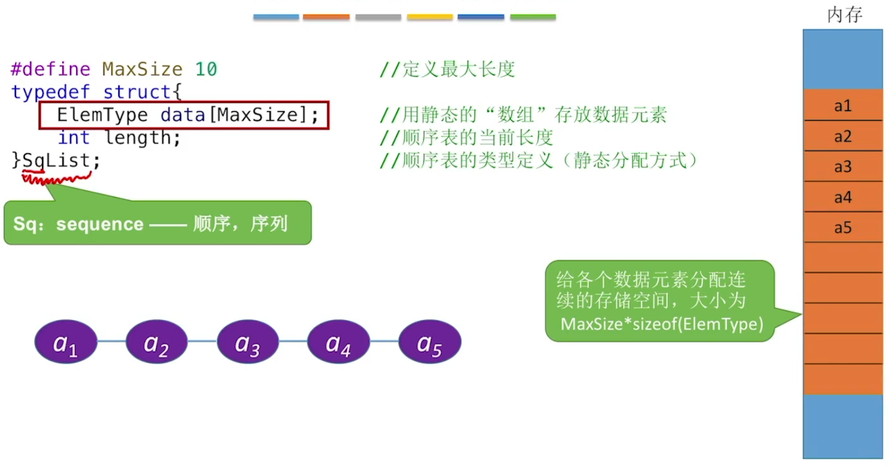

# 顺序表的定义

顺序表 用顺序存储的方式实现线性表顺序存储。把逻辑上相邻的元素存储在物理位置上也相邻的存储单元中，元素之间的关系由存储单元的邻接关系来体现。

线性表是具有相同数据类型的n(n>=0)个数据元素的有限序列 每个数据元素所占空间一样大

## 顺序表的实现

### 静态分配

内存中会有遗留的“脏数据”

更好的做法是使用基本操作来访问各个数据元素

Q：如果”数组“存满了怎么办？

A：顺序表的表长刚开始确定后就无法更改（存储空间是静态的）

思考：如果刚开始就声明一个很大的内存空间呢？存在什么问题？

### 动态分配

顺序表的特点：

1. 随机访问，即可以在O(1)时间内找到第i个元素。

   代码实现：data[i=1];

   静态分配、动态分配都一样

2. 存储密度高，每个结点只存储数据元素

3. 扩展容量不方便（即便采用动态分配的方式实现，拓展长度的时间复杂度也比较高）

4. 插入、删除操作不方便，需要移动大量元素

# 顺序表的插入删除

用存储位置的相邻来体现数据元素之间的逻辑关系

## 插入

ListInsert(&L,i,e)：插入操作。在表L中的第i个位置上插入指定元素e。

注：本节代码建立在顺序表的”静态分配“实现方式之上，”动态分配“也雷同。

基本操作：在L的位序i处插入元素e

注意位序、数组下标的关系，并从后面的元素依次移动

基操 让自己实现的数据结构可以让别人很方便地使用

好的算法，应该具有”健壮性“。能处理异常情况，并给使用者反馈

### 插入操作的时间复杂度

关注最深层循环语句的执行次数与问题规模n的关系

最好情况：新元素插入到表尾，不需要移动元素

i=n+1，循环0次；最好时间复杂度=O(1)

最坏情况：新元素插入到表头，需要将原有的n个元素全都向后移动

i=1，循环n次；最坏时间复杂度=O(n)

平均情况：假设新元素插入到任何一个位置的概率相同，即i=1,2,3,...,length+1的概率都是p=1/(n+1)

i=1，循环n次；i=2，循环n-1次；i=3，循环n-2次...i=n+1时，循环0次

平均时间复杂度=O(n)

## 删除

注意位序、数组下标的关系，并从前面的元素依次移动

### 删除操作的时间复杂度

问题规模n=L.length（表长）

最好情况：删除表尾元素，不需要移动其他元素

i=n，循环0次；最好时间复杂度O(1)

最坏情况：删除表头元素，需要将后续的n-1个元素全都向前移动

i=1，循环n-1次；最坏时间复杂度O(n)

平均情况：假设删除任何一个元素的概率相同，即i=1,2,3,...,length的概率都是p=1\n

i=1，循环n-1次；i=2时，循环n-2次；i=3，循环n-3次...i=n时，循环0次

平均循环次数=(n-1)p+(n-2)p+...+1*p=n(n-1)/2 * 1/n = (n-1)/2

平均时间复杂度=O(n)

# 顺序表的查找

## 按位查找

按位查找操作。获取表L中第i个位置的元素的值。

再次理解，为何malloc函数返回的存储空间起始地址要转换为与数据元素的数据类型相对应的指针

### 按位查找的时间复杂度

由于顺序表的各个数据元素在内存中连续存放，因此可以根据起始地址和数据元素大小立即找到第i个元素 ”随机存取“特性

## 按值查找

按值查找操作。在表L中查找具有给定关键字值得元素。

## 结构类型的比较

### 按值查找的时间复杂度

关注最深层循环语句的执行次数与问题规模n的关系

最好情况：目标元素在表头

循环1次；最好时间复杂度=O(1)

最坏情况：目标元素在表尾

循环n次；最坏时间复杂度=O(n)

平均情况：假设目标元素出现在任何一个位置的概率相同，都是1/n

目标元素在第1位，循环1次；在第2位，循环2次；...；在第n位，循环n次

平均循环次数=1\*1/n+2\*1/n+...+n\*1/n=n(n+1)/2\*1/n=(n+1)/2

平均时间复杂度O(n)

