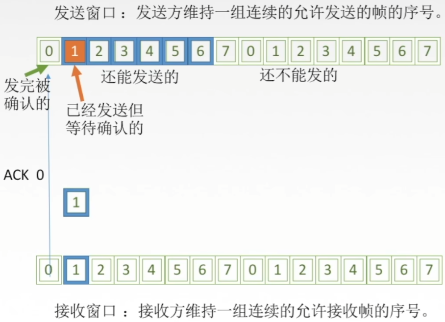
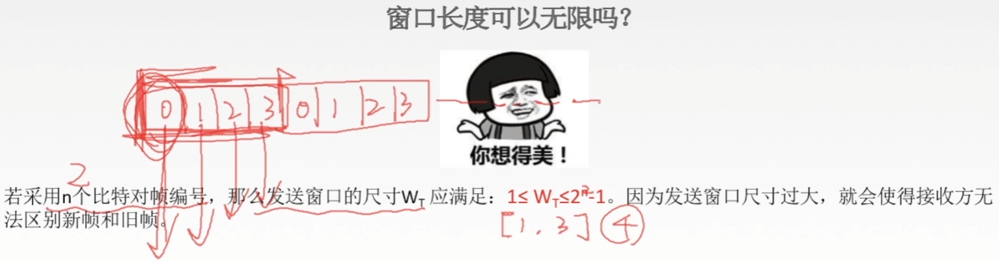

# 流量控制与可靠传输机制

## 数据链路层的流量控制

较高的发送速度和较低的接收能力的不匹配，会造成传输出错，因此流量控制页式数据链路层的一项重要工作。

数据链路层的流量控制是点对点的，而传输层的流量控制是端到端的。

数据链路层流量控制手段：接收方收不下就不回复确认。

传输层流量控制手段：接收端给发送端一个窗口公告。

## 流量控制方法

|                    | 发送窗口大小 | 接收窗口大小 |
| ------------------ | ------------ | ------------ |
| 停止-等待协议      | =1           | =1           |
| 后退N帧协议（GBN） | >1           | =1           |
| 选择重传协议（SR） | >1           | >1           |

## 停止-等待协议

每发送完一个帧就停止发送，等待对方的确认，在收到确认后再发送下一个帧。

停止-等待协议究竟是那一层的？

## 滑动窗口协议

### 后退N帧协议（GBN）

### 选择重传协议（SR）

## 可靠传输、滑动窗口、流量控制

可靠传输：发送端发啥，接收端收啥。

流量控制：控制发送速率，使接收方有足够的缓冲空间来接收每一个帧。

滑动窗口解决

- 流量控制（收不下就不给确认，想发也发不了）（使接收方有足够的缓冲空间来接收每一个帧）
- 可靠传输（发送方自动重传）

# 停止-等待协议

1. 为什么要有停止-等待协议？

   除了比特出差错，底层信道还会出现丢包问题。

   丢包：物理线路故障、设备故障、病毒攻击、路由信息错误等原因，会导致数据包的丢失。

   为了实现流量控制。

2. 研究停等协议的前提？

   虽然现在常用全双工通信方式，但为了讨论问题方便，仅考虑一方发送数据（发送方），一方接收数据（接收方）。

   因为是在讨论可靠传输的原理，所以并不考虑数据是在哪一个层次上传送的。  

   “停止-等待”就是每发送完一个分组就停止发送，等待对方确认，在收到确认后再发送下一个分组。

3. 停等协议有几种应用情况？

   无差错情况&有差错情况

## 无差错情况

每发送1个数据帧就停止并等待，因此用1bit来编号就够。

## 有差错情况

1. 数据帧丢失或检测到帧出错

   超时计时器：每次发送一个帧就启动一个计时器。

   超时计时器设置的重传时间应当比帧传输的平均RTT更长一些

   

   - 发完一个帧后，必须保留它的副本。
   - 数据帧和确认帧必须编号。

2. ACK丢失

   

3. ACK迟到

   

## 停等协议性能分析

简单

信道利用率太低

## 信道利用率

发送方在一个发送周期内，有效地发送数据所需要的时间占整个发送周期的比率。

信道吞吐率=信道利用率*发送方的发送速率 

# 后退N帧协议（GBN）

## 停等协议的弊端

流水线技术

1. 必须增加序号范围
2. 发送方需要缓存多个分组

## 后退N帧协议中的滑动窗口

发送窗口：发送方维持一组连续的允许发送的帧的序号。

接收窗口：接收方维持一组连续的允许接收帧的序号。

## GBN发送方必须响应的三件事

1. 上层的调用

   上层要发送数据时，发送方先检查发送窗口是否已满，如果未满，则产生一个帧并将其发送；如果窗口已满，发送方只需将数据返回给上层，暗示上层窗口已满。上层等一会再发送。（实际实现中，发送方可以缓存这些数据，窗口不满时再发送帧）。

2. 收到了一个ACK

   GBN协议中，对n号帧的确认采用累积确认的方式，标明接收方已经收到n号帧和它之前的全部帧。

3. 超时事件

   协议的名字为后退N帧/回退N帧，来源于出现丢失和时延过长帧时发送方的行为。就像在停等协议中一样，定时器将再次用于恢复数据帧或确认帧的丢失。如果出现超时，发送方重传所有已发送但未确认的帧。

## GBN接收方要做的事

如果正确收到n号帧，并且按序，那么接收方为n帧发送一个ACK，并将该帧中的数据部分交付给上层。

其余情况都丢弃帧，并为最近按序接收的帧重新发送ACK。接收方无需缓存任何失序帧，只需要维护一个信息：expectedseqnum（下一个按序接收的帧序号）

## 运行中的GBN

假设发送窗口尺寸为4

## 滑动窗口长度

窗口长度可以无限吗？

若采用n个比特对帧编号，那么发送窗口的尺寸WT应满足一个公式。因为发送窗口尺寸过大，就会使得接收方无法区别新帧和旧帧。

## GBN协议重点总结

1. 累积确认（偶尔捎带确认）
2. 接收方只按序接收帧，不按序无情丢弃
3. 确认序列号最大的、按序到达的帧
4. 发送窗口最大是2^n-1，接收窗口大小为1

## GBN协议性能分析

因连续发送数据帧而提高了信道利用率

在重传时必须把原来已经正确传送的数据帧重传，使传送效率降低。

# 选择重传协议（SR）

## GBN协议的弊端

累积确认 -> 批量重传

可不可以只重传出错的帧？

解决办法：设置单个确认，同时加大接收窗口，设置接收缓存，缓存乱序到达的帧。

## 选择重传协议中的滑动窗口

## SR发送方必须响应的三件事

1. 上层的调用

   从上层收到数据后，SR发送方检查下一个可用于该帧的序号，如果序号位于发送窗口内，则发送数据帧；否则就像GBN一样，要么将数据缓存，要么返回给上层之后再传输。

2. 收到了一个ACK

   如果收到ACK，加入该帧序号在窗口内，则SR发送方将那个被确认的帧标记为已接收。如果该帧序号是窗口的下界（最左边第一个窗口对应的序号），则窗口向前移动到具有最小序号的未确认帧处。如果窗口移动了并且有序号在窗口内的未发送帧，则发送这些帧。

   

3. 超时事件

   每个帧都有自己的定时器，一个超时事件发生后只重传一个帧。

## SR接收方要做的事

### 来者不拒（窗口内的帧）

SR接收方将确认一个正确接收的帧而不管其是否按序。失序的帧将被缓存，并返回给发送方一个该帧的确认帧【收谁确认谁】，直到所有帧（即序号更小的帧）皆被收到为止，这时才可以将上一批帧按序交付给上层，然后向前移动滑动窗口。

如果收到了窗口序号外（小于窗口下界）的帧，就返回一个ACK。

## 运行中的SR

假设发送窗口和接收窗口尺寸都为4

## 滑动窗口长度

窗口可以无限吗？

发送窗口最好等于接收窗口。（大了会溢出，小了没意义）

## SR协议重点总结

1. 对数据帧逐一确认，收一个确认一个
2. 只重传出错帧
3. 接收方有缓存
4. W_Tmax=W_Rmax=2^(n-1)

