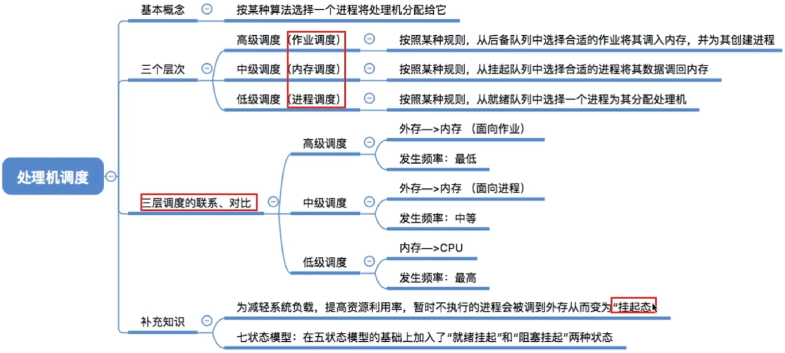

# 调度的概念、层次

## 调度的基本概念

当有一堆任务要处理，但由于资源有限，这些事情没法同时处理。这就需要确定某种规则来决定处理这些任务的顺序，这就是“调度”研究的问题。

## 调度的三个层次

### 高级调度

作业：一个具体的任务

用户向系统提交一个作业

用户让操作系统启动一个程序（来处理一个具体的任务）

内存空间有限，有时无法将用户提交的作业全部放入内存

高级调度（作业调度）。按一定的原则从外存的作业后备队列中挑选一个作业调入内存，并创建进程。每个作业只调入一次，调出一次。作业调入时会建立PCB，调出时才撤销PCB。

简化理解：好几个程序需要启动，到底先启动哪个

### 低级调度

低级调度（进程调度/处理机调度）按照某种策略从就绪队列中选取一个进程，将处理机分配给它。

进程调度是操作系统中最基本的一种调度，在一般的操作系统中都必须配置进程调度。

进程调度的频率很高，一般几十毫秒一次。

### 中级调度

内存不够时，可将某些进程的数据调出外存。等内存空闲或者进程需要运行时再重新调入内存。

暂时调到外存等待的进程状态为挂起状态。被挂起的进程PCB会被组织成挂起队列

中级调度（内存调度）按照某种策略决定将哪个处于挂起状态的进程重新调入内存。

一个进程可能会被多次调出、调入内存，因此中级调度发生的频率要比高级调度更高。

## 进程的挂起态与七状态模型

暂时调到外存等待的进程状态为挂起状态（挂起态，suspend）

挂起态又可以进一步细分为就绪挂起、阻塞挂起两种状态

五状态模型->七状态模型

注意“挂起”和“阻塞”的区别，两种状态都是暂时不能获得CPU的服务，但挂起态是将进程映像调到外存去了，而阻塞态下进程映像还在内存中。

有的操作系统会把就绪挂起、阻塞挂起分为两个挂起队列，甚至会根据阻塞原因不同再把阻塞挂起进程进一步细分为多个队列。

## 三层调度的联系、对比

|                            | 要做什么                                                     | 调度发生在                   | 发生频率 | 对进程状态的影响                   |
| -------------------------- | ------------------------------------------------------------ | ---------------------------- | -------- | ---------------------------------- |
| 高级调度 （作业调度） | 按照某种规则，从后备队列中选择合适的作业将其调入内存，并为其创建进程 | 外存->内存 （面向作业） | 最低     | 无->创建态->就绪态                 |
| 中级调度 （内存调度） | 按照某种规则，从挂起队列中选择合适的进程将其数据调回内存。   | 外存->内存 （面向进程） | 中等     | 挂起态->就绪态（阻塞挂起->阻塞态） |
| 低级调度 （进程调度） | 按照某种规则，从就绪队列中选择一个进程为其分配处理机         | 内存->CPU                    | 最高     | 就绪态->运行态                     |

# 进程调度时机、切换与过程、方式

## 进程调度的时机

进程调度（低级调度），就是按照某种算法从就绪队列中选择一个进程为其分配处理机。

需要进行进程调度与切换的情况

当前运行的进程主动放弃处理机

进程正常终止

运行过程中发生异常而终止

进程主动请求阻塞（如 等待I/O）

当前运行的进程被动放弃处理机

分给进程的时间片用完

有更紧急的事需要处理（如 I/O中断）

有更高优先级的进程进入就绪队列

不能进行进程调度与切换的情况

1. 在处理中断的过程中。中断处理过程复杂，与硬件密切相关，很难做到在中断处理过程中进行进程切换。
2. 进程在操作系统内核程序临界区中。
3. 在原子操作过程中（原语）。原子操作不可中断，要一气呵成（如之前讲过的修改PCB中进程状态标志，并把PCB放到相应队列）

进程在操作系统内核程序临界区不能进行调度与切换 √

进程处于临界区时不能进行处理机调度 x

临界资源：一个时间段内只允许一个进程使用的资源。各进程需要互斥地访问临界资源。

临界区：访问临界资源的那段代码。

内核程序临界区一般是用来访问某种内核数据结构的，比如进程的就绪队列（由各就绪进程的PCB组成）

如果还没退出临界区（还没解锁）就进行进程调度，但是进程调度相关的程序也需要访问就绪队列，但此时就绪队列被锁住了，因此又无法顺利进行进程调度

内核程序临界区访问的临界资源如果不尽快释放的话，极有可能影响到操作系统内核的其他管理工作。因此在访问内核程序临界区期间不能进行调度与切换

在打印机打印完成之前，进程一直处于临界区内，临界资源不会解锁。但打印机又是慢速设备，此时如果一直不允许进程调度的话就会导致CPU一直空闲

普通临界区访问的临界资源不会直接影响操作系统的管理工作。因此在访问普通临界区时可以进行调度与切换。

有的系统中，只允许进程主动放弃处理机

有的系统中，进程可以主动放弃处理机，当有更紧急的任务需要处理时，也会强行剥夺处理机（被动放弃）

但是进程在普通临界区中是可以进行调度、切换的。

## 进程调度的方式

非剥夺调度方式，又称非抢占方式。即，只允许进程主动放弃处理机。在运行过程中即便有更紧迫的任务到达，当前进程依然会继续使用处理机，直到该进程终止或主动要求进入阻塞态。

实现简单，系统开销小但是无法及时处理紧急任务，适合于早期的批处理系统

剥夺调度方式，又称抢占方式。当一个进程正在处理机上执行时，如果有一个更重要或更紧迫的进程需要使用处理机，则立即暂停正在执行的进程，将处理机分配给更重要紧迫的那个过程。

可以优先处理更紧急的进程，也可实现让各进程按时间片轮流执行的功能（通过时钟中断）。适合于分时操作系统、实时操作系统

## 进程的切换与过程

“狭义的进程调度”与“进程切换”的区别：

狭义的进程调度指的是从就绪队列中选中一个要运行的进程。（这个进程可以是刚刚被暂停执行的进程，也可能是另一个进程，后一种情况就需要进程切换）

进程切换是指一个进程让出处理机，由另一个进程占用处理机的过程。

广义的进程调度包含了选择一个进程和进程切换两个步骤。

进程切换的过程主要完成了：

1. 对原来运行进程各种数据的保存

2. 对新的进程各种数据的恢复

   （如：程序计数器、程序状态字、各种数据寄存器等处理机现场信息，这些信息一般保存在进程控制块）

注意：进程切换是有代价的，因此如果过于频繁的进行进程调度、切换，必然会使整个系统的效率降低，使系统大部分事件都花在了进程切换上，而真正用于执行进程的时间减少。

# 调度器和闲逛进程

## 调度器/调度程序（scheduler）

2、3由调度程序引起，调度程序决定：

让谁运行？调度算法

运行多长时间？时间片大小

调度时机 什么事件会触发”调度程序“？

- 创建新进程
- 进程退出
- 运行进程阻塞
- I/O中断发生（可能唤醒某些阻塞进程）
- 非抢占式调度策略，只有运行进程阻塞或退出才触发调度程序工作
- 抢占式调度策略，每个时钟中断或k个时钟中断会触发调度程序工作

不支持内核级线程的操作系统，调度程序的处理对象是进程

支持内核级线程的操作系统，调度程序的处理对象是内核线程

## 闲逛进程

调度程序永远的备胎，没有其他就绪进程时，运行闲逛进程（idle）

闲逛进程的特性：

- 优先级最低
- 可以是0地址指令，占一个完整的指令周期（指令周期末尾例行检查中断）
- 能耗低

# 调度算法的评价指标

## CPU利用率

由于早期的CPU造价极其昂贵，因此人们会希望让CPU尽可能多地工作

CPU利用率：指CPU”忙碌“的时间占总时间的比例
$$
利用率=\frac{忙碌的时间}{总时间}
$$
有的题目还会要求计算某种设备的利用率

通常会考察多道程序并发执行的情况，可以用”甘特图“来辅助计算

## 系统吞吐量

对于计算机来说，希望能用尽可能少的时间处理完尽可能多的作业

系统吞吐量：单位时间内完成作业的数量
$$
系统吞吐量=\frac{总共完成了多少道作业}{总共花了多少时间}
$$

## 周转时间

对于计算机的用户来说，他很关心自己的作业从提交到完成花了多少时间。

周转时间，是指从作业被提交给系统开始，到作业完成为止的这段时间间隔。

它包括四个部分：作业在外存后备队列上等待作业调度（高级调度）的时间、进程在就绪队列上等待进程调度（低级调度）的时间、进程在CPU上执行的时间、进程等待I/O操作完成的时间。后三项在一个作业的整个处理过程中，可能发生多次。

（作业）周转时间=作业完成时间-作业提交时间

对于用户来说，更关心自己的单个作业的周转时间
$$
平均周转时间=\frac{各作业周转时间之和}{作业数}
$$
对于操作系统来说，更关心系统的整体表现，因此更关心所有作业周转时间的平均值。

思考：有的作业运行时间短，有的作业运行时间长，因此在周转时间相同的情况下，运行时间不同的作业，给用户的感觉肯定是不一样的。
$$
带权周转时间=\frac{作业周转时间}{作业实际运行的时间}=\frac{作业完成时间-作业提交时间}{作业实际运行的时间}
$$
对于周转时间相同的两个作业，实际运行时间长的作业在相同时间内被服务的时间更多，带权周转时间更小，用户满意度更高。

对于实际运行时间相同的两个作业，周转时间短的带权周转时间更小，用户满意度更高。

带权周转时间必然>=1

带权周转时间与周转时间都是越小越好

## 等待时间

计算机的用户希望自己的作业尽可能少的等待处理机

等待时间，指进程/作业处于等待处理机状态时间之和，等待时间越长，用户满意度越低。

作业在后备队列等待被服务（调度）

作业调入内存后，建立对应的进程。这个进程会被CPU服务、会被I/O设备服务，当然也会有等待被服务的时候。

对于进程来说，等待时间就是指进程建立后等待被服务的时间之和，在等待I/O完成的期间其实进程也是在被服务的，所以不计入等待时间。

对于作业来说，不仅要考虑建立进程后的等待时间，还要加上作业在外存后备队列中等待的时间。

一个作业总共需要被CPU服务多久，被I/O设备服务多久一般是确定不变的，因此调度算法其实只会影响作业/进程的等待时间。当然，与前面指标类似，也有”平均等待时间“来评价整体性能。

## 响应时间

对于计算机用户来说，会希望自己的提交的请求（比如通过键盘输入了一个调试命令）尽早地开始被系统服务、回应。

响应时间，指从用户提交请求到首次产生响应所用的时间。

# 调度算法1

各种调度算法的学习思路

1. 算法思想

2. 算法规则

3. 这种调度算法是用于作业调度还是进程调度？

4. 抢占式？非抢占式？

5. 优点和缺点

6. 是否会导致饥饿

   某进程/作业长期得不到服务

## 先来先服务（FCFS, First Come First Serve）

例题：各进程到达就绪队列的时间、需要运行时间如下表所示。使用先来先服务调度算法，计算各进程的等待时间、平均等待时间、周转时间、平均周转时间、带权周转时间、平均带权周转时间。

先来先服务调度算法：按照到达的先后顺序调度，事实上就是等待时间越久的越优先得到服务。

周转时间=完成时间-到达时间

注意：本例中的进程都是纯计算型的进程，一个进程到达后要么在等待，要么在运行。如果是又有计算、又有I/O操作的进程，其等待时间就是周转时间-运行时间-I/O操作的时间

因此，调度顺序为：P1->P2->P3->P4

- 算法思想

  主要从”公平“的角度考虑（类似于我们生活中排队买东西的例子）

- 算法规则

  按照作业/进程到达的先后顺序进行服务

- 用于作业/进程调度

  用于作业调度时，考虑的是哪个作业先到达后备队列；用于进程调度时，考虑的是哪个进程先到达就绪队列。

- 是否可抢占？

  非抢占式的算法

- 优缺点

- 是否会导致饥饿

