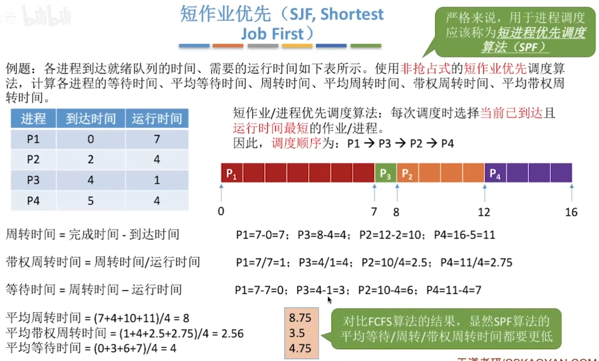
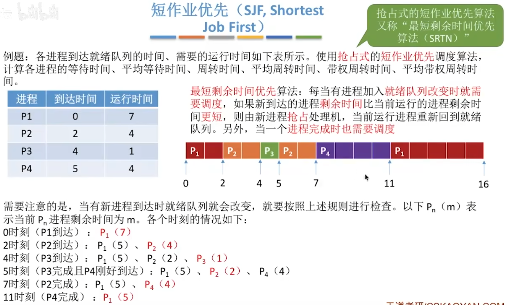
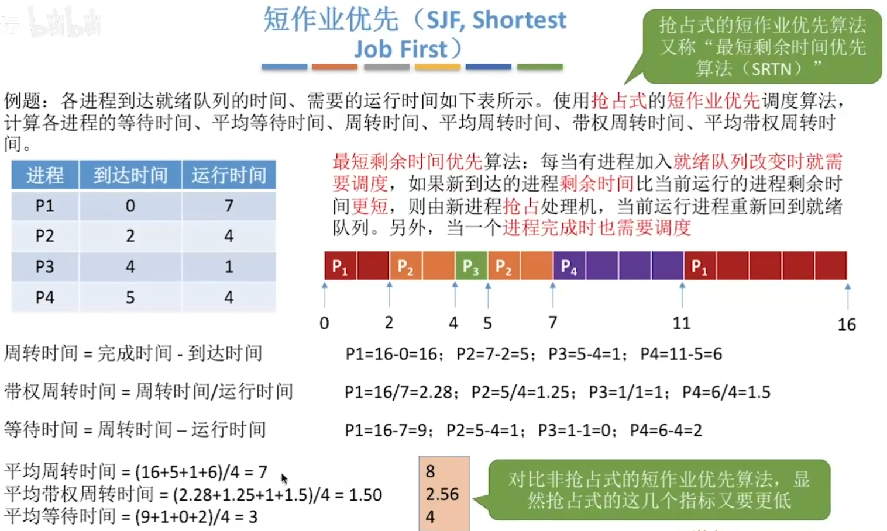
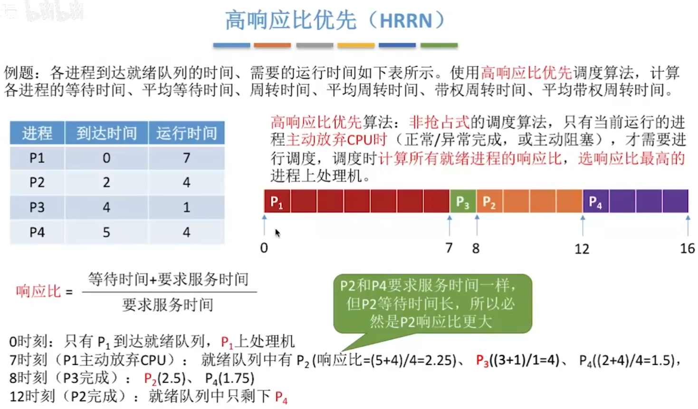
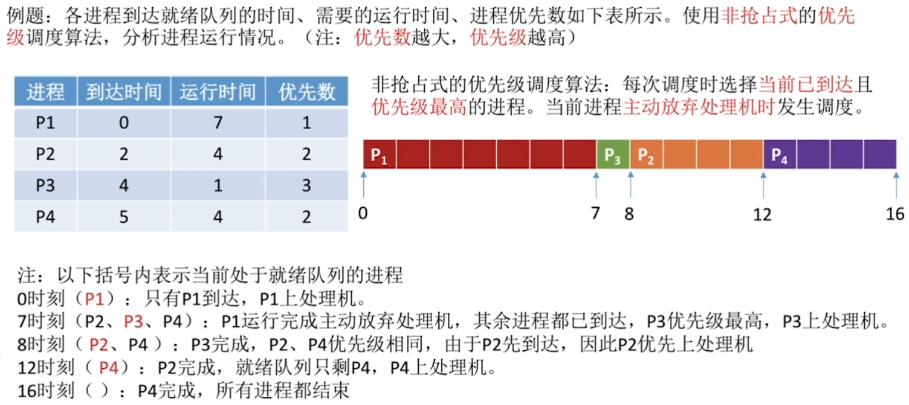
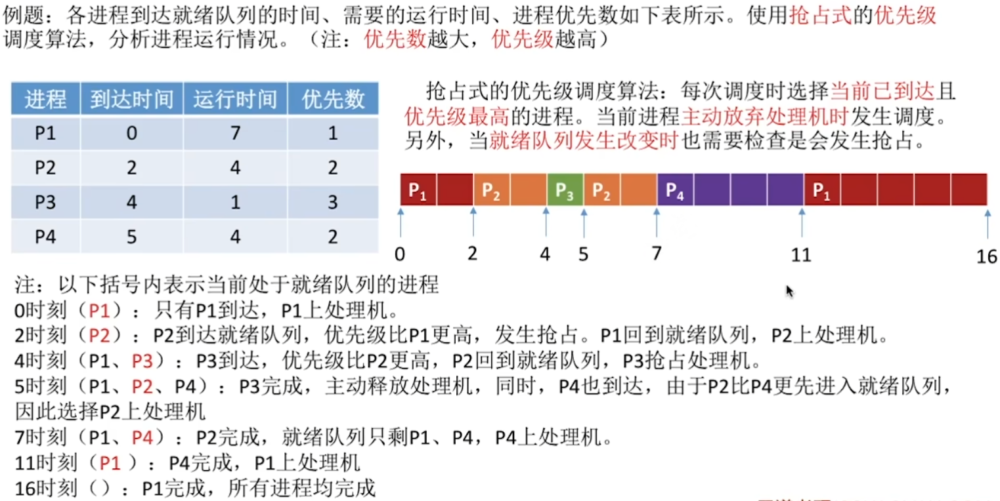

# 调度算法1

## 先来先服务（FCFS, First Come First Serve）

优点：公平、算法实现简单

缺点：排在长作业（进程）后面的短作业需要等待很长时间，带权周转时间很大，对短作业来说用户体验不好。即，FCFS算法对长作业有利，对短作业不利。（eg. 排队买奶茶）

不会导致饥饿

## 短作业优先（SJF, Shortest Job First）

短作业/进程优先调度算法：每次调度时选择当前已到达且运行时间最短的作业/进程。

因此，调度顺序为：P1->P3->P2->4

最短剩余时间优先算法：每当有进程加入就绪队列改变时需要调度，如果新到达的进程剩余时间比当前运行的进程剩余时间更短，则由新进程抢占处理机，当前运行进程重新回到就绪队列。另外，当一个进程完成时也需要调度

需要注意的是，当有新进程到达时就绪队列就会改变，就要按照上述规则进行检查。以下Pn(m)表示当前Pn进程剩余时间为m。各个时刻的情况如下：

|                   |                                                              |
| ----------------- | ------------------------------------------------------------ |
| 算法思想          | 追求最少的平均等待时间，最少的平均周转时间、最少的平均带权周转时间 |
| 算法规则          | 最短的作业/进程优先得到服务（所谓“最短”，是指要求服务时间最短） |
| 用于作业/进程调度 | 即可用于作业调度，也可用于进程调度。用于进程调度时称为“短进程优先（SPF, Shortest Process First）算法” |
| 是否可抢占？      | SJF 和SPF 是非抢占式的算法。但是也有抢占式的版本 最短剩余时间优先算法（SRTN, Shortest Remaining Time Next） |
| 优缺点            | 优点：”最短的“平均等待时间、平均周转时间 缺点：不公平。对短作业有利，对长作业不利。可能产生饥饿现象。另外，作业/进程的运行时间是由用户提供的，并不一定真实，不一定能做到真正的短作业优先 |
| 是否会导致饥饿    | 会。如果源源不断地有短作业/进程到来，可能使长作业/进程长时间得不到服务，产生”饥饿“现象。如果一直得不到服务，则称为”饿死“ |

注意几个小细节：

1. 如果题目中未特别说明，所提到的“短作业/进程优先算法”默认是非抢占式的

2. 很多书上都会说“SJF调度算法的平均等待时间、平均周转时间最小”严格来说这个表述是错误的，不严谨的。之前的例子表明，最短剩余时间优先算法得到的平均等待时间、平均周转时间还要更少

   应该加上一个条件“在所有进程同时可运行时，采用SJF调度算法的平均等待时间、平均周转时间最少”

   或者说“在所有进程都几乎同时到达时，采用SJF调度算法的平均等待时间、平均周转时间最少”

   如果不加上述前提条件，则应该说“抢占式的短作业/进程优先调度算法（最短剩余时间优先，SRNT算法）的平均等待时间、平均周转时间最少“

3. 虽然严格来说，SJF的平均等待时间、平均周转时间并不一定最少，但相比于其他算法（如FCFS），SJF依然可以获得较少的平均等待时间、平均周转时间

4. 如果选择题中遇到”SJF算法的平均等待时间、平均周转时间最少“的选项，那最好判断其他选项是不是有很明显的错误，如果没有更合适的选项，那也应该选择该选项

## 对FCFS和两种算法地思考

FCFS算法是在每次调度的时候选择一个等待时间最长的作业（进程）为其服务。但是没有考虑到作业的运行时间，因此导致了对短作业不友好的问题。

SJF算法是选择一个执行时间最短的作业为其服务。但是又完全不考虑各个作业的等待时间，因此导致了对长作业不友好的问题，甚至还会造成饥饿问题

能不能设计一个算法，即考虑到各个作业的等待时间，也能兼顾运行时间呢？

高响应比优先算法

## 高响应比（HRRN, Highest Response Ration Next）

高响应比优先算法：非抢占式的调度算法， 只有当前运行的进程主动放弃CPU时（正常/异常完成，或主动阻塞），才需要进行调度，调度时计算所有就绪进程的响应比，选响应比最高的进程上处理机。
$$
响应比=\frac{等待时间+要求服务时间}{要求服务时间}
$$
0时刻：只有P1到达就绪队列，P1上处理机

7时刻（P1主动放弃CPU）：就绪队列中有P2

P2和P4要求服务时间一样，但P2等待时间长，所以必然是P2响应比更大

|                   |                                                              |
| ----------------- | ------------------------------------------------------------ |
| 算法思想          | 要综合考虑作业/进程的等待时间和要求服务的时间                |
| 算法规则          | 在每次调度时先计算各个作业/进程的响应比，选择响应比最高的作业/进程为其服务，响应比>=1 |
| 用于作业/进程调度 | 既可用于作业调度，也可用于进程调度                           |
| 是否可抢占？      | 非抢占式的算法。因此只有当前运行的作业/进程主动放弃处理机时，才需要调度，才需要计算响应比 |
| 优缺点            | 综合考虑了等待时间和运行时间（要求服务时间） 等待时间相同，要求服务时间短的优先（SJF的优点） 要求服务时间相同时，等待时间长的优先（FCFS的优点） 对于长作业来说，随着等待时间越来越久，其响应比也会越来越大，从而避免了长作业饥饿的问题 |
| 是否会导致饥饿    | 不会                                                         |

| 算法    | 可抢占？                                                     | 优点                                                 | 缺点                                                 | 考虑到等待时间&运行时间？ | 会导致饥饿？ |
| ------- | ------------------------------------------------------------ | ---------------------------------------------------- | ---------------------------------------------------- | ------------------------- | ------------ |
| FCFS    | 非抢占式                                                     | 公平；实现简单                                       | 对短作业不利                                         | 等待时间√ 运行时间x  | 不会         |
| SJF/SPF | 默认为非抢占式，也有SJF的抢占式版本最短剩余时间优先算法（SRTN） | ”最短的“平均等待/周转时间                            | 对长作业不利，可能导致饥饿；难以做到真正的短作业优先 | 等待时间x 运行时间√  | 会           |
| HRRN    | 非抢占式                                                     | 上述两种算法的权衡折中，综合考虑的等待时间和运行时间 | \                                                    | 等待时间√ 运行时间√  | 不会         |

注：这几种算法主要关心对用户的公平性、平均周转时间、平均等待时间等评价系统整体性能的指标，但是不关心”响应时间“，也并不区分任务的紧急程度，因此对于用户来说，交互性很糟糕。因此这三种算法一般适用于早期的批处理系统，当然，FCFS算法也常结合其他的算法使用，在现在也扮演着很重要的角色。

# 调度算法2

各种调度算法的学习思路

1. 算法思想
2. 算法规则
3. 这种调度算法是用于作业调度还是进程调度？
4. 抢占式？非抢占式？
5. 优点和缺点
6. 是否会导致饥饿 某进程/作业长期得不到服务

## 时间片轮转（RR, Round-Robin）

常用于分时操作系统，更注重”响应时间”，因而此处不计算周转时间

时间片轮转调度算法：轮流让就绪队列中的进程依次执行一个时间片（每次选择的都是排在就绪队列队头的进程）

时间片大小为2（注：以下括号内表示当前时刻就绪队列中的进程、进程的剩余运行时间）

如果时间片太大，使得每个进程都可以在一个时间片内就完成，则时间片轮转调度算法退化为先来先服务调度算法，并且会增加进程响应时间。因此时间片不能太大。

比如：系统中有10个进程在并发执行，如果时间片为1秒，则一个进程被响应可能需要等9秒...也就是说，如果用户在自己进程的时间片外通过键盘发出调试命令，可能需要等待9秒才能被系统响应

另一方面，进程调度、切换是有时间代价的（保存、恢复运行环境），因此如果时间片太小，会导致进程切换过于频繁，系统会花大量的时间来处理进程切换，从而导致实际用于进程执行的时间比例减少。可见时间片也不能太小。

一般来说，设计时间片时要让切换进程的开销占比不超过1%

|                   |                                                              |
| ----------------- | ------------------------------------------------------------ |
| 算法思想          | 公平地、轮流地为各个进程服务，让每个进程在一定时间间隔内都可以得到响应 |
| 算法规则          | 按照各进程到达就绪队列的顺序，轮流让各个进程执行一个时间片（如100ms）。若进程未在一个时间片内执行完，则剥夺处理机，将进程重新放到就绪队列尾重新排队。 |
| 用于作业/进程调度 | 用于进程调度（只有作业放入内存建立了相应的进程后，才能被分配处理时间片） |
| 是否可抢占？      | 若进程未能在时间片内运行完，将被强行剥夺处理机使用权，因此时间片轮转调度算法属于抢占式的算法。由时钟装置发出时钟中断来通知CPU时间片已到。 |
| 优缺点            | 优点：公平；响应快，适用于分时操作系统； 缺点：由于高频率的进程切换，因此有一定开销；不区分任务的紧急程度 |
| 是否会导致饥饿    | 不会                                                         |
| 补充              | 时间片太大或太小分别有什么影响？                             |

## 优先级调度算法

非抢占式的优先级调度算法：每次调度时选择当前已到达且优先级最高的进程。当前进程主动放弃处理机时发生调度。

抢占式的优先级调度算法：每次调度时选择当前已到达且优先级最高的进程。当前进程主动放弃处理机时发生调度。另外，当就绪队列发生改变时也需要检查是会发生抢占。

补充：

就绪队列未必只有一个，可以按照不同优先级来组织。另外，也可以把优先级高的进程排在更靠近队头的位置

根据优先级是否可以动态改变，可将优先级分为静态优先级和动态优先级两种。

静态优先级：创建进程时确定，之后一直不变。

动态优先级：创建进程时有一个初始值，之后会根据情况动态地调整优先级。

如何合理地设置各类进程地优先级？

通常：系统进程优先级高于用户进程

前台进程优先级高于后台进程

操作系统更偏好I/O型进程（或称I/O繁忙型进程）

与I/O型进程相对的是计算型进程（或称CPU繁忙型进程）

I/O设备和CPU可以并行工作。如果优先让I/O繁忙型进程优先运行的话，则越有可能让I/O设备尽早地投入工作，则资源利用率、系统吞吐量都会得到提升

如果采用的是动态优先级，什么时候应该调整？

可以从追求公平、提升资源利用率等角度考虑

如果某进程在就绪队列中等待了很长时间，则可以适当提升其优先级

如果某进程占用处理机运行了很长时间，则可适当降低其优先级

如果发现一个进程频繁地进行I/O操作， 则可适当提升其优先级

|                   |                                                              |
| ----------------- | ------------------------------------------------------------ |
| 算法思想          | 随着计算机的发展，特别是实时操作系统的出现，越来越多的应用场景需要根据任务的紧急程度来决定处理顺序 |
| 算法规则          | 每个作业/进程有各自的优先级，调度时选择优先级最高的作业/进程 |
| 用于作业/进程调度 | 既可用于作业调度，也可用于进程调度。甚至，还会用于在之后学习的I/O调度中 |
| 是否可抢占？      | 抢占式、非抢占式都有。做题时的区别在于：非抢占式只需在进程主动放弃处理机时进行调度即可，而抢占式还需在就绪队列变化时，检查是否发生抢占。 |
| 优缺点            | 优点：用优先级区分紧急程度、重要程度，适用于实时操作系统。可灵活地调整对各种作业/进程的偏好程度。 缺点：若源源不断地有高优先级进程到来，则可能导致饥饿 |
| 是否会导致饥饿    | 会                                                           |

## 思考

FCFS算法的优点是公平

SJF算法的优点是能尽快处理完短作业 平均等待/周转时间等参数很优秀

时间片轮转调度算法可以让各个进程得到及时的响应

优先级调度算法可以灵活地调整各种进程被服务的机会

能否对其他算法做个折中权衡？得到一个综合表现优秀平衡的算法呢？

多级反馈队列调度算法

## 多级反馈队列调度算法

|                   |                                                              |
| ----------------- | ------------------------------------------------------------ |
| 算法思想          | 对其他调度算法的这种权衡                                     |
| 算法规则          | 1. 设置多级就绪队列，各级队列优先级从高到低，时间片从小到大 2. 新进程到达时先进入第1级队列，按FCFS原则排队等待被分配时间片，若用完时间片进程还未结束，则进程进入下一级队列队尾。如果此时已经是在最下级的队列，则重新放回该队列队尾 3. 只有第k级队列为空时，才会为k+1级队头的进程分配时间片 |
| 用于作业/进程调度 | 用于进程调度                                                 |
| 是否可抢占？      | 抢占式的算法。在k级队列的进程运行过程中，若更上级的队列（1~k-1级）中进入了一个新进程，则由于新进程处于优先级更高的队列中，因此新进程会抢占处理机，原来运行的进程放回k级队列队尾。 |
| 优缺点            |                                                              |
| 是否会导致饥饿    |                                                              |

