# 进程同步、进程互斥

## 什么是进程同步

知识点回顾：进程具有异步性的特征。异步性是指，各并发执行的进程以各自独立的、不可预知的速度向前推进。

操作系统要提供“进程同步机制”来实现上述需求。

进程通信 管道通信


读进程和写进程并发地运行，由于并发必然导致异步性，因此“写数据”和“读数据”两个操作执行的先后顺序是不确定的。而实际应用中，又必须按照“写数据->读数据”的顺序来执行的。

如何解决这种异步问题，就是“进程同步”所讨论的内容。

同步亦称直接制约关系，它是指为完成某种任务而建立的两个或多个进程，这些进程因为需要在某些位置上协调它们的工作次序而产生的制约关系。进程间的直接制约关系就是源于它们之间的相互合作。

## 什么是进程互斥

进程“并发“需要”共享“的支持。各个并发执行的进程不可避免的需要共享一些系统资源（比如内存，又比如打印机、摄像头这样的I/O设备）

系统中的某些资源，虽然可以提供给多个进程使用，但一个时间段内只允许一个进程访问该资源。


系统中的某些资源，允许一个时间段内由多个进程”同时“对它们进行访问

我们把一个时间段内只允许一个进程使用的资源称为临界资源。许多物理设备（比如摄像头、打印机）都属于临界资源。此外还有许多变量、数据、内存缓冲区等都属于临界资源。

对临界资源的访问，必须互斥地进行。互斥，亦称间接制约关系。进程互斥指当一个进程访问某临界资源时，另一个想要访问该临界资源的进程必须等待。当前访问临界资源的进程访问结束，释放该资源之后，另一个进程才能去访问临界资源。

对临界资源的互斥访问，可以在逻辑上分为如下四个部分：

```c
do{
	entry section;     //进入区
	critical section;  //临界区
	exit section;      //退出区
	remainder section; //剩余区
} while(true)
```

- 进入区

  负责检查是否可进入临界区，若可进入，则应设置正在访问临界资源的标志（可理解为”上锁“），以阻止其他进程同时进入临界区

- 临界区

  访问临界资源的那段代码

- 退出区

  负责接触正在访问临界资源的标志（可理解为”解锁“）

- 剩余区

  做其他处理

注意：

临界区是进程中访问临界资源的代码段。

进入区和退出区是负责实现互斥的代码段。

临界区也可称为”临界段“。

如果一个进程暂时不能进入临界区，那么该进程是否应该一直占着处理机？该进程有没有可能一直进不了临界区？

为了实现对临界资源的互斥访问，同时保证系统整体性能，需要遵循以下原则：

1. 空闲让进。临界区空闲时，可以允许一个请求进入临界区的进程立即进入临界区；
2. 忙则等待。当已有进程进入临界区时，其他试图进入临界区的进程必须等待；
3. 有限等待。对请求访问的进程，应保证能在有限时间内进入临界区（保证不会饥饿）；
4. 让权等待。当进程不能进入临界区时，应立即释放处理机，防止进程忙等待。

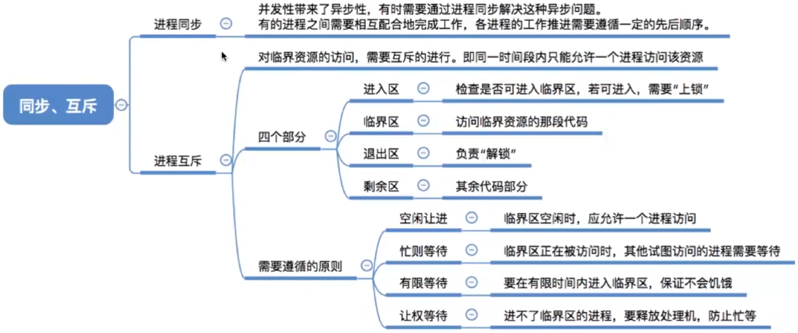

# 进程互斥的软件实现方法


1. 理解各个算法的思想、原理
2. 结合上小节学习的”实现互斥的四个逻辑部分“，重点理解各算法在进入区、退出区都做了什么
3. 分析各算法存在的缺陷（结合”实现互斥要遵循的四个原则“进行分析）

## 如果没有注意进程互斥？

进程A、进程B在系统中并发地运行

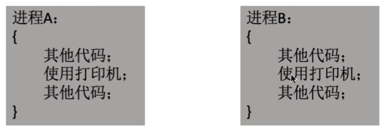

先调度A上处理机运行

当A在使用打印机的过程中，分配给它的时间片用完了，接下来操作系统调度B让它上处理机运行进程B也在使用打印机

结局：A、B的打印内容混在一起了

如何实现进程互斥？

## 单标志法

算法思想：两个进程在访问完临界区后会把使用临界区的权限转交给另一个进程。也就是说每个进程进入临界区的权限只能被另一个进程赋予

```c
int turn = 0; //turn 表示当前允许进入临界区的进程号
//P0
while(turn!=0);//进入区
critical section;//临界区
turn = 1;//退出区
remainder section;//剩余区
//P1
while(turn!=1);//进入区
critical section;//临界区
turn = 0;//剩余区
remainder section;//剩余区
```

turn的初值为0，即刚开始只允许0号进程进入临界区。

若P1先上处理机运行，则会一直卡在进入区。直到P1的时间片用完，发生调度，切换P0上处理机运行。P0进入区不会卡住，P0可以正常访问临界区，在P0访问临界区期间即时切换回P1，P1依然回卡在进入区。

因此，该算法可以实现”同一时刻最多只允许一个进程访问临界区“

只能按P0P1P0P1这样轮流访问。这种必须”轮流访问”带来的问题是，如果此时允许进入临界区的进程是P0，而P0一直不访问临界区，那么虽然此时临界区空闲，但是并不允许P1访问。因此，单标志法存在的主要问题是：违背“空闲让进”原则。

## 双标志先检查法

```c
bool flag[2]; //表示进入临界区意愿的数组
flag[0]=false;
flag[1]=false;//刚开始设置为两个进程都不想进入临界区
```

算法思想：设置一个布尔型数组 flag[]，数组中各个元素用来标记各进程想进入临界区的意愿，比如“flag[0]=true”意味着0号进程P0现在想要进入临界区。每个进程在进入临界区之前先检查当前有没有别的进程想进入临界区，如果没有，则把自身对应的标志flag[i]设为true，之后开始访问临界区。

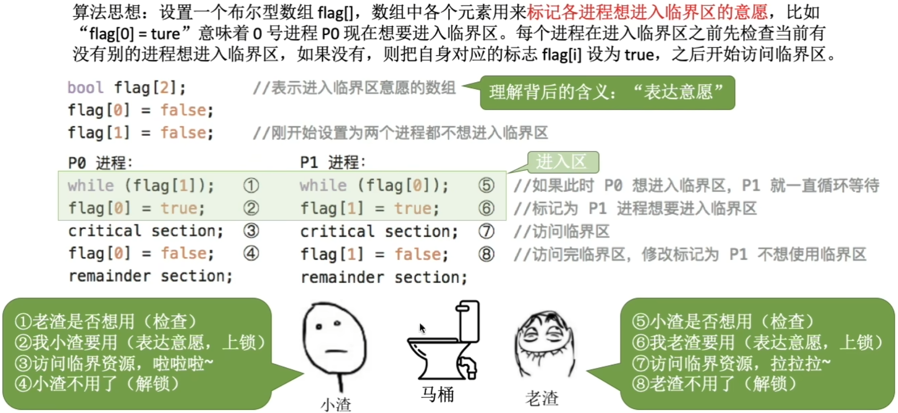

若按照152637的顺序执行，P0和P1将会同时访问临界区。

因此，双标志先检查法的主要问题是：违法“忙则等待”原则。

原因在于，进入区的“检查”和“上锁”两个处理不是一气呵成的。“检查”后，“上锁”前可能发生进程切换。

## 双标志后检查法

算法思想：双标志先检查法的改变。前一个算法的问题是先“检查”后“上锁”，但是这两个操作又无法一气呵成，因此导致饿了两个进程同时进入临界区的问题。因此，人们又想到先“上锁”后“检查”的方法，来避免上述问题。

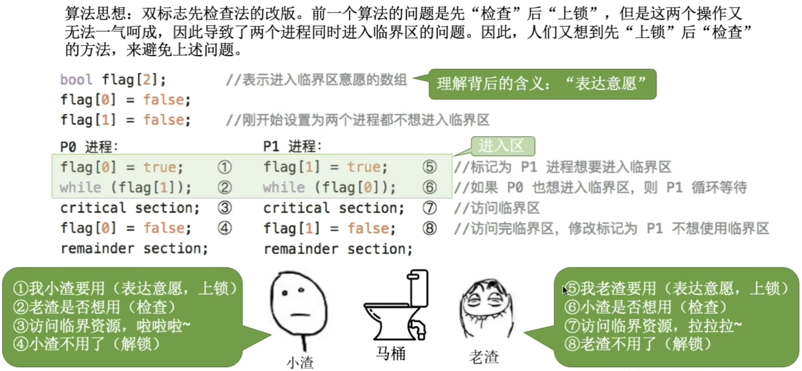

若按照1526的顺序执行，P0和P1将都无法进入临界区

因此，双标志后检查法虽然解决了“忙则等待”的问题，但是又违背了“空闲让进”和“有限等待”原则，会因各进程都长期无法访问临界资源而产生“饥饿”现象。

## Peterson算法

算法思想：结合双标志法、单标志法的思想。如果双方都争着想进入临界区，那可以让进程尝试“孔融让梨”（谦让）。做一个有礼貌的进程。

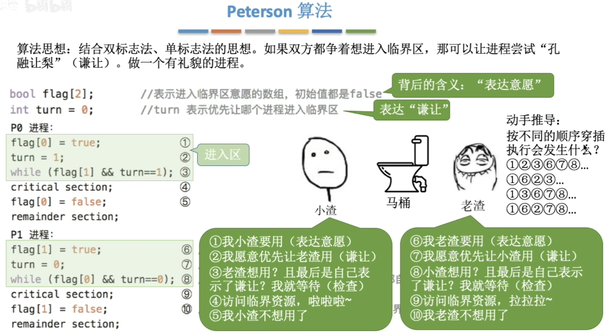

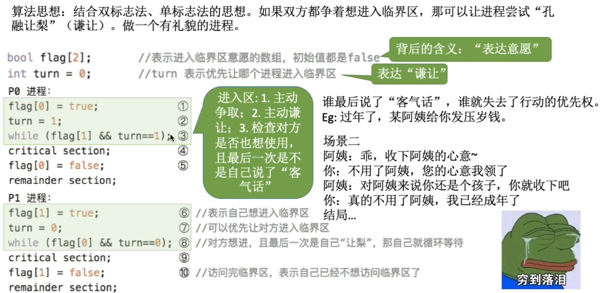

Peterson算法用软件方法解决了进程互斥问题，遵循了空闲让进、忙则等待、有限等待三个原则，但是依然未遵循让权等待的原则。

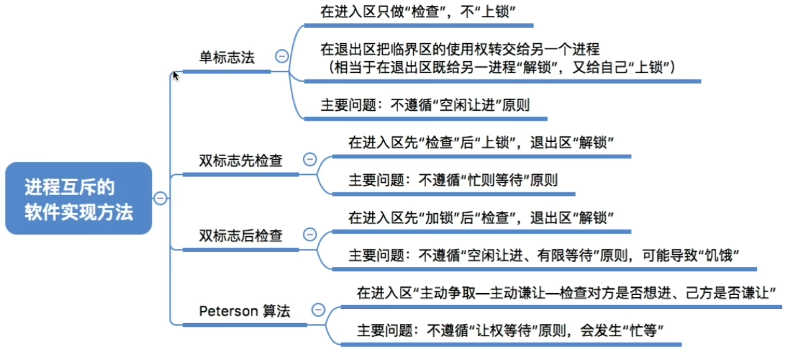

# 进程互斥的硬件实现方法

1. 理解各方法的原理
2. 了解各方法的优缺点

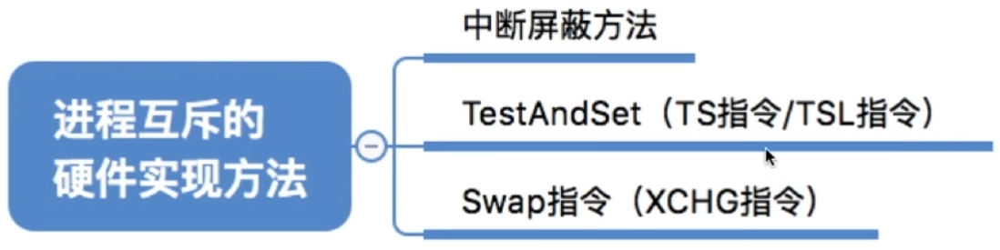

## 中断屏蔽方法

利用“开/关中断指令”实现（与原语的实现思想相同，即在某进程开始访问临界区到结束访问为止都不允许被中断，也就不能发生进程切换，因此也不可能发生两个同时访问临界区的情况）

关中断后即不允许当前进程被中断，也必然不会发生进程切换

直到当前进程访问完临界区，再执行开中断指令，才有可能有别的进程上处理机并访问临界区

优点：简单、高效

缺点：不适用于多处理机；只适用于操作系统内核进程，不适用于用户进程（因为开/关中断指令只能运行在内核态，这组指令如果能让用户随意使用会很危险）

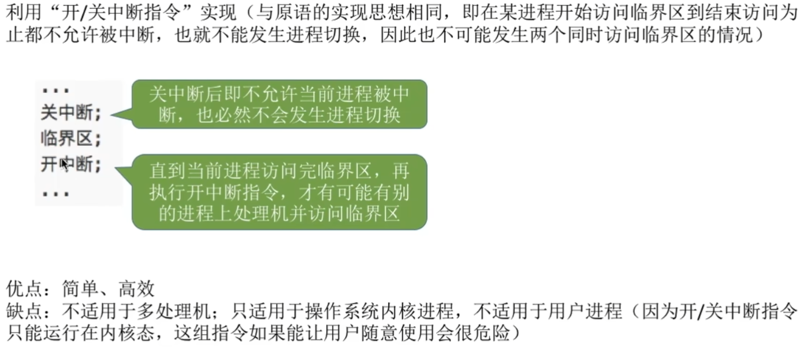

## TestAndSet指令

简称TS指令，也有地方称为TestAndSetLock指令，或TSL指令

TSL指令是用硬件实现的，执行的过程不允许被中断，只能一气呵成。以下是用C语言描述的逻辑

```c
//布尔型共享变量lock表示当前临界区是否被加锁
//true表示已加锁，false表示未加锁
bool TestAndSet(bool *lock)
{
    bool old;
    old = *lock; //old用来存放lock 原来的值
    *lock = true; //无论之前是否已加锁，都将lock设为true
    return old; //返回lock原来的值
}
//以下是使用TSL指令实现互斥的算法逻辑
while(TestAndSet(&lock)); //“上锁”并“检查”
//临界区代码段
lock = false; //“解锁”
//剩余区代码段
```

若刚开始lock是false，则TSL返回的old值为false，while循环条件不满足，直接跳过循环，进入临界区。若刚开始lock是true，则执行TLS后old返回的值为true，while循环条件满足，会一直循环，直到当前访问临界区的进程在退出区进行“解锁”。

相比软件实现方法，TSL指令把“上锁”和“检查”操作用硬件的方式变成了一气呵成的原子操作。

优点：实现简单，无需像软件实现方法那样严格检查是否会有逻辑漏洞；适用于多处理机环境

缺点：不满足“让权等待”原则，暂时无法进入临界区的进程会占用CPU并循环执行TSL指令，从而导致“忙等”。

## Swap指令

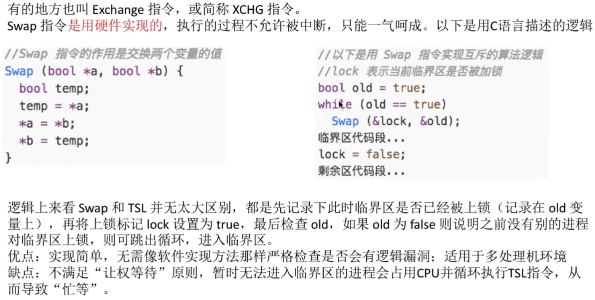

Swap指令是用硬件实现的，执行的过程不允许被中断，只能一气呵成。

逻辑上来看Swap和TSL并无太大区别，都是先记录下此时临界区是否已经被上锁（记录在old变量上），再将上锁标记lock设置为true，最后检查old，如果old为false则说明之前没有别的进程对临界区上锁，则可跳出循环，进入临界区。

优点：实现简单，无需像软件实现那样严格检查是否会有逻辑漏洞；适用于多处理机环境

缺点：不满足“让权等待”原则，暂时无法进入临界区的进程会占用CPU并循环执行TSL指令，从而导致“忙等”。

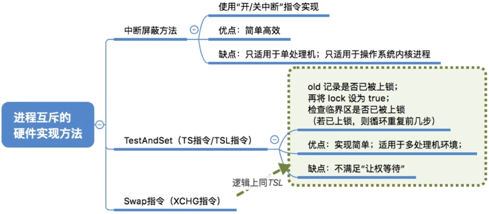