# 信道划分介质访问控制

## 传输数据使用的两种链路

### 点对点链路

两个相邻节点通过一个链路相连，没有第三者。

应用：PPP协议，常用于广域网。

### 广播式链路

所有主机共享通信介质

应用：早期的总线以太网、无线局域网，常用于局域网

典型拓扑结构：总线型、星型（逻辑总线型）

## 介质访问控制

介质访问控制的内容是就是，采取一定的措施，使得两对结点之间的通信不会发生互相干扰的情况。

## 信道划分介质访问控制

信道划分介质访问控制：将使用介质的每个设备与来自同一信道上的其他设备的通信隔离开，把时域和频域资源合理地分配给网络上的设备。

### 多路复用技术

把多个信号组合在一条物理信道上进行传输，使得多个计算机或终端设备共享信道资源，提高信道利用率。

把一条广播信道，逻辑上分成几条用于两个结点之间通信得互不干扰得子信道，实际就是把广播信道转变为点对点信道。

### 频分多路复用FDM

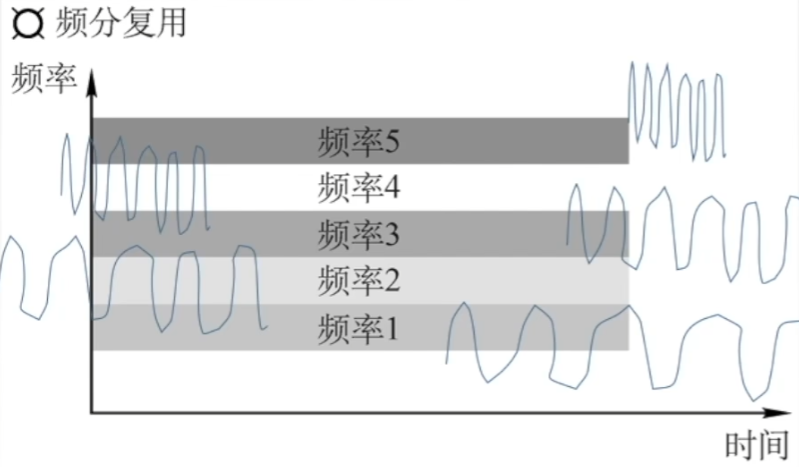

用户在分配到一定的频带后，在通信过程中自始至终都占用这个频带。频分复用的所有用户在同样的时间占用不同的带宽（频率带宽）资源。

充分利用传输介质带宽，系统效率较高；

由于技术比较成熟，实现也比较容易。

### 时分多路复用TDM

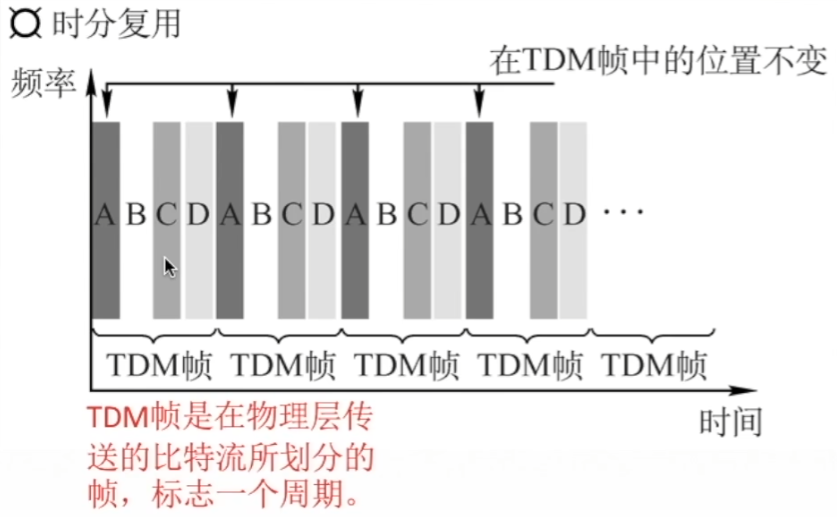

TDM帧使在物理层传送的比特流所划分的帧，标志一个周期。

将时间划分为一段段等长的时分复用帧（TDM帧）。每一个时分复用的用户在每一个TDM帧中占用固定序号的时隙，所有用户轮流占用信道。

频分复用--“并行”

时分复用--”并发“

### 改进的时分复用--统计时分复用STDM

每一个STDM帧中的时隙数小于连接在集中器上的用户数。各用户有了数据就随时发往集中器的输入缓存，然后集中器按顺序依次扫描输入缓存，把缓存中的输入数据放入STDM帧中，一个STDM帧满了就发出。STDM帧不是固定分配时隙，而是按需动态分配时隙。

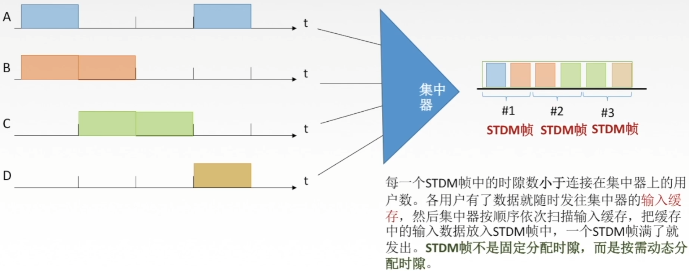

### 波分多路复用WDM

波分多路复用就是光的频分多路复用，在一根光纤中传输多种不同波长（频率）的光信号，由于波长（频率）不同，所以各路光信号互不干扰，最后再用波长分解复用器将各路波长分解出来。

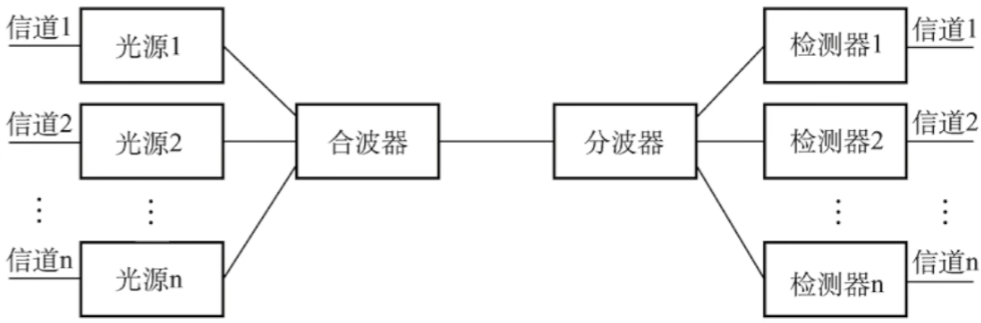

### 码分多路复用CDM

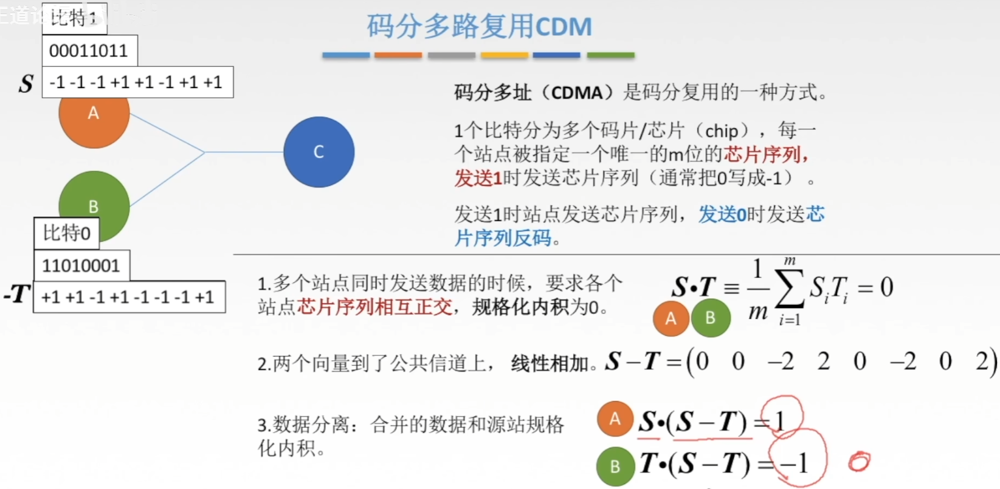

码分多址（CDMA）是码分复用的一种方式。

1个比特分为多个码片/芯片(chip)，每一个站点被指定一个唯一的m位的芯片序列，发送1时发送芯片序列（通常把0写成-1）。

发送1时站点发送芯片序列，发送0时发送芯片序列反码。

1. 多个站点同时发送数据的时候，要求各个站点芯片序列相互正交，规格化内积为0。
2. 两个向量到了公共信道上，线性相加。
3. 数据分离：合并的数据和源站规格化内积。

# ALOHA协议

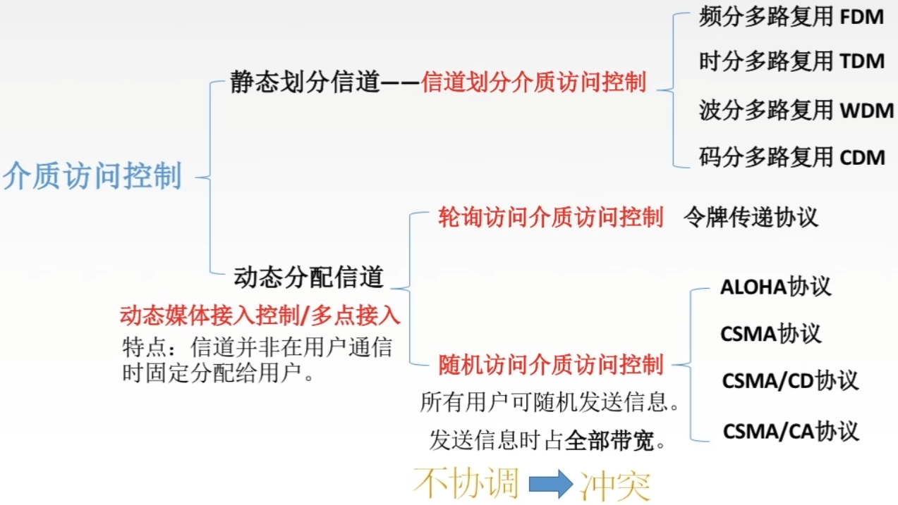

## 纯ALOHA协议

纯ALOHA协议思想：不监听信道，不按时间槽发送，随机重发。想发就发

冲突如何检测？

如果发生冲突，接收方在就会检测出差错，然后不予确认，发送方在一定时间内收不到就判断发生冲突。

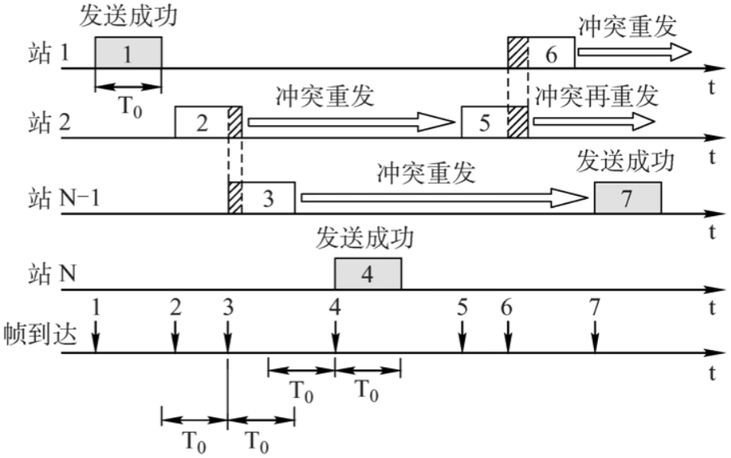

冲突如何解决？

超时后等一随机时间再重传。

## 时隙ALOHA协议

时隙ALOHA协议的思想：把时间分成若干个相同的时间片，所有用户在时间片开始时刻接入网络信道，若发生冲突，则必须等到下一个时间片开始时刻再发送。

控制想发就发的随意性

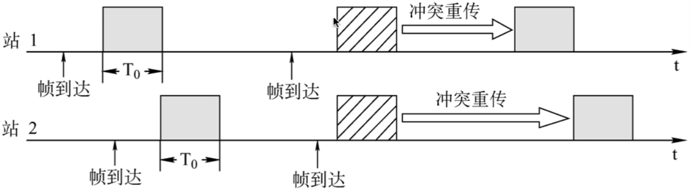

## 关于ALOHA要知道的事

1. 纯ALOHA比时隙ALOHA吞吐量更低，效率更低。
2. 纯ALOHA协议想发就发，时隙ALOHA只有在时间片段开始时才能发。

# CSMA协议

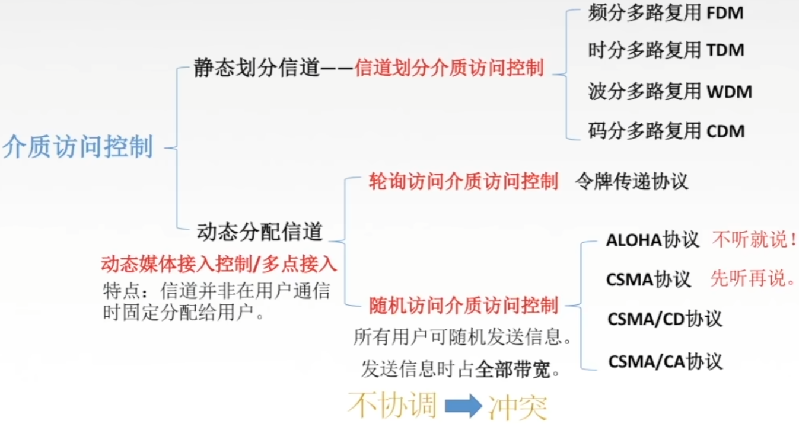

载波监听多路访问协议CSMA（carrier sense multiple access）

CS：载波侦听/监听，每一个站在发送数据之前要检测以下总线上是否有其他计算机在发送数据。

当几个站同时在总线上发送数据时，总线上的信号电压摆动值将会增大（互相叠加）。当一个站检测到的信号电压摆动值超过一定门限值时，就认为总线上至少有两个站同时在发送数据，表明产生了碰撞，即发生了冲突。

MA：多点接入，表示许多计算机以多点接入的方式连接在一根总线上。

协议思想：发送帧之前，监听信道。

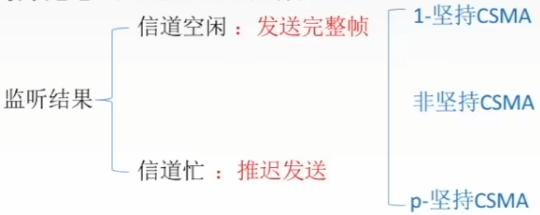

## 1-坚持CSMA

坚持指的是对于监听信道忙之后的坚持。

1-坚持CSMA思想：如果一个主机要发送消息，那么它先监听信道。

空闲则直接传输，不必等待。

忙则一直监听，直到空闲马上传输。

如果有冲突（一段时间内未收到肯定回复），则等待一个随机长的时间再监听，重复上述过程。

优点：只要媒体空闲，站点就马上发送，避免了媒体利用率的损失。

缺点：假如有两个或两个以上的站点有数据要发送，冲突就不可避免。

## 非坚持CSMA

非坚持指的是对于监听信道忙之后就不继续监听。

非坚持CSMA思想：如果一个主机要发送消息，那么它先监听信道。

空闲则直接传输，不必等待。

忙则等待一个随机的事件之后再进行监听。

优点：采用随机的重发延迟时间可以减少冲突发生的可能性。

缺点：可能存在大家都在延迟等待过程中，使得媒体仍可能处于空闲状态，媒体使用率降低。

## p-坚持CSMA

- Assumes a very fine-grained slotted channel
- if p=1 protocol similar to 1-persistent CSMA
- p=0 is not the same as non-persistent CSMA

Algorithm:

Sense the channel before transmitting on mini-slot boundaries

If busy, wait till channel goes idle

If idle, transmit with probability p

Else wait for the next mini-slot, and repeat.

p-坚持指的是对于监听信道空闲的处理。

p-坚持CSMA思想：如果一个主机要发送消息，那么它先监听信道。

空闲则以p概率直接传输，不必等待；概率1-p等待到下一个时间槽再传输。

忙则持续监听直到信道空闲再以p概率发送。

若冲突则等到下一个时间槽开始再监听并重复上述过程。

优点：既能像非坚持算法那样减少冲突，又能像1-坚持算法那样减少媒体空闲时间的这种方案。

发生冲突后还是要坚持把数据帧发送完，造成了浪费。

有没有什么办法可以减少资源浪费，一冲突就能发现呢？

CSMA/CD

## 三种CSMA对比总结

|          | 1-坚持CSMA   | 非坚持CSMA                     | p-坚持CSMA                                   |
| -------- | ------------ | ------------------------------ | -------------------------------------------- |
| 信道空闲 | 马上发       | 马上发                         | p概率马上发 1-p概率等到下一个时隙再发送 |
| 信道忙   | 继续坚持监听 | 放弃监听，等一个随机时间再监听 | 持续监听，直到信道空闲再以p概率发送          |

# CSMA-CD协议

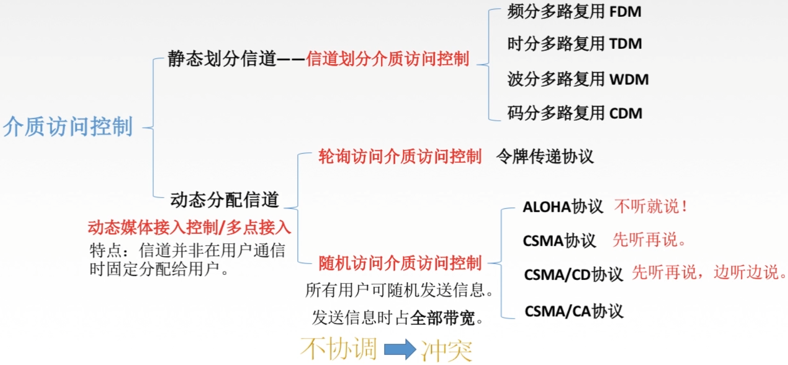

载波监听多点接入/碰撞检测CSMA/CD（carrier sense multiple access with collision detection）

CS：载波侦听/监听，每一个站在发送数据之前以及发送数据时都要检测一下总线上是否有其他计算机在发送数据。

MA：多点接入，表示许多计算机以多点接入的方式连接在一根总线上。总线型网络

CD：碰撞检测（冲突检测），“边发送边监听”，适配器边发送数据边检测信道上信号电压的变化情况，以便判断自己在发送数据时其他站是否也在发送数据。半双工网络

先听后发为什么还会冲突？因为电磁波在总线上总是以有限的速率传播的。

## 传播时延对载波监听的影响

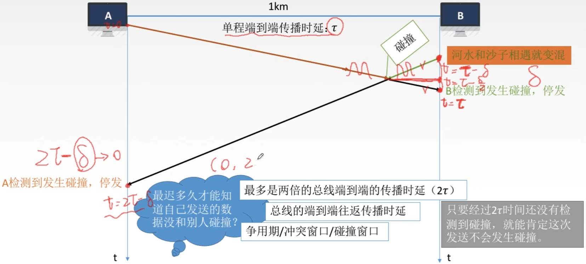

## 如何确定碰撞后的重传时机？

### 截断二进制指数规避算法

1. 确定基本退避（推迟）时间为争用期2tao
2. 定义参数k，它等于重传次数，但k不超过10，即k=min[重传次数, 10]。当重传次数不超过10时，k等于重传次数；当重传次数大于10时，k就不再增大而一直等于10。
3. 从离散的整数集合[0, 1, , 2^k-1]中随机取出一个数r，重传所需要退避的时间就是r倍的基本退避时间，即2rtao。
4. 当重传达16次仍不能成功时，说明网络太拥挤，认为此帧永远无法正确发出，抛弃此帧并向高层报告出错。

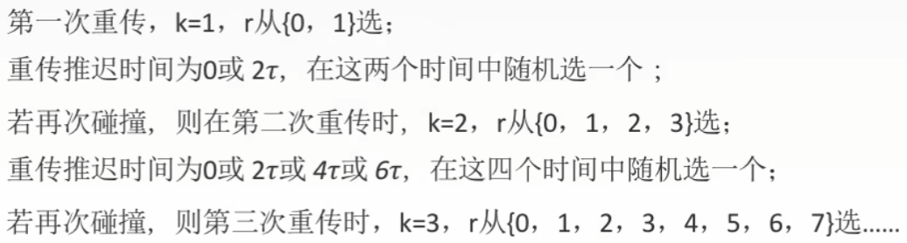

若连续多次发生冲突，就表明可能有较多的站参与争用信道。使用此算法可使重传需要推迟的平均时间随重传次数的增大而增大，因而减小发生碰撞的概率，有利于整个系统的稳定。

## 最小帧长问题

A站发了一个很短的帧

但发生了碰撞

不过帧在发送完毕后才检测到发生碰撞

没法停止发送

因为发完了

帧的传输时延至少要两倍于信号在总线中的传播时延。
$$
\frac{帧长(bit)}{数据传输速率}\geq 2\tau
$$
以太网规定最短帧长为64B，凡是长度小于64B的都是由于冲突而异常终止的无效帧。

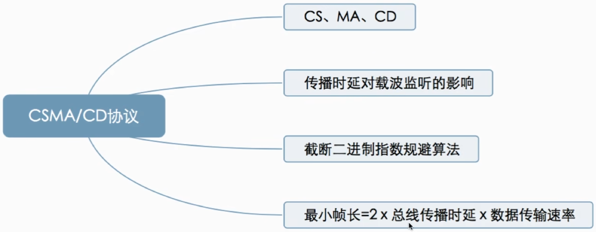

# CSMA-CA协议

载波监听多点接入/碰撞避免CSMA/CA (carrier sense multiple access with collision avoidance)

为什么要有CSMA/CA？无线局域网

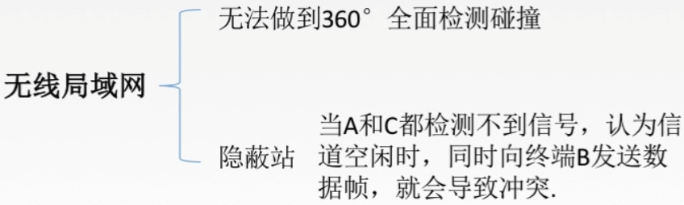

## CSMA/CA协议工作原理

发送数据前，先检测信道是否空闲。

空闲则发出RTS (request to send)，RTS包括发射端的地址、接收端的地址、下一份数据将持续发送的时间等信息；信道忙则等待。

接收端收到RTS后，将响应CTS (clear to send)。

发送端收到CTS后，开始发送数据帧（同时预约信道：发送方告知其他站点自己要传多久数据）。

接收端收到数据帧后，将用CRC来检验数据是否正确，正确则响应ACK帧。

发送方收到ACK就可以进行下一个数据帧的发送，若没有则一直重传至规定重发次数为止（采用二进制指数退避算法来确定随机的推迟时间）。

1. 预约信道
2. ACK帧
3. RTS/CTS帧（可选）

## CSMA/CD与CSMA/CA

相同点：

CSMA/CD与CSMA/CA机制都从属于CSMA的思路，其核心是先听再说。换言之，两个在接入信道之前都需要进行监听。当发现信道空闲后，才能进行接入。

不同点：

1. 传输介质不同：CSMA/CD用于总线式以太网【有线】，而CSMA/CA用于无线局域网【无线】。
2. 载波检测方式不同：因传输介质不同，CSMA/CD与CSMA/CA的检测方式也不同。CSMA/CD通过电缆中电压的变化来检测，当数据发生碰撞时，电缆中的电压就会随着发生变化；而CSMA/CA采用能量检测（ED）、载波检测（CS）和能量载波混合检测三种检测信道空闲的方式。
3. CSMA/CD检测冲突，CSMA/CA避免冲突，二者出现冲突后都会进行有上限的重传。

# 轮询访问介质访问控制

信道划分介质访问控制（MAC Multiple Access Control）协议：

​	基于多路复用技术划分资源。

​	网络负载重：共享信道效率高，且公平

​	网络负载轻：共享信道效率低

随机访问MAC协议：冲突

​	用户根据意愿随机发送信息，发送信息时可独占信道带宽。

​	网络负载重：产生冲突开销

​	网络负载轻：共享信道效率高，单个结点可利用信道全部带宽

轮询访问MAC协议/轮流协议/轮转访问MAC协议：

​	既要不产生冲突，又要发送时占全部带宽。

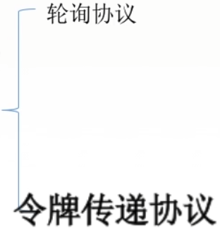

## 轮询协议

主结点轮流“邀请”从属结点发送数据

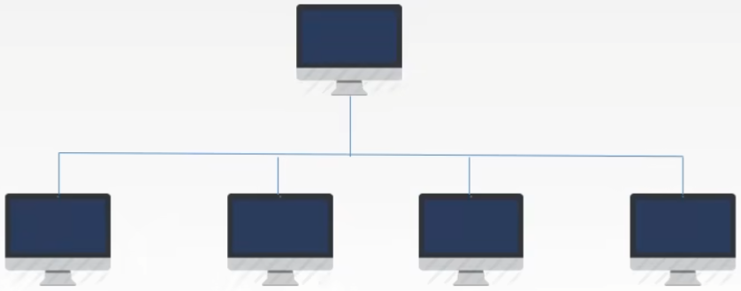

问题：

1. 轮询开销
2. 等待延迟
3. 单点故障

## 令牌传递协议

令牌：一个特殊格式的MAC控制帧，不含任何信息。

控制信道的使用，确保同一时刻只有一个结点独占信道。

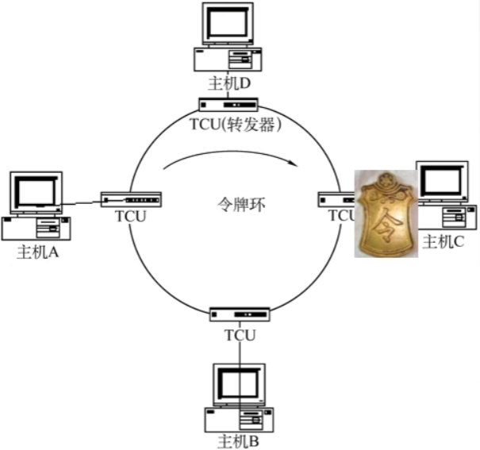

令牌环网无碰撞

每个结点都可以在一定的时间内（令牌持有时间）获得发送数据的权利，并不是无限制地持有令牌。

问题：

1. 令牌开销
2. 等待延迟
3. 单点故障

应用于令牌环网（物理星型拓扑，逻辑环形拓扑）。

采用令牌传送方式地网络常用于负载较重、通信量较大的网络中。

# MAC协议总结

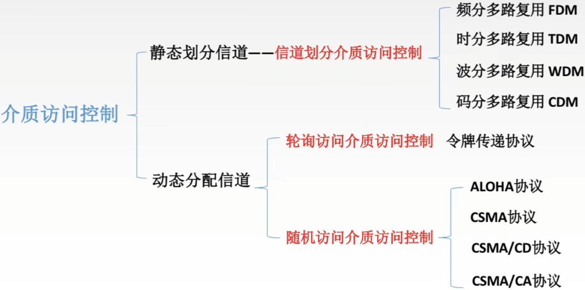