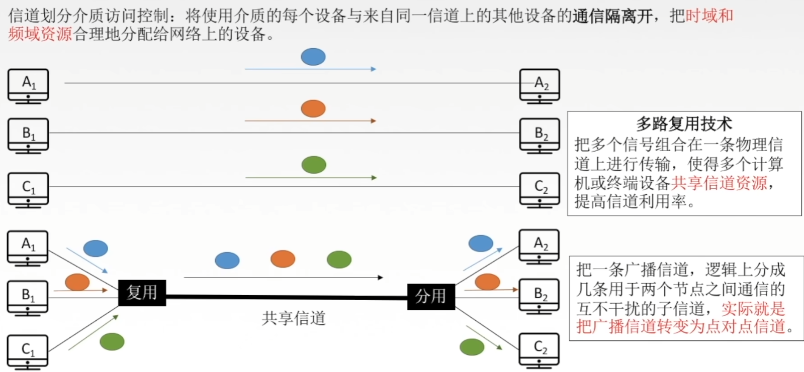

# 信道划分介质访问控制

## 传输数据使用的两种链路

### 点对点链路

两个相邻节点通过一个链路相连，没有第三者。

应用：PPP协议，常用于广域网。

### 广播式链路

所有主机共享通信介质

应用：早期的总线以太网、无线局域网，常用于局域网

典型拓扑结构：总线型、星型（逻辑总线型）

## 介质访问控制

介质访问控制的内容是就是，采取一定的措施，使得两对结点之间的通信不会发生互相干扰的情况。

## 信道划分介质访问控制

信道划分介质访问控制：将使用介质的每个设备与来自同一信道上的其他设备的通信隔离开，把时域和频域资源合理地分配给网络上的设备。

### 多路复用技术

把多个信号组合在一条物理信道上进行传输，使得多个计算机或终端设备共享信道资源，提高信道利用率。

把一条广播信道，逻辑上分成几条用于两个结点之间通信得互不干扰得子信道，实际就是把广播信道转变为点对点信道。

### 频分多路复用FDM

用户在分配到一定的频带后，在通信过程中自始至终都占用这个频带。频分复用的所有用户在同样的时间占用不同的带宽（频率带宽）资源。

充分利用传输介质带宽，系统效率较高；

由于技术比较成熟，实现也比较容易。

### 时分多路复用TDM

TDM帧使在物理层传送的比特流所划分的帧，标志一个周期。

将时间划分为一段段等长的时分复用帧（TDM帧）。每一个时分复用的用户在每一个TDM帧中占用固定序号的时隙，所有用户轮流占用信道。

频分复用--“并行”

时分复用--”并发“

### 改进的时分复用--统计时分复用STDM

每一个STDM帧中的时隙数小于连接在集中器上的用户数。各用户有了数据就随时发往集中器的输入缓存，然后集中器按顺序依次扫描输入缓存，把缓存中的输入数据放入STDM帧中，一个STDM帧满了就发出。STDM帧不是固定分配时隙，而是按需动态分配时隙。

### 波分多路复用WDM

波分多路复用就是光的频分多路复用，在一根光纤中传输多种不同波长（频率）的光信号，由于波长（频率）不同，所以各路光信号互不干扰，最后再用波长分解复用器将各路波长分解出来。

### 码分多路复用CDM

码分多址（CDMA）是码分复用的一种方式。

1个比特分为多个码片/芯片(chip)，每一个站点被指定一个唯一的m位的芯片序列，发送1时发送芯片序列（通常把0写成-1）。

发送1时站点发送芯片序列，发送0时发送芯片序列反码。

1. 多个站点同时发送数据的时候，要求各个站点芯片序列相互正交，规格化内积为0。
2. 两个向量到了公共信道上，线性相加。
3. 数据分离：合并的数据和源站规格化内积。

# ALOHA协议

## 纯ALOHA协议

纯ALOHA协议思想：不监听信道，不按时间槽发送，随机重发。想发就发

冲突如何检测？

如果发生冲突，接收方在就会检测出差错，然后不予确认，发送方在一定时间内收不到就判断发生冲突。

冲突如何解决？

超时后等一随机时间再重传。

## 时隙ALOHA协议

时隙ALOHA协议的思想：把时间分成若干个相同的时间片，所有用户在时间片开始时刻接入网络信道，若发生冲突，则必须等到下一个时间片开始时刻再发送。

控制想发就发的随意性

## 关于ALOHA要知道的事

1. 纯ALOHA比时隙ALOHA吞吐量更低，效率更低。
2. 纯ALOHA协议想发就发，时隙ALOHA只有在时间片段开始时才能发。

# CSMA协议

# CSMA-CD协议

# CSMA-CA协议

# 轮询访问介质访问控制