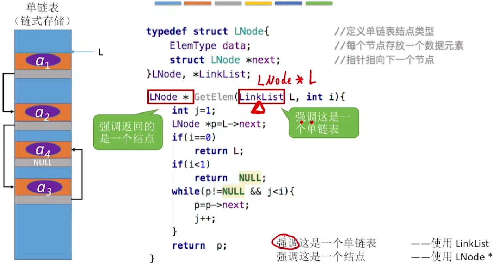

# 单链表的定义

## 用代码定义一个单链表

## 不带头结点的单链表

## 带头结点的单链表

## 不带头结点v.s.带头结点

# 单链表的插入删除

## 按位序插入（带头结点）

## 按位序插入（不带头结点）

## 指定结点的后插操作

## 指定结点的前插操作

## 按位序删除（带头结点）

## 指定结点的删除

## 封装的好处

# 单链表的查找

## 按位查找

## 按值查找

## 求表的长度

# 单链表的建立

## 尾插法建立单链表

## 头插法建立单链表

头插法、尾插法：核心就是初始化操作、指定结点的后插操作

# 双链表

# 循环链表

# 静态链表

# 顺序表和链表的比较