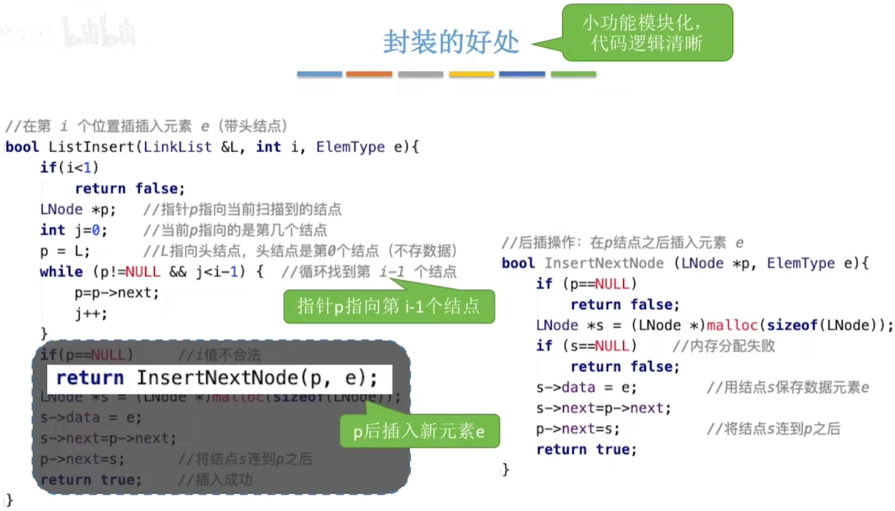
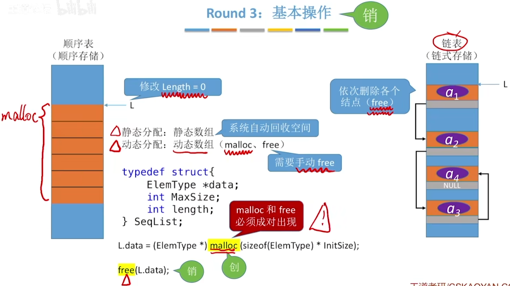

# 单链表的定义

## 用代码定义一个单链表

## 不带头结点的单链表

## 带头结点的单链表

## 不带头结点v.s.带头结点

# 单链表的插入删除

## 按位序插入（带头结点）

## 按位序插入（不带头结点）

## 指定结点的后插操作

## 指定结点的前插操作

## 按位序删除（带头结点）

## 指定结点的删除

## 封装的好处

# 单链表的查找

## 按位查找

## 按值查找

## 求表的长度

# 单链表的建立

## 尾插法建立单链表

## 头插法建立单链表

头插法、尾插法：核心就是初始化操作、指定结点的后插操作

# 双链表

## 双链表的初始化（带头结点）

## 双链表的插入

## 双链表的删除

## 双链表的遍历

# 循环链表

## 循环单链表

单链表：从一个结点出发只能找到后续的各个结点

循环单链表：从一个结点出发可以找到其他任何一个结点

## 循环双链表

双链表：

表头结点的prior指向NULL；

表尾结点的next指向NULL

循环双链表：

表头结点的prior指向表尾结点

表尾结点的next指向头结点

## 循环双链表的初始化

## 双链表的插入

## 双链表的删除

# 静态链表

单链表：各个结点在内存中星罗棋布、散落天涯。

静态链表：分配一整片连续的内存空间，各个结点集中安置。

## 用代码定义一个静态链表

初始化静态链表：

把a[0]的next设为-1

查找：

从头结点出发挨个往后遍历结点 O(n)

插入位序为i的结点：

1. 找到一个空的结点，存入数据元素
2. 从头结点出发找到位序为i-1的结点
3. 修改新结点的next
4. 修改i-1号结点的next

删除某个结点：

1. 从头结点出发找到前驱结点
2. 修改前驱结点的游标
3. 被删除结点next设为-2

静态链表：用数组的方式实现的链表

# 顺序表和链表的比较

## 逻辑结构

都属于线性表，都是线性结构

## 存储结构

顺序表（顺序存储）

优点：支持随机存取、存储密度高

缺点：大片连续空间分配不方便，改变容量不方便

链表（链式存储）

优点：离散的小空间分配方便，改变容量方便

缺点：不可随机存取，存储密度低

## 基本操作

创销、增删改查

表长难以预估、经常要增加/删除元素 > 链表

表长可预估、查询（搜索）操作较多 > 顺序表

