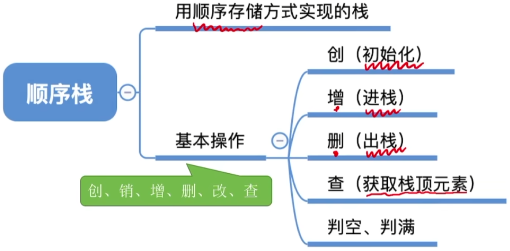
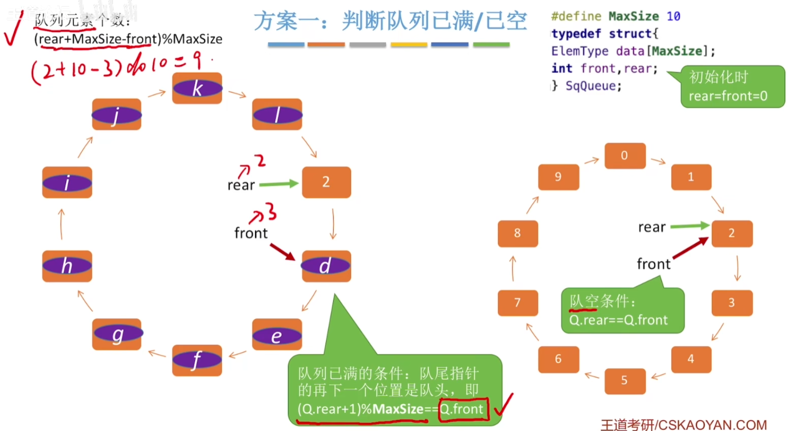

# 栈的基本概念

## 栈的定义

 

## 栈的基本操作

## 栈的常考题型

# 栈的顺序存储实现

## 顺序栈的定义

## 初始化操作

## 进栈操作

## 出栈操作

## 读栈顶元素操作

## 另一种方式

## 共享栈

# 栈的链式存储实现

## 链栈的定义

# 队列的基本概念

## 队列的定义

## 队列的基本操作

# 队列的顺序实现

# 队列的链式实现

