# 网络层功能概述

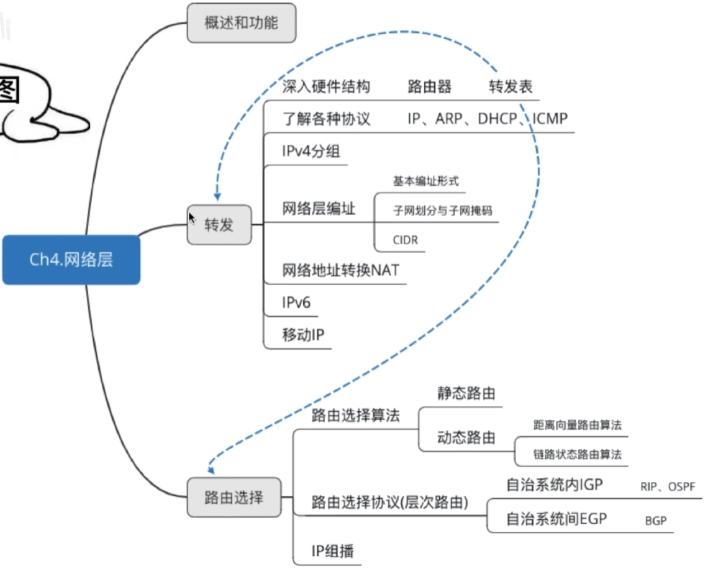

## 网络层

主要任务是把分组从源端传到目的端，为分组交换网上的不同主机提供通信服务。网络层传输单位是数据报。

功能一：路由选择与分组转发 最佳路径

功能二：异构网络互联

功能三：拥塞控制

若所以后结点都来不及接收分组，而要丢弃大量分组的话，网络就处于拥塞状态。因此要采取一定措施，缓解这种拥塞。

WAY1：开环控制 静态

WAY2：闭环控制 动态

# SDN基本概念

路由器功能：转发&路由选择

转发：达到路由器输入链路之一的数据报如何转发到该路由器的输出链路之一。

路由选择：

控制数据报沿着从源主机到目的主机的端到端路径中路由器之间的路由方式。

数据平面

数据平面对于数据处理过程中各种具体处理转发过程。

控制平面

控制平面用于控制和管理网络协议的运行，比如OSPF协议、RIP协议、BGP协议。

## 数据平面

数据平面执行的主要功能是根据转发表进行转发，这是路由器的本地动作。

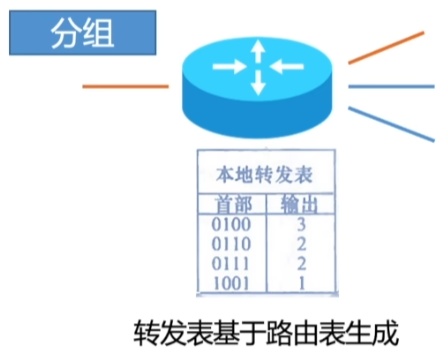

## 控制平面（传统方法/每路由器法）

控制平面（传统方法）：

路由选择算法运行在每台路由器中，并且在每台路由器中都包含转发和路由选择两种功能。

具体方法：

在一台路由器中的路由选择算法与其他路由器中的路由选择算法通信（通过交换路由选择报文），计算出路由表和转发表。

## 控制平面（SDN方法：Software-Defined Networking）

控制平面（传统方法）：

控制平面从路由器物理上分离。路由器仅实现转发，远程控制器计算和分发转发表以供每台路由器所使用。

具体方法：

路由器通过交换包含转发表和其他路由选择信息的报文与远程控制器通信。因为计算转发并与路由器交互的控制器是用软件实现的，所以网络是”软件定义的“。

远程控制器可能在具有高可靠性的远程数据中心中，并可能由ISP或某些第三方管理。

## 控制平面中的路由选择处理器

传统方法：

路由选择处理器执行控制平面功能。在传统的路由器中，它执行路由选择协议，维护路由选择表于关联链路状态信息，并为该路由器计算转发表。

SDN方法：

在SDN路由器中，路由选择处理器负责远程控制器通信，目的是接收远程控制器计算的转发表项。

## SDN控制平面

控制平面

1. SDN控制器：维护准确的网络状态信息（远程链路、交换机和主机的状态）；为运行在控制平面中的网络控制应用程序提供这些信息（逻辑集中，在多台服务器上实现）。
2. 网络控制应用程序：根据SDN控制器提供的方法，这些应用程序通过这些方法能够监视、编程和控制下面的网络设备。  

## SDN控制器的三个层次

对于网络控制应用程序的接口：

SDN控制器通过”北向接口“与网络控制应用程序交互。该API允许网络控制应用程序在状态管理层之间读写网络状态。

网络范围状态管理层：

由SDN控制平面作出的最终控制决定，将要求控制器具有有关网络的主机、链路等最新状态信息。

通信层：

SDN控制器与受控网络设备之间的通信（OpenFlow协议），包含”南向接口“

##  习题

1. 假定你要在SDN控制平面中实现一个新型路由选择协议。你将在哪个层次中实现该协议？

   网络范围状态管理层。因为在这一层能获得有关网络的主机，链路，交换机和其他SDN控制设备的最新状态信息，可以根据这些信息的基础上实现新型路由选择协议，并通知给控制器落地执行。

2. 谁是从控制器跨越南向接口发送的这些报文的接收者？谁是跨越北向接口从控制器发送的这些报文的接收者？

   - 受控网络设备（路由器）
   - 网络控制应用程序

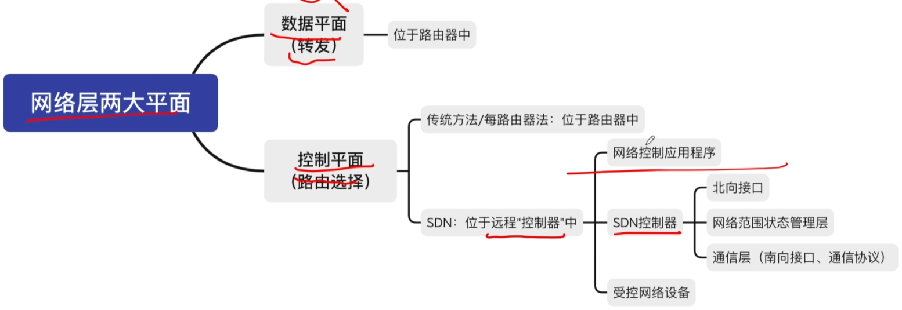

# 路由算法与路由协议概念

## 路由算法

最佳路由：”最佳“只能是相对于某一种特定要求下得出的较为合理的选择而已。

## 路由算法的分类

路由算法

静态路由算法（非自适应路由算法）管理员手工配置路由信息。

简单、可靠，在负荷稳定、拓扑变化不大的网络中运行效果很好，广泛用于高度安全性的军事网络和较小的商业网络。路由更新慢，不适用大型网络。

动态路由算法（自适应路由算法）路由器间彼此交换信息，按照路由算法优化出路由表项。

路由更新快，使用大型网络，即时响应链路费用或网路拓扑变化。算法复杂，增加网络负担。

动态路由算法

全局性 链路状态路由算法 OSPF

所有路由器掌握完整的网络拓扑和链路费用信息。

分散性

距离向量路由算法。RIP

路由器只掌握物理相连的邻居及链路费用。

## 分层次的路由选择协议

1. 因特网规模很大
2. 许多单位不想让外界知道自己的路由选择协议，但还想连入因特网

自治系统AS：在单一的技术管理下的一组路由器，而这些路由器使用一种AS内部的路由选择协议和共同的度量以确定分组在该AS内的路由，同时还使用一种AS之间的路由协议以确定在AS之间的路由。

一个AS内的所有网络都属于一个行政单位来管辖，一个自治系统的所有路由器在本自治系统内都必须连通。

路由选择协议

内部网关协议IGP

一个AS内使用的RIP、OSPF

外部网关协议EGP

AS之间使用的GP

# IP数据报格式

## TCP/IP协议栈

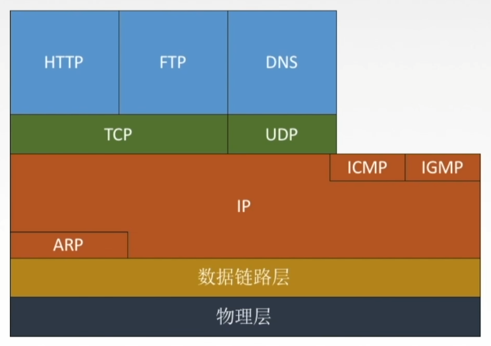

## IP数据报格式

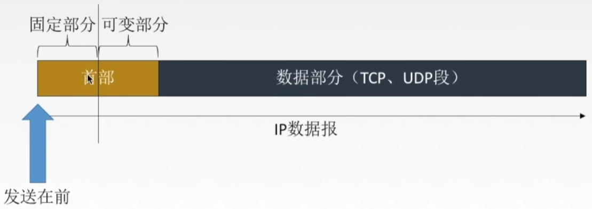

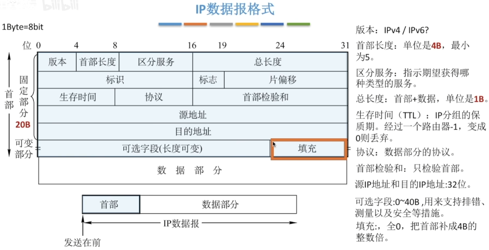

# IP数据报分片

## 最大传送单元MTU

链路层数据帧可封装数据的上限。

以太网的MTU是1500字节。

如果所传送的数据报长度超过某链路的MTU值？

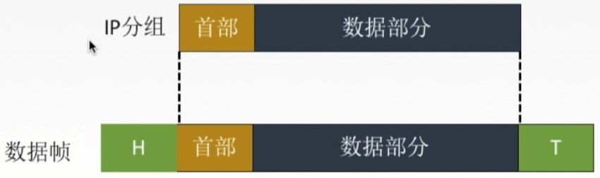

## IP数据报格式

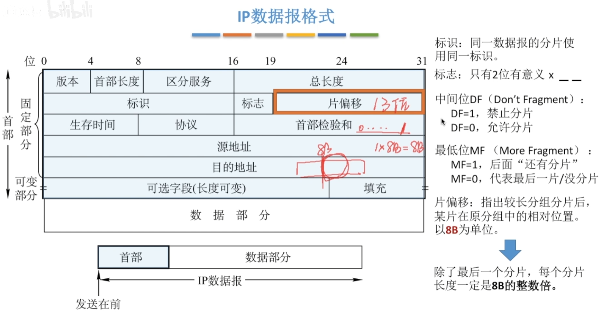

## IP数据报分片例题

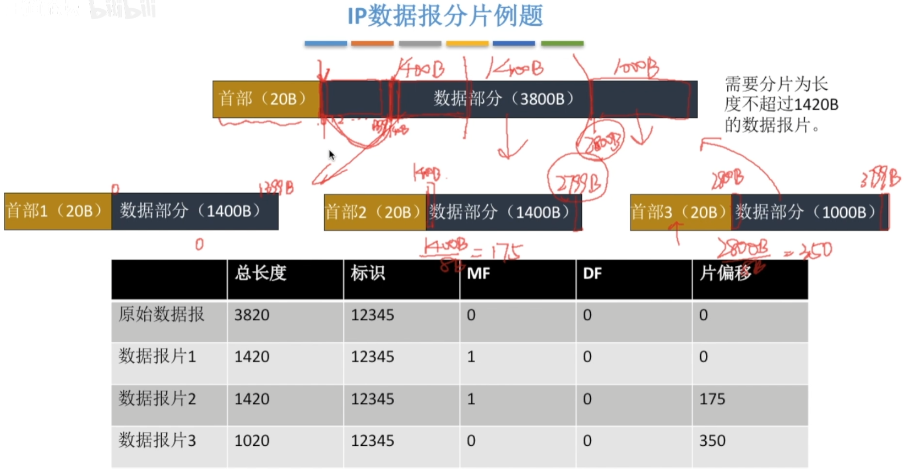

## IP数据报格式

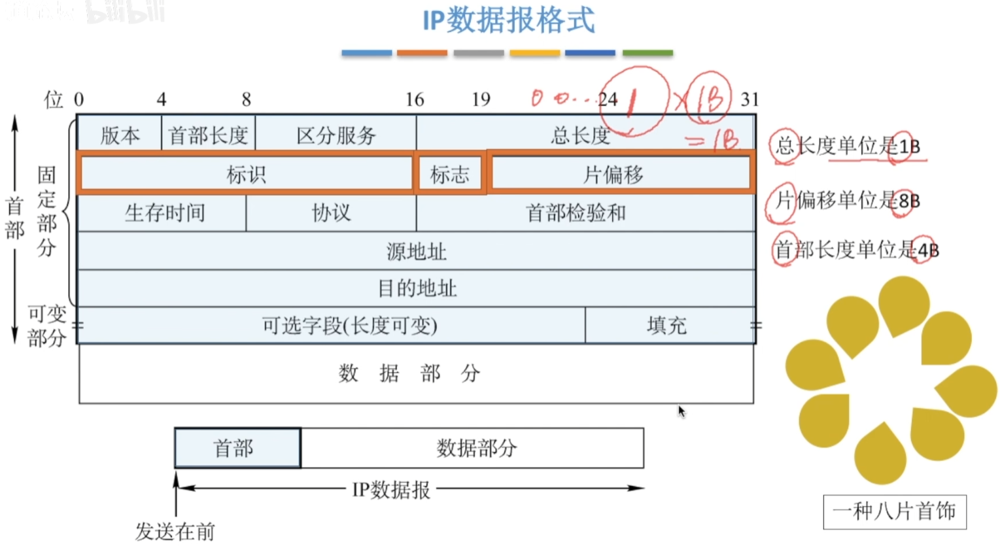

# IPv4地址

## IP地址

## IP编制的历史阶段

### 分类的IP地址

IP地址：全世界唯一的32位/4字节标识符，标识路由器主机的接口。

点分十进制

互联网中的IP地址

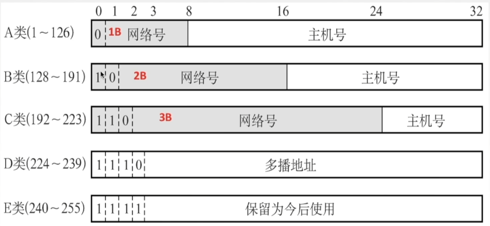

特殊IP地址

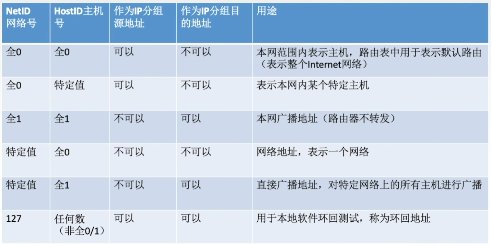

## 私有IP地址

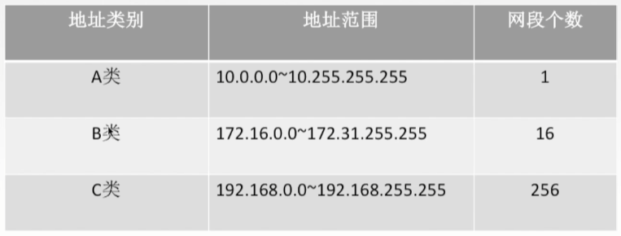

### 子网的划分

### 构成超网（无分类编址方法）

# 网络地址转换NAT

私有IP地址

路由器对目的地址是私有IP地址的数据报一律不进行转发。

网络地址转换NAT（Network Address Translation）:在专用网连接到因特网的路由器上安装NAT软件，安装了NAT软件的路由器叫NAT路由器，它至少有一个有效的外部全球IP地址。

# IPv6

## 为什么有IPv6

32位IPv4地址空间已分配殆尽...

CIDR NAT治标不治本

IPv6从根本上解决地址耗尽问题

改进首部格式

快速处理/转发数据报

支持QoS

## IPv6数据报格式

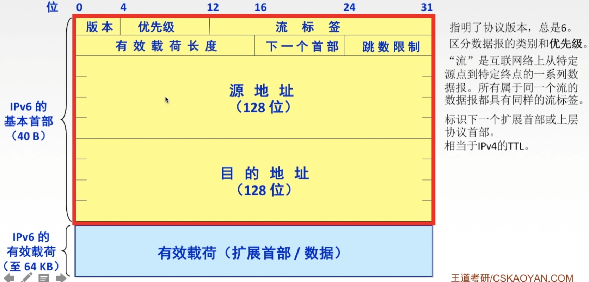

## IPv6和IPv4

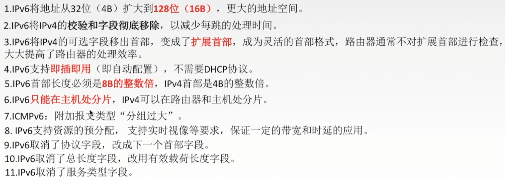

## IPv6地址表示形式

点分十进制？

一般形式 冒号十六进制记法

压缩形式

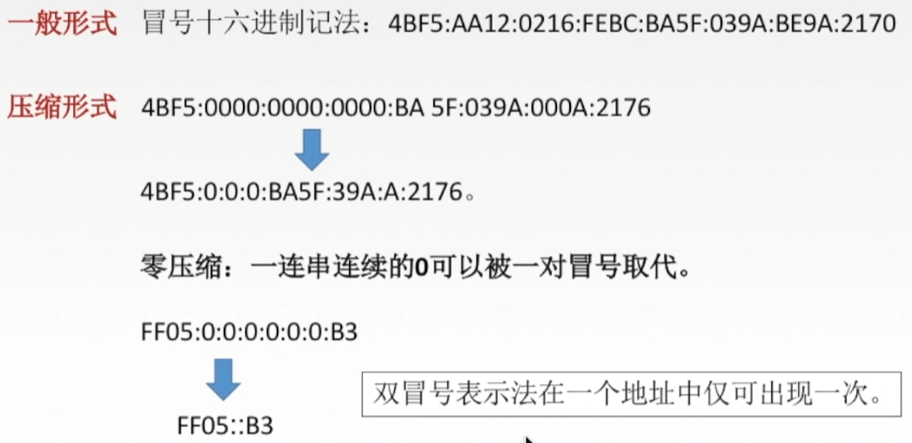

## IPv6基本地址类型

单播 一对一通信 可做源地址+目的地址

多播 一对多通信 可做目的地址

任播 一对多中的一个通信 可做目的地址

## IPv6向IPv4过渡的策略

双栈协议

隧道技术

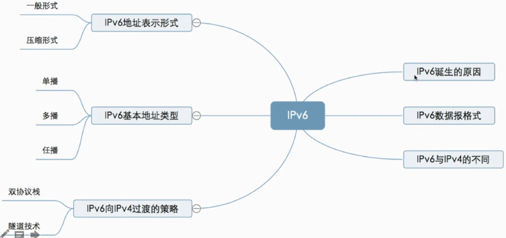

   

