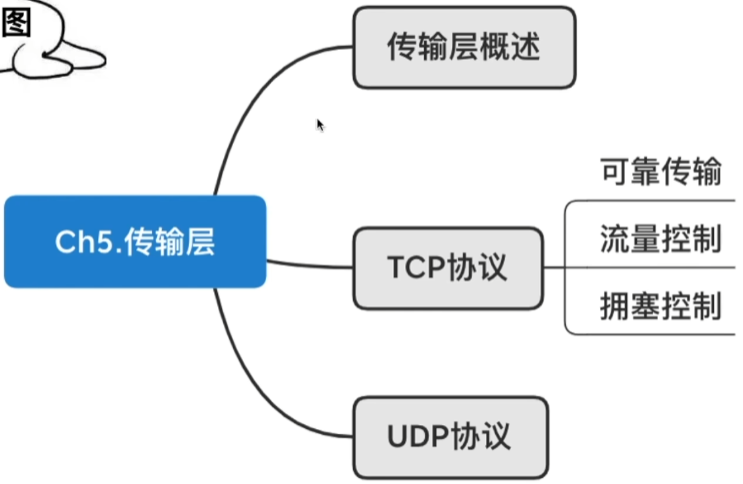
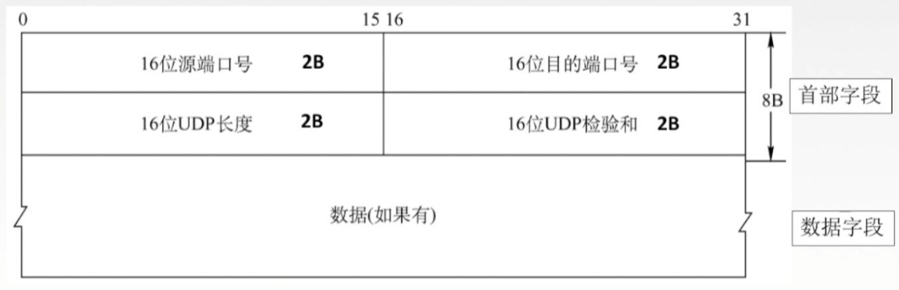

# 传输层概述

## 传输层

只有主机才有的层次

为应用层提供通信服务

使用网络层的服务

传输层的功能：

1. 传输层提供进程和进程之间的逻辑通信。

   网络层提供主机之间的逻辑通信。

2. 复用和分用

3. 传输层对收到的报文进行差错检测。

4. 传输层的两种协议

## 传输层的两个协议

### 面向连接的传输控制协议TCP

传送数据之前必须建立连接，数据传送结束后要释放连接。不提供广播或多播服务。由于TCP要提供可靠的面向连接的传输服务，因此不可避免增加了许多开销：确认、流量控制、计时器及连接管理等。

可靠，面向连接，时延大，使用于大文件。

### 无连接的用户数据报协议UDP

传送数据之前不需要建立连接，收到UDP报文后也不需要给出任何确认。

不可靠，无连接，时延小，适用于小文件。

## 传输层的寻址与端口

复用：应用层所有的应用进程都可以通过传输层再传输到网络层。

分用：传输层从网络层收到数据后交付指明的应用程序。

逻辑端口/软件端口 端口是传输层的SAP，标识主机中的应用进程。

端口号只有本地意义，在因特网中不同计算机的相同端口是没有联系的。

端口号长度为16bit，能表示65536个不同的端口号。

端口号（按范围分）

服务端使用的端口号

- 熟知端口号：给TCP/IP最重要的一些应用程序，让所有用户都知道。0~1023
- 登记端口号：为没有熟知端口号的应用程序使用的。1024~49151

客户端使用的端口号：仅在客户进程运行时才动态选择。49152~65535

在网络中采用发送方和接收方的套接字组合来识别端点，套接字唯一标识了网络中的一个主机和它上面的一个进程。

套接字Socket=（主机IP地址，端口号）

# UDP协议

## 用户数据报协议UDP概述

UDP只在IP数据报服务之上增加了很少功能，即复用分用和差错检测功能。

UDP的主要特点：

1. UDP是无连接的，减少开销和发送数据之前的时延。
2. UDP使用最大努力交付，即不保证可靠交付。
3. UDP是面向报文的，适合一次性传输少量数据的网络应用。
4. UDP无拥塞控制，适合很多实时应用。

应用层给UDP多长的报文，UDP就照样发送，即一次发一个完整报文。

## UDP首部格式

分用时，找不到对应的目的端口号，就丢弃报文，并给发送方发送ICMP”端口不可达“差错报告报文。

## UDP校验

伪首部只有在计算检验和时才出现，不向下传送也不向上递交。

# TCP协议特点和TCP报文段格式

## TCP协议的特点

1. TCP是面向连接（虚连接）的传输层协议。
2. 每一条TCP连接只能有两个端点，每一条TCP连接只能是点对点的。
3. TCP提供可靠交付的服务，无差错、不丢失、不重复、按序到达。可靠有序，不丢不重
4. TCP提供全双工通信。
5. TCP面向字节流->TCP把应用程序交下来的数据看成仅仅是一连串的无结构的字节流。

## TCP报文段首部格式

窗口：指的是发送本报文段的一方的接收窗口，即现在允许对方发送的数据量。

检验和：检验首部+数据，检验时要加上12B伪首部，第四个字段为6。

紧急指针：URG=1时才有意义，指出本报文段中紧急数据的字节数。

选项：最大报文段长度MSS、窗口扩大、时间戳、选择确认...s

# TCP连接管理

## TCP的连接建立

## SYN洪泛攻击

## TCP的连接释放

# TCP可靠传输

传输层 使用TCP实现可靠传输

网络层 提供最大努力交付，不可靠传输

可靠：保证接收方进程从缓存区读出的字节流与发送方发出的字节流是完全一样的。

重传

# TCP流量控制

流量控制：让发送方慢点，要让接收方来得及接收。

TCP利用滑动窗口机制实现流量控制。

# TCP拥塞控制

出现拥塞的条件：对资源需求的总和>可用资源

网络中有许多资源同时呈现供应不足->网络性能变坏->网络吞吐量将随输入负荷增大而下降

拥塞控制：

防止过多的数据注入到网络中。全局性