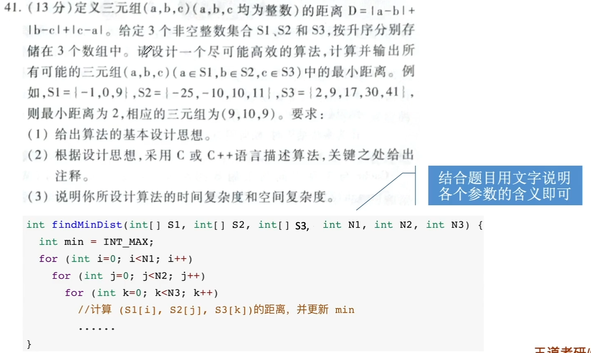
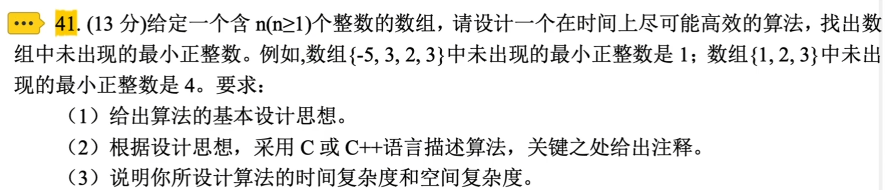
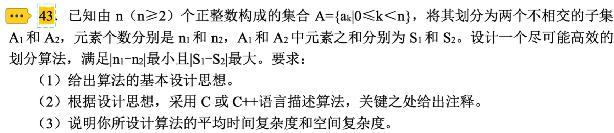
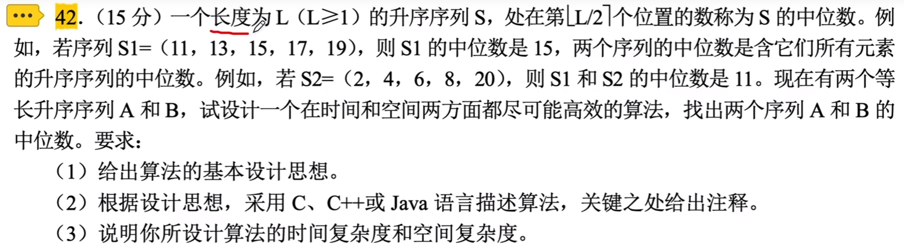

# 线性表的顺序表示

### 顺序表、链表

逻辑结构：都是线性表

物理结构：

顺序表 顺序存储，逻辑上相邻的物理上也相邻

链表 链式存储，逻辑上相邻的物理上可以不相邻，用指针描述逻辑上的前驱后继关系

Key：顺序表的随机存取特性

基本操作：创销增删改查

### 顺序表的基本操作

静态分配：静态数组

```c++
#define MaxSize 10
typedef struct{
    ElemType data[MaxSize];
    int length;
}SeqList;
```

动态分配：动态数组（malloc、free）

```c++
typedef struct{
    ElemType *data;
    int MaxSize;
    int length;
}SeqList;

L.data = (ElemType *)malloc(sizeof(ElemType)*InitSize);
free(L.data);
```

Tips：目前为止，顺序表的算法题只需简单定义一个数组即可，基于数组实现算法

int data[N]; //文字说明数组里存了什么数据，数据长度为N

### 顺序表的插入操作

对于插入算法，若表长为n，则在第i位置插入元素，则从an到ai都要向后移动一个位置，共需移动n-i+1个元素，平均时间复杂度为O(n)。代码如下：

```c++
//判断i的范围是否有效，否则非法
//判断当前存储空间是否已满，否则不能插入
for(int j = L.length; j >= i; j--) //将第i个位置及之后的元素后移
    L.data[j] = L.data[j-1];       
L.data[i-1] = e;                   //在位置i处放入e，数组从0开始存储
L.length++;                        //线性表长度加1
```

### 顺序表的删除操作

对于删除算法，若表长为n，当删除i个元素时，从ai+1到an都要向前移动一个位置，则共需移动n-i个元素，平均时间复杂度为O(n)。代码如下：

```c++
//判断i的范围是否有效
for(int j=i;j<L.length;j++) //将第i个位置之后的元素前移
    L.data[j-1]=L.data[j];
L.length--;                 //线性表长度减1
```

### 顺序表的查找

1. 按序号查找，顺序表具有随机存取（根据首元地址和序号）的特点，时间复杂度为O(1)。
2. 按值x查找，主要运算是比较操作，比较的次数与值x在表中的位置有关，也与表长有关，平均比较次数为(n+1)/2，时间复杂度为O(n)。

对有序表的按值查找呢？

折半查找的时间复杂度 O(log2 n)







无脑做法：先把乱序的数组变有序？怎么搞？

快排，时间复杂度、空间复杂度是？



无脑做法：申请一个大数组，一趟二路归并排序

一趟二路归并排序，时间复杂度、空间复杂度是？


### 顺序表的考察方式

考察顺序表时，大多数情况下就是在对数组操作

Key：基于数组的算法题（保命重点）

查找 顺序遍历查找、折半查找

排序 快速排序（不变长）归并排序（变长）

必须熟悉这几种算法的代码（要能快速手写）、时间复杂度、空间复杂度