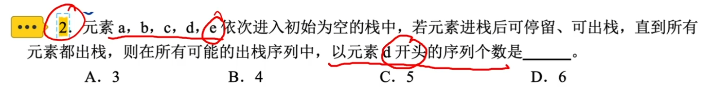

# 栈和队列的基本性质

### 栈和队列的性质

| 术语 | 定义                                                         |
| ---- | ------------------------------------------------------------ |
| 栈   | 只允许在表的一端（栈顶）进行插入或删除的线性表。栈的操作特性为后进先出（LIFO），故又称为后进先出的线性表。 |
| 队列 | 只允许在表尾（队尾）进行插入，而在表头（队头）进行删除的线性表。队列的操作特性为先进先出（FIFO），故又称为先进先出的线性表。 |

某个元素出栈时，只要是在其后出栈且早于它进栈的元素，那么这些元素（包括该元素）的出栈顺序与它的进栈顺序相反。