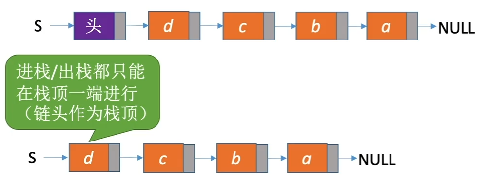
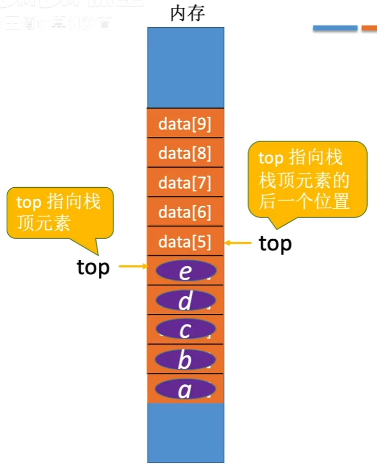
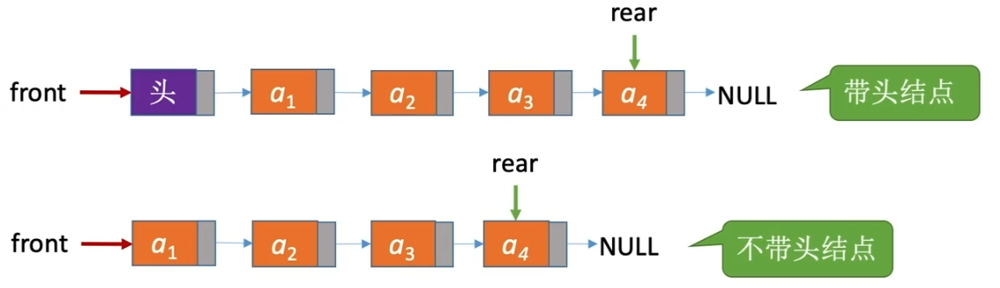
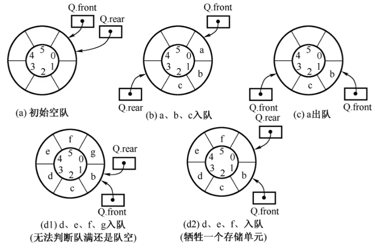
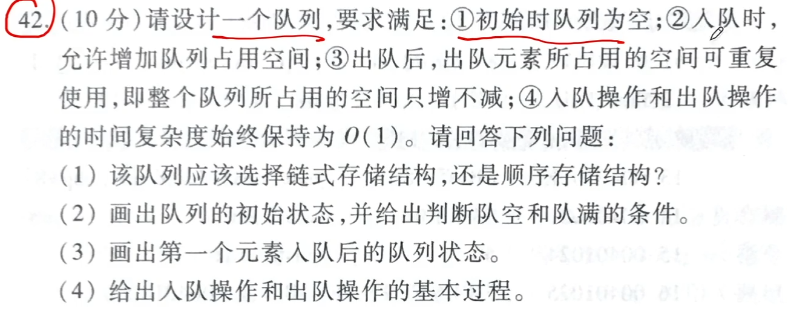
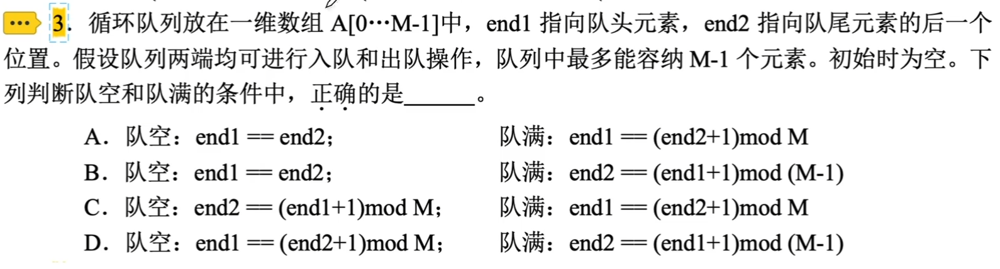
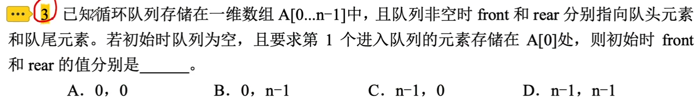
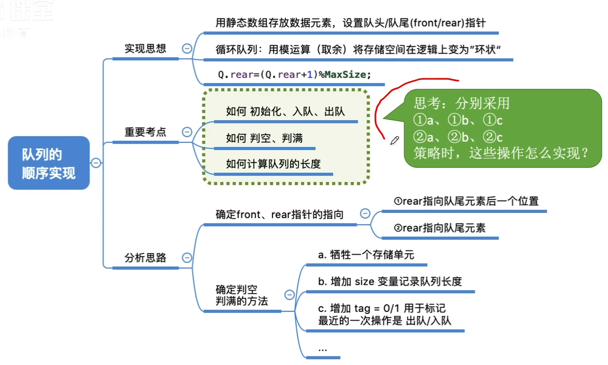

# 栈和队列的存储结构

### 栈的存储结构

- 栈的链式存储，入栈、出栈操作的实现

  

- 栈的顺序存储，入栈、出栈操作的实现，判空、判满、栈顶指针初始化

  

### 队列的存储结构

- 队列的链式存储，入队、出队的实现

  

### 难点：循环队列的初始状态、入队/出队、判空/判满

元素入队：Q.rear=(Q.rear+1)%MaxSize

队列长度：(Q.rear+MaxSize-Q.front)%MaxSize（front指向第一个元素、rear指向最后一个元素的下一位置的情况）

为了区分队空还是队满，通常采用牺牲一个存储单元的方法，约定以“队头指针在队尾指针的下一位置作为队满的标志”

队满条件 (Q.rear+1)%MaxSize==Q.front

队空条件 Q.front==Q.rear

