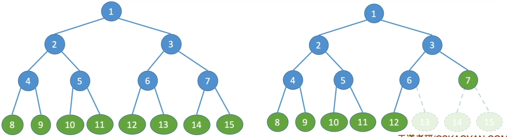

# 二叉树的定义和性质

### 特殊的二叉树

| 术语       | 定义                                                         |
| ---------- | ------------------------------------------------------------ |
| 满二叉树   | 一棵高度为h，并且含有2^h-1个结点的二叉树称为满二叉树，即每一层的结点都到达了其最大值 |
| 完全二叉树 | 一棵高度为h，有n个结点的二叉树，当且仅当其每一个结点都与高度为h的满二叉树中编号为1~n的结点一一对应时，称为完全二叉树。 相比满二叉树，完全二叉树少了最底层、最右边的一些连续叶子结点 |

### 完全二叉树的性质

对完全二叉树从上到下、从左到右的顺序依次编号1、2、...、n，则有：

1. 若i<=[n/2]，则结点i为分支结点，否则为叶子结点，也即最后一个分支结点的编号为[n/2]（建议画几个结点数分别为3、4、5、6的完全二叉树检验）
2. 叶子结点只可能在层次最大的两层上出现（若删除满二叉树中最底层、最右边的连续2个或以上的叶子结点，则倒数第二层将会出现叶子结点）
3. 如果有度为1的结点，只可能有一个，且该结点只有左孩子而无右孩子（度为1的分支结点可能是最后一个分支结点，其结点编号为[n/2]）
4. 按层序编号后，一旦出现某结点（其编号为i）为叶子结点或只有左孩子，则编号大于i的结点均为叶子结点（与结论1和结论3是相通的）
5. 若n为奇数，则每个分支结点都有左子女和右子女；若n为偶数，则编号最大的分支结点（编号为n/2）只有左子女，没有右子女，其余分支结点左、右子女都有（建议画几个结点数分别为3、4、5、6的完全二叉树检验）
6. 结点i所在层次（深度）为[log2 i]+1 （与结论7的原理一样）
7. 具有n个（n>0）结点的完全二叉树的高度为[log2 (n+1)]或[log2 n]+1

### 二叉树的顺序存储

**2018** 设一棵非空完全二叉树T的所有叶结点均位于同一层，且每个非叶节点都有2个子结点。若T有k个叶结点，则T的结点总数是 A

A 2k-1

B 2k

C k^2

D 2^k-1

**2011** 若一棵完全二叉树有768个结点，则该二叉树中叶结点的个数是 C

A 257

B 258

C 384

D 385

**2009** 已知一棵完全二叉树的第6层（设根为第1层）有8个叶结点，则该完全二叉树的结点个数最多是 C

A 39

B 52

C 111

D 199