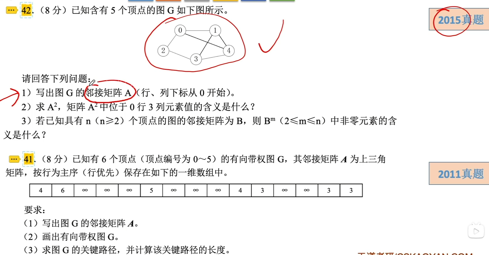

# 图的存储及基本操作

### 图的邻接矩阵存储法

用一个一维数组存储图中顶点的信息，用一个二维数组存储图中边的信息。

邻接矩阵存储法的特点：

1. 无向图的邻接矩阵一定是一个对称矩阵，可采用压缩存储。有向图的邻接矩阵不一定是对称矩阵，有向完全图的邻接矩阵是对称矩阵。
2. 对于无向图，邻接矩阵第i行（或第i列）非零元素（或非∞元素）的个数正好是第i个顶点的度。
3. 对于有向图，邻接矩阵第i行（或第i列）非零元素（或非∞元素）的个数正好是第i个顶点的出度（或入度）。
4. 很容易确定图中任意两个顶点是否有边相连，但要确定图中有多少条边，则必须按行、按列对每个元素进行检测，代价很大，这是邻接矩阵存储的局限性。
5. 稠密图适合使用临界矩阵的存储表示

### 图的邻接表存储法

将图G所有邻接于顶点vi的顶点链成一个单链表，这个单链表就称为顶点vi的邻接表，再将所有顶点的邻接表表头放到数组中，就构成了图的邻接表。

邻接表存储发的特点：

1. 若无向图有n个顶点、e条边，则其邻接表仅需n个头结点和2e个表结点。
2. 对于无向图，顶点vi的度恰为第i个链表中的结点数；对于有向图，第i个链表中的结点数只是顶点vi的出度，为求入度，必须遍历整个邻接表。
3. 在邻接表上容易找到任一顶点的所有边。但要判定任意两个顶点(vi和vj)之间是否有边或弧相连，则需搜索第i个或第j个链表，在这方面不及邻接矩阵方便。
4. 图的邻接表表示并不唯一，这是因为在每个顶点对应的单链表中，各边结点的链接次序可以是任意的，取决于建立邻接表的算法以及边的输入次序。

