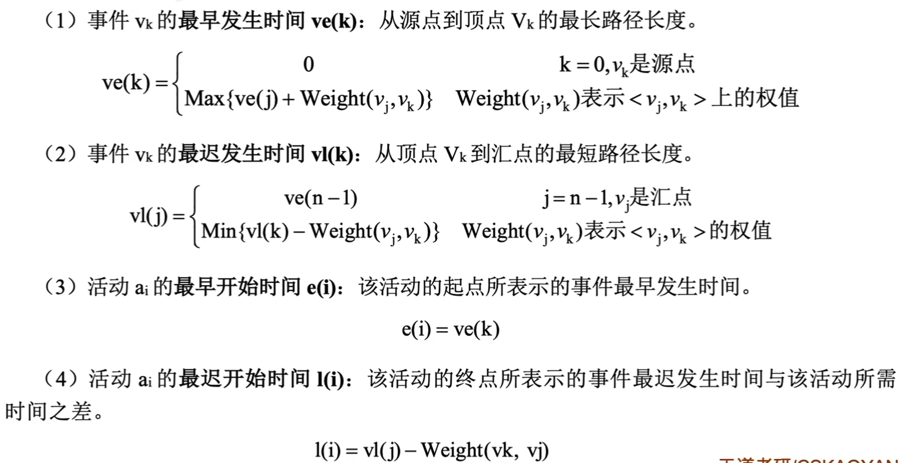
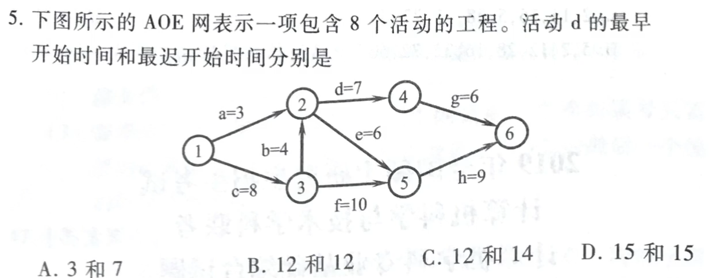
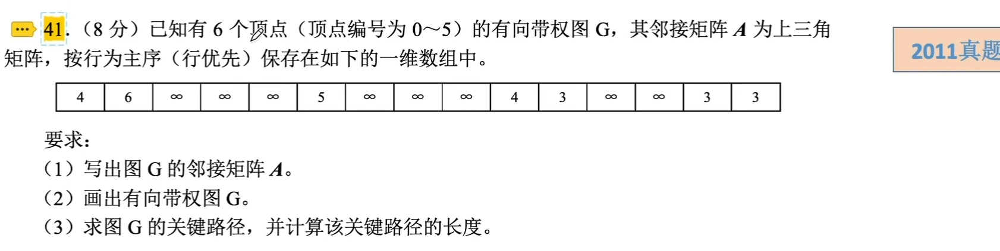

# 关键路径

### 关键路径

带权有向图以顶点表示事件，有向边表示活动，边上的权值表示完成该活动的开销，称为AOE网。AOE网中从源点到汇点的最大路径长度的路径称为关键路径，关键路径长度是整个工程所需的最短工期。关键路径上的活动称为关键活动。

关键路径的性质：

1. 可以通过加快关键活动，来缩短整个工程的工期。并非关键活动缩短多少工期就缩短多少，因为缩短到一定的程度，该关键活动可能变成非关键活动了。
2. 关键路径并不唯一。对于有几条关键路径的网，只提高一条关键路径上的关键活动速度并不能缩短整个工程的工期，只有加快那些包括在所有关键路径上的关键活动才能达到缩短工期的目的。

### 求关键路径的几个参数定义

求关键路径的算法：

1. 求AOE网中所有事件的最早发生时间ve()。按拓扑排序序列依次确定
2. 求AOE网中所有事件的最迟发生时间v1()。按逆拓扑排序序列依次确定
3. 求AOE网中所有活动的最早开始时间e()。等于弧尾事件的最早发生时间
4. 求AOE网中所有活动的最迟开始时间l()。等于弧头事件的最晚发生事件-活动时间
5. 求AOE网中所有活动的差额d()=l()-e()，找出所有d()=0的活动构成关键路径。

