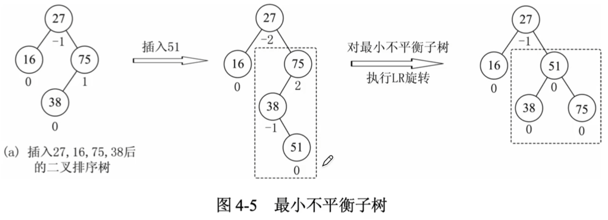

# 平衡二叉树

### 平衡二叉树的定义

定义结点左子树与右子树的高度差为该结点的平衡因子。

平衡二叉树或者是一棵空树，或者是具有下列性质的二叉树：它的左子树和右子树都是平衡二叉树，且左子树和右子树的高度差的绝对值不超过1

注意：我们通常将平衡二叉树默认为二叉排序树，故平衡二叉树的概念包含两个方面平衡、有序。

### 平衡二叉树的插入与旋转

**最小不平衡子树** 在插入路径上离插入结点最近的平衡因子的绝对值大于1的结点作为根的子树。如图，虚线框内为最小不平衡子树

平衡二叉树的插入过程：

1. 按二叉排序树的插入算法插入一个结点
2. 若原平衡二叉树在新结点插入后不再平衡，需要找到**最小不平衡子树**进行调整

### 平衡二叉树

1. LL平衡旋转（右单旋转）。由于在A的左孩子（L）的左子树（L）上插入新结点，A的平衡因子由1增至2，导致以A为根的子树失去平衡，需要一次向右的旋转操作。

   将A的左孩子B向右上旋转代替A成为根结点，将A结点向右下旋转成为B的右子树的根结点，而B的原右子树则为A结点的左子树，如图所示。

   

2. RR平衡旋转（左单旋转）。由于在A的右孩子（R）的右子树（R）上插入新结点，A的平衡因子由-1减至-2，导致以A为根的子树失去平衡，需要一次向左的旋转操作。

   将A的右孩子B向左上旋转代替A成为根结点，将A结点向左下旋转成为B的左子树的根结点，而B的原左子树则作为A结点的右子树，如图所示。

   

3. LR平衡旋转（先左后右双旋转）。由于在A的左孩子（L）的右子树（R）上插入新结点，A的平衡因子由1增至2，导致以A为根的子树失去平衡，需要进行两次旋转操作。

   先将A的左孩子B的右子树的根结点C向左上旋转提升到B结点的位置，然后再把该C结点向右上旋转提升到A结点的位置，如图所示。

   

4. RL平衡旋转（先右后左双旋转）。由于在A的右孩子（R）的左子树（L）上插入新结点，A的平衡因子由-1减至-2，导致以A为根的子树失去平衡，需要进行两次旋转操作。

   先将A的右孩子B的左子树的根结点C向右上旋转提升到B结点的位置，然后再把该C结点向左上旋转提升到A结点的位置，如图所示。

   

**2013** 若将关键字1，2，3，4，5，6，7一次插入到初始为空的平衡二叉树T中，则T中平衡因子为0的分支结点的个数是 D

A 0

B 1

C 2

D 3

**2010** 如图所示的平衡二叉树中，插入关键字48后得到一棵新平衡二叉树。在新平衡二叉树中，关键字37所在结点的左、右子结点中保存的关键字分别是 C

A 13，48 

B 24，48

C 24，53

D 24，90