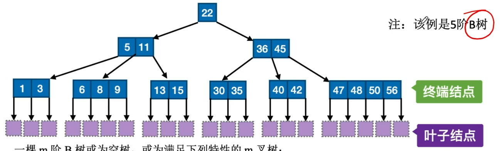
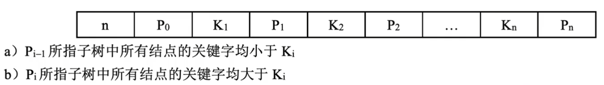
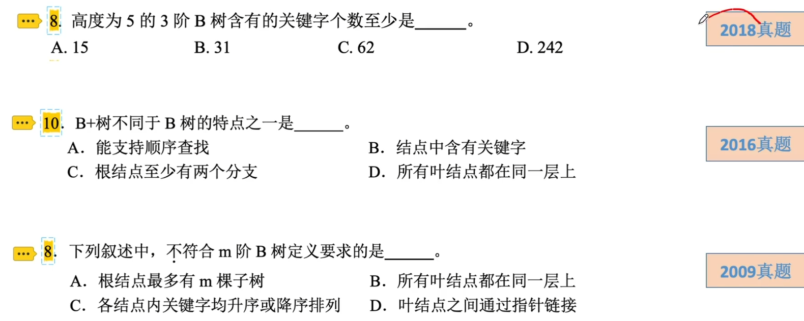
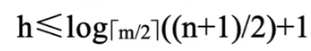
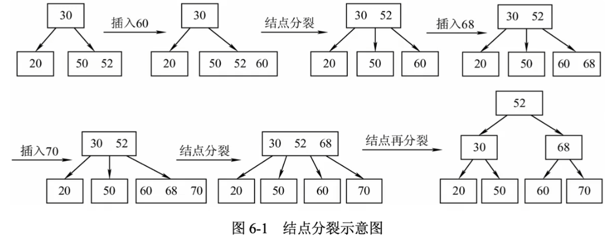
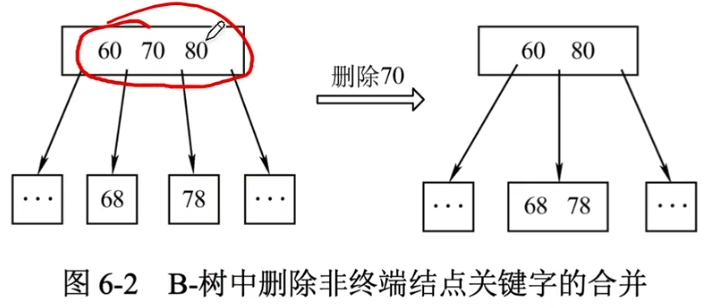
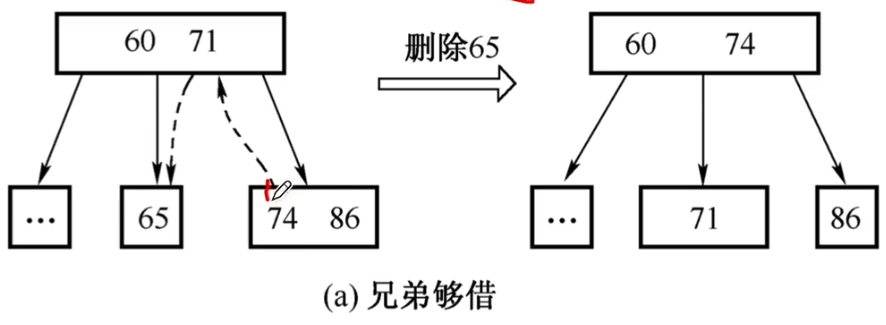
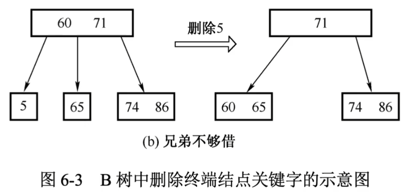
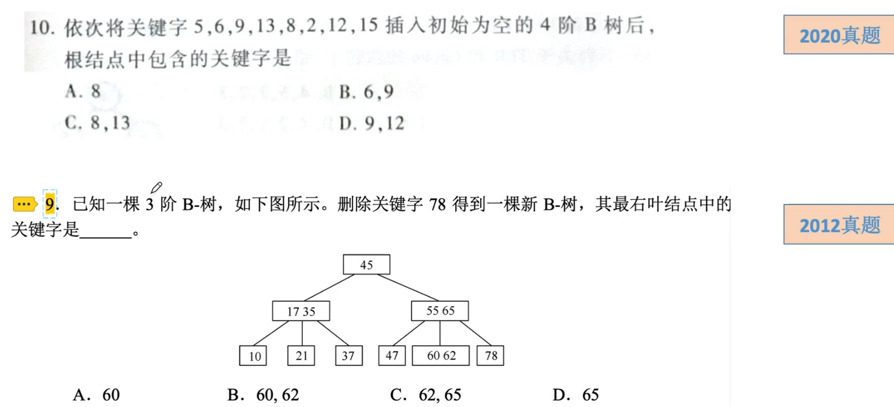

# B树和B+树

一棵m阶B树或为空树，或为满足下列特性的m叉树：

1. 若根结点不是终端结点，则至少有两棵子树，至多有m棵子树。

2. 除根结点外的所有非叶结点至少有[m/2]棵子树，至多有m棵子树。

3. 所有的叶结点都出现在同一层次上，并且不带信息（可看成失败结点）。

4. 所有非叶结点的结构如下：

   

一棵m阶的B+树需满足下列条件：

1. 每个分支结点最多有m棵子树。
2. 非叶根结点至少有两棵子树，其他每个分支结点至少有[m/2]棵子树。
3. 结点的子树个数与关键字个数相等。
4. 所有叶结点包含全部关键字及指向相应记录的指针，而且叶结点中将关键字按大小顺序排列，并且相邻叶结点按大小顺序相互链接起来。
5. 所有分支结点（可看成是索引的索引）中仅包含它的各个子结点（即下一级的索引块）中关键字的最大值及指向其子结点的指针。

### B树和B+树的区别

1. 在B+树中，具有n个关键字的结点只含有n棵子树，即每个关键字对应一棵子树；而在B树中，具有n个关键字的结点含有(n+1)棵子树。
2. 在B+树中，非根结点关键字个数n的范围是[m/2]<=n<=m（根结点：1<=n<=m），在B树中，非根结点关键字个数n的范围是[m/2]-1<=n<=m-1（根结点：1<=n<=m-1）。
3. 在B+树中，所有非叶结点仅起到索引作用，即结点中的每个索引项只含有对应子树的最大关键字和指向该子树的指针，不含有关键字对应记录的存储地址。
4. 在B+树中，叶结点包含了全部关键字，即其他非叶结点中的关键字包含在叶结点中；而在B树中，叶结点包含的关键字和其他结点包含的关键字是不重复的。

### B树的查找

B树的查找算法：

1. 在B树中找结点（磁盘上进行），当查找到叶结点时，查找失败。
2. 在结点内的多关键字有序表中查找关键字（内存中进行）。
   1. 先在有序表中进行查找，若找到则查找成功；
   2. 否则，根据找到的指针信息到所指的子树，执行1

对于含有n个关键字的B树的查找，磁盘I/O次数也就是树的高度h（不包含叶结点）满足：

### B树的插入

B树的插入过程如下：

1. 查找：利用B树查找算法，找出插入该关键字的最底层中某个非叶结点。
2. 插入：当插入后的结点关键字个数小于m，则可以直接插入；如果等于m，则必须对结点进行分裂。

分裂的过程即方法如图所示（3阶B树）

若此时导致其父结点的关键字个数也超过了上限，则继续进行这种分裂操作

若最终使得根结点分裂，B树的高度增1。

### B树的删除

为使删除后的结点中的关键字个数>=[m/2]-1，将涉及结点的“合并”问题。

1. 当被删除的关键字k不在非叶终端结点中时：

   - 如果小于（大于）k的子树中关键字个数>[m/2]-1，则找出k的前驱（后继）值k'，并且用k'来取代k，再递归地按此方法删除k'。
   - 如果前后两个子树中关键字个数均为[m/2]-1，则将两个子结点合并，直接删除k。如图所示为某4阶B树地一部分。

   

2. 当被删除地关键字k在非叶中断结点中时：

   1. 若该结点的关键字个数>[m/2]-1，直接删去该关键字。
   2. 若该结点的关键字个数=[m/2]-1，且与此结点相邻的右（左）兄弟结点的关键字个数>=[m/2]，需要调整该结点、右（左）兄弟结点以及其双亲结点（父子换位法），以达到新的平衡，如图所示。

   

3. 若该结点关键字个数=[m/2]-1，且与该结点相邻的右（左）兄弟结点的关键字个数=[m/2]-1，则将关键字删除后与右（左）兄弟结点及双亲结点中的关键字进行合并，如图所示。

   在合并的过程中，若此时导致其父结点的关键字个数也不满足B树的定义，则继续进行这种合并操作。

   若最终使得根结点被合并，B树高度减1。

