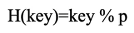
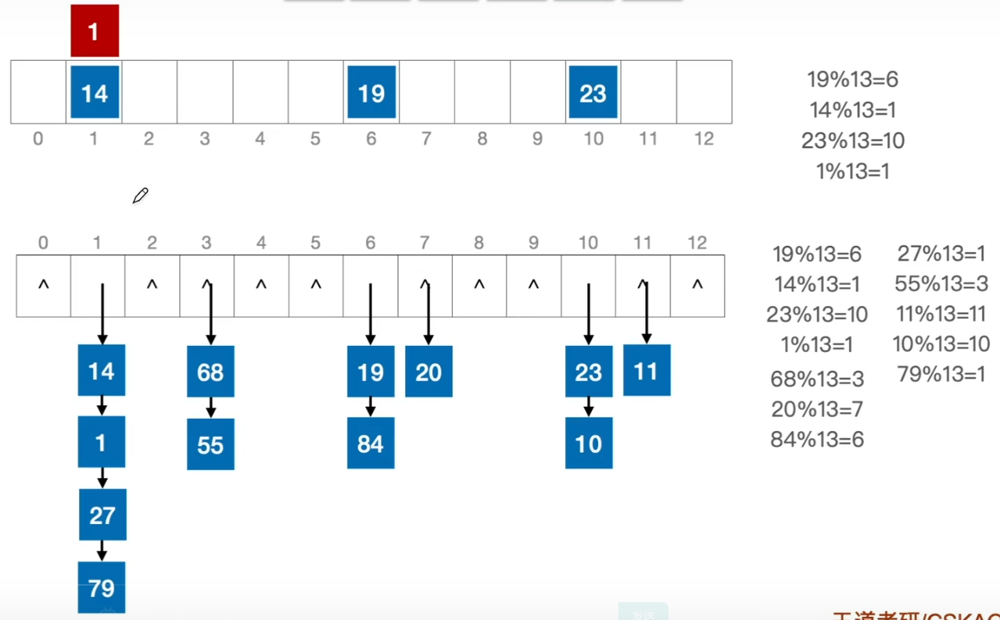
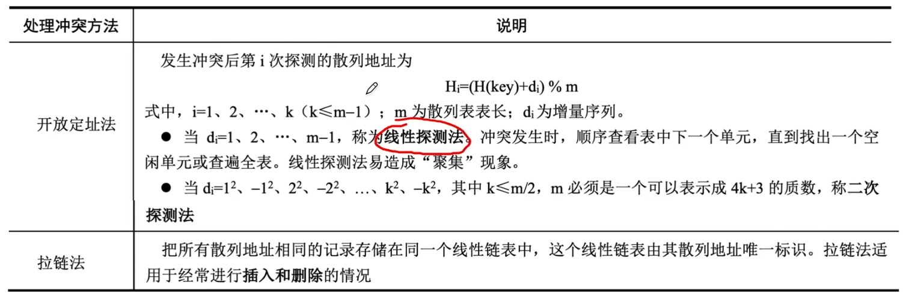
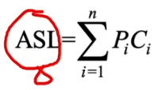
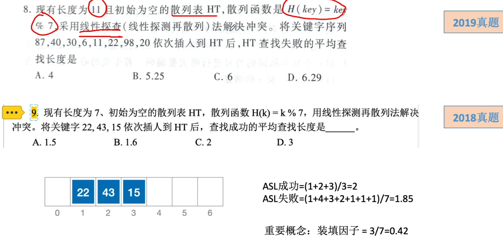

# 散列（Hash）表

### 相关基本概念

| 术语         | 定义及说明                                                   |
| ------------ | ------------------------------------------------------------ |
| 散列表       | 散列表建立了关键字和存储地址之间的一种直接映射关系，把关键字映射成其对应地址的函数称为散列函数，记为Hash(key)。 |
| 冲突         | 散列函数把两个或两个以上的不同关键字映射到同一地址。         |
| 冲突处理方法 | 开放定址法，容易产生聚集现象。拉链法：不会产生聚集现象。     |
| 聚集（堆积） | 非同义词之间争夺一个地址的情况。                             |

### 散列函数的构造方法

最常用的是除留余数法，假设散列表表长为m，取一个不大于m但是最接近或等于m的质数p，利用以下公式把关键字转换成散列地址。散列函数为

### 处理冲突的方法

### 平均查找长度

平均查找长度是查找过程中进行关键字的比较次数的平均值。其数学定义为

式中，Pi是查找第i个数据元素的概率，Ci是找到第i个数据元素所需的比较次数。

