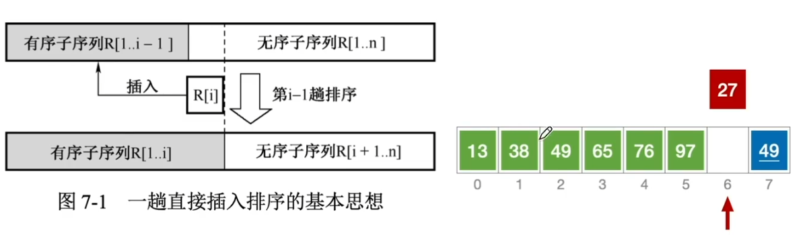
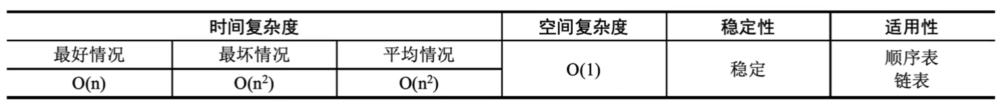
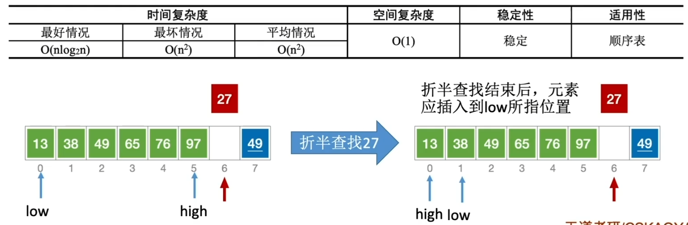
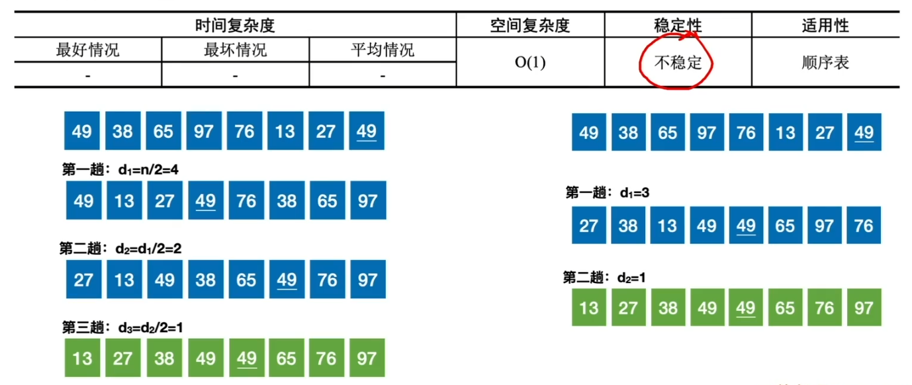
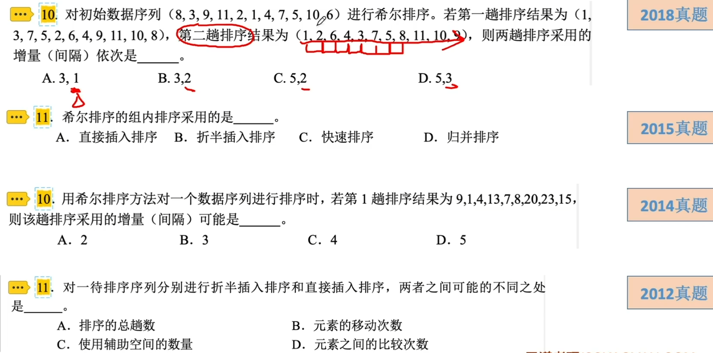

# 插入排序

### 直接插入排序

依次将待排序序列中的元素插入到前面已排好序的子序列中，直至全部元素都排好序，如图所示。

直接插入排序的性能：

### 折半插入排序

直接插入排序总是边比较边移动元素，折半插入排序将比较和移动操作分离出来，即先查找出元素的待插入位置，然后再同一地移动待插入元素后的所有元素。这里查找插入位置时使用的是折半查找法，查找过程中的比较次数为O(nlog2 n)。

两种插入排序的阶段性特征是第i轮排序结束时，前（后）i+1个元素局部有序。

折半插入排序的性能：

### 希尔排序

先将整个待排序序列分割成若干个子序列，再子序列内分别进行直接插入排序，待整个序列中的元素基本有序时，再对全体元素进行一次直接插入排序。

希尔排序的性能：

