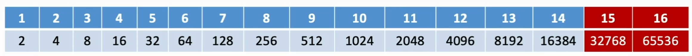
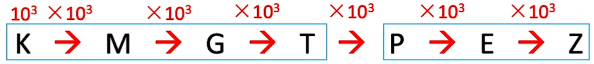

# 计算机性能指标

### 主要性能指标

| 性能指标     | 定义                                                         |
| ------------ | ------------------------------------------------------------ |
| 机器字长     | 指计算机进行一次定点整数运算所能处理的二进制数据的位数，机器字长一般等于内部寄存器的大小。字长越长，数的表示范围越大，计算精度就越高 |
| 数据通路带宽 | 指外部数据总线一次所能并行传送信息的位数                     |
| 主存容量     | 主存容量是指主存储器所能存储信息的最大容量，通常以字节来衡量，也可以用”字数X字长“来表示存储容量 |
| 吞吐量       | 系统在单位时间内处理请求的数量，主要取决于主存的存取周期     |
| CPU时钟周期  | 通常为节拍脉冲或T周期，即主频的倒数，它是CPU中最小的时间单位。 |
| 主频         | 机器内部主时钟的频率，主频的倒数是CPU时钟周期。 CPU时钟周期=1/主频，主频通常以MHz为单位，1Hz表示每秒一次 |
| CPI          | 执行一条指令所需的时钟周期数                                 |
| CPU执行时间  | 运行一个程序所花费的时间 CPU执行时间=CPU时钟周期数/主频=(指令条数XCPI)/主频 |
| MIPS         | 每秒执行多少百万条指令，MIPS=指令条数/(执行时间x10^6)=主频/CPI |
| MFLOPS       | 每秒执行多少百万次浮点运算，MFLOPS=浮点操作数/(执行时间x10^6) |
| GFLOPS       | 每秒执行多少十亿次浮点运算，GFLOPS=浮点操作数/(执行时间x10^6) |
| TFLOPS       | 每秒执行多少万亿次浮点运算，TFLOPS=浮点操作次数/(执行时间x10^9) |
| PFLOPS       | 每秒执行多少千万亿次浮点运算，PFLOPS=浮点操作次数/(执行时间x10^12) |

**2017** 假定计算机M1和M2具有相同的指令集体系结构（ISA），主频分别为1.5GHz和1.2GHz。在M1和M2上运行基准程序P，平均CPI分别为2和1，则程序P在M1和M2上运行时间的比值是

A 0.4

B 0.625

C 1.6

D 2.5

### 命题重点

1. 冯诺依曼计算机的特点，计算机语言的分类及特点，计算机的5大功能部件，MAR和MDR，计算机的层次结构。
2. 指令字长、机器字长和存储字长，影响计算机性能的因素，计算机性能指标的计算：CPI、主频、时钟周期、CPU执行时间、MFLOPS、MIPS。

