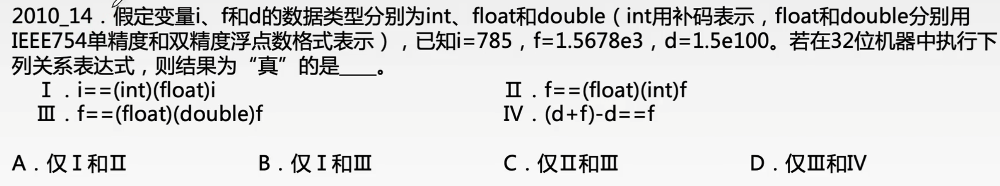

# C语言中各种数据的转换

### 不同类型数据的转换

双目运算符两侧的操作数类型要求必须一致，当出现两侧操作数类型不同时，系统会将较低类型转换为较高类型。主要有以下三种基本形式。

| 数据类型的转换                       | 转换原则                                                   |
| ------------------------------------ | ---------------------------------------------------------- |
| 同一类型但字长不同的数据间的转换     | 由字长短的转为字长长的                                     |
| 定点方式与浮点方式间的转换           | 由定点数转换为浮点数                                       |
| 整型数中的有符号数和无符号数间的转换 | 机器数不变，只是看待符号位的角度不同，代表的数值也随之不同 |

### 数据运算中的类型转换

不同类型数据的混合运算时，遵循的原则是“类型提升”，即较低类型转换为较高类型。类型转换的常用规律为char int long float double。

如一个long型数据与一个int型数据一起运算，需先将int型转换为long型，然后再进行运算，结果为long型。如果float型和double型数据一起运算，虽然它们同为实型，但两者精度不同，仍要先将float型转换为double型再进行运算，结果亦为double型。所有这些转换都是由系统自动进行的，这种转换成为隐式类型转换。

