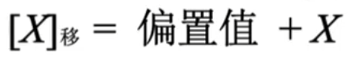
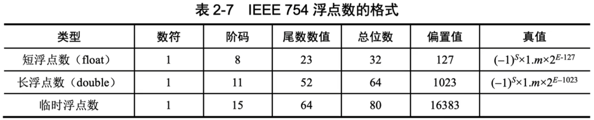
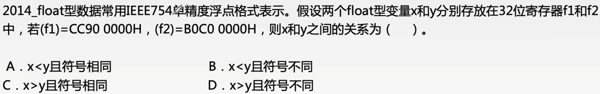
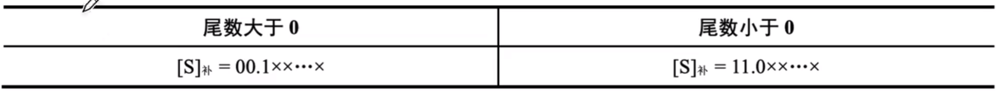
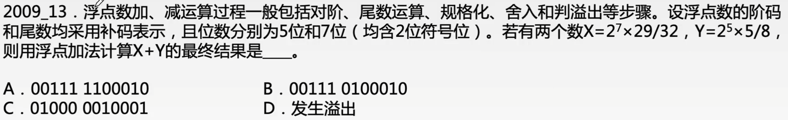

# IEEE 754 标准浮点数运算

### 移码的定义

移码是在真值X的基础上加一个偏置值，相当于X在数轴上向正方向偏移了若干单位，这就是“移码”名称的由来，其定义为

对于字长为n+1的定点整数而言，偏置值通常取2的n次方。

移码可视为无符号数，码值的大小直观地反映了真值的大小，采用移码表示浮点数的阶码，使得浮点运算中比较阶码的大小变得很方便。

### IEEE 754标准的浮点数

IEEE 754标准规定常用的浮点数格式有短浮点数（单精度、float型）、长浮点数（双精度、double型）和临时浮点数，如下表。

注：S表示数符（0正1负），m表示尾数（原码表示），E表示阶码（移码表示）。

注意：

1. 尾数表示小数部分，小数点之前隐含一个“1”
2. float型的阶码用移码表示，偏置值是-127，而不是-128
3. 阶码全0表示无穷小、全1表示无穷大，因此float型的阶码的真值范围是-126~127

### 浮点数的加减运算

浮点数运算的特点是阶码运算和尾数运算分开进行（一律采用补码），难点在于对阶、结果规格化、溢出判断这三步。运算过程如下：

1. 对阶

   小阶向大阶看齐。将阶码小的尾数右移一位，阶加1，直到两个数的阶码相等为止。

2. 位数求和

   将对阶后的尾数按定点数加（减）运算规则运算。

3. 规格化

   补码规格化形式（归纳：尾数的符号位和最高有效数位不同）如下所示。

   

   规格化分为左规和右规两种：

   

### 舍入（在对阶和右规的过程中）

| 简单丢弃法 | 误差最大                                                     |
| ---------- | ------------------------------------------------------------ |
| 0舍1入法   | 被移去的最高数值位为0，则舍去；被移去的最高数值位为1，则末位加1 |
| 恒置1法    | 不论丢掉的最高数值位是1还是0，都使尾数末位恒置1              |

### 溢出判断（双符号位补码）

对尾数求和结果进行规格化后：

1. 若为左规，不会发生溢出。
2. 若未右规，溢出与否是由阶码的符号决定的，阶码的符号位不同表示溢出。当阶码的符号位出现“01”时，即阶码大于最大阶码，表示上溢，进入中断处理；当阶码的符号位出现“10”时，即阶码小于最小阶码，表示下溢，按机器零处理。

