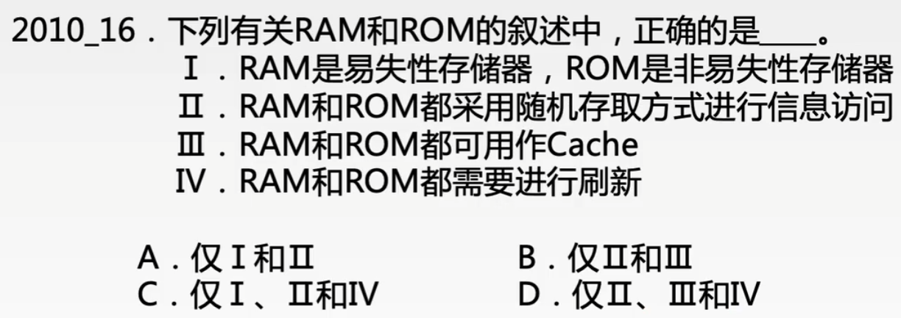

# 半导体随机存储器

### 命题重点

1. 存储器的分类与特点，易失性，存取方式等，特别是DRAM、SRAM、ROM和Flash Memory等各自的性质。
2. 字扩展，位扩展，存储器扩展的芯片选择、连线、地址分配等。
3. 低位交叉存储器的性能分析。
4. Cache的性能分析，Cache容量的计算，2路相联映射和直接映射的原理和地址结构，Cache替换算法与命中分析，Cache块与主存块的关系。
5. TLB与页表的关系，页表的分析，虚地址和实地址的转换。
6. 磁盘存储器相关的参数和计算。

### 半导体存储器：RAM和ROM

RAM又可分为SRAM和DRAM，RAM和ROM都属于半导体存储器，它们都采用随机存取方式对数据进行访问，它们之间的特点如下表。

| 分类 | 特点                                                         |
| ---- | ------------------------------------------------------------ |
| SRAM | 非破坏性读出，不需要刷新。断电信息即丢失，属易失性存储器。存取速度快，但集成度低，功耗较大，常用于Cache |
| DRAM | 破坏性读出，需要定期刷新。断电信息即丢失，属易失性存储器。集成度高、价位低、容量大和功耗低。存取速度比SRAM慢，常用于大容量的主存系统。 |
| ROM  | 通常ROM只能读出，不能写入。信息永久保存，属非易失性存储器。ROM和RAM可同作为主存的一部分，构成主存的地址域。ROM的升级版：EPROM、EEPROM、FLASH |

SRAM 存储元件采用双稳态触发器，读出数据后触发器状态不会改变

DRAM 存储元件采用电容，读出数据时电容放电，需要充电

### FLASH存储器

一般MOS管的栅极和通道的间隔为绝缘氧化层，而Flash Memory在控制栅极和通道间却多了一层物质浮栅。浮栅能存储电荷，从而具有记忆功能。通过控制浮栅，可以完成Flash单元的读取、写入、擦除等操作。

Flash存储器的主要特点有：

1. 是EEPROM的演进，本质上还是属于EEPROM。
2. 价格便宜、集成度高。
3. 属于易失性存储器，适合长期保存信息。
4. 能快速擦写，写入前必须先擦除，因此写比读要慢。
5. 现在常用的SSD固态硬盘是由Flash芯片组成的。

Flash存储器支持随机存取

