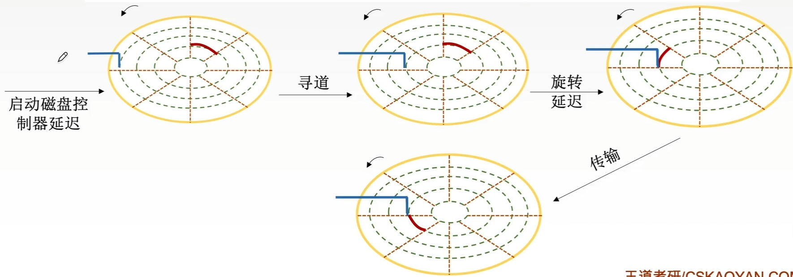
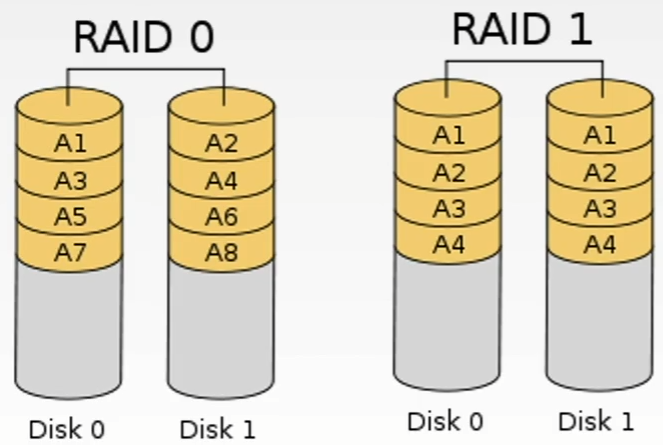
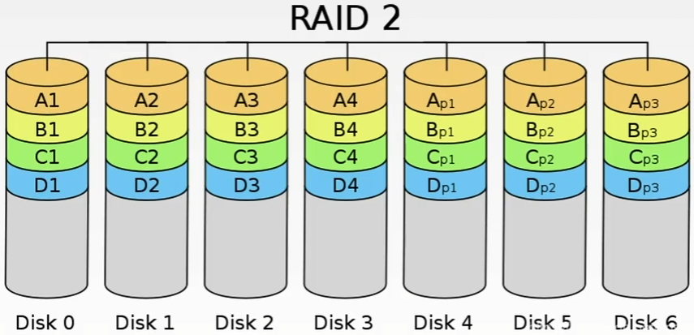
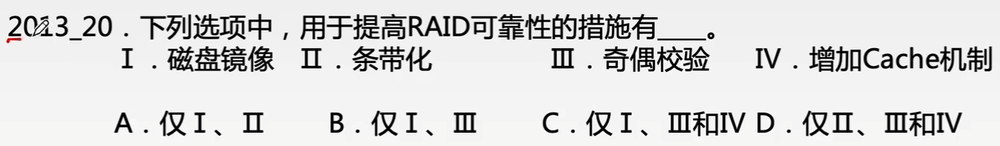

# 磁盘与RAID

### 磁盘操作的时间

一次磁盘读写操作的时间由寻找（寻道）时间、延迟时间和传输时间决定：

| 时间       | 定义                                         | 决定因素     |
| ---------- | -------------------------------------------- | ------------ |
| 寻找时间Ts | 将磁头移动到指定磁道所需要的时间             | 磁盘调度算法 |
| 延迟时间Tr | 磁头定位到某一磁道的扇区（块号）所需要的时间 | 磁盘转速     |
| 传输时间Tt | 从磁盘读出或向磁盘写入数据所经历的时间       | 磁盘转速     |

### 磁盘阵列 RAID

RAID的分级如下所示。在RAID1~RAID5的几种方案中，无论何时有磁盘损坏，都可以随时拔出受损的磁盘再插入好的磁盘，而数据不会损坏。

- RAID0：无冗余和无校验的磁盘阵列。
- RAID1：镜像磁盘阵列。
- RAID2：采用纠错的海明码的磁盘阵列。
- RAID3：位交叉奇偶校验的磁盘阵列。
- RAID4：块交叉奇偶校验的磁盘阵列。
- RAID5：无独立校验的奇偶校验磁盘阵列。

RAID0把连续多个数据块交替地存放在不同物理磁盘的扇区中，几个磁盘交叉并行读写，不仅扩大了存储容量，而且提高了磁盘数据存取速度，但RAID0没有容错能力。

RAID1是为了提高可靠性，使两个磁盘同时进行读写，互为备份，如果一个磁盘出现故障，可从另一磁盘中读出数据。两个磁盘当一个磁盘使用，意味着容量减少一半。

总之，RAID通过使用多个磁盘，提高了传输率；通过在多个磁盘上并行存取来大幅提高吞吐量；通过镜像功能，提高了安全可靠性；通过数据校验，提供容错能力。

RAID技术的关注点：提升读写速度、提升容错能力

RAID0：逻辑上相邻的两个扇区在物理上存到两个磁盘，类比第三章“低位交叉编址的多体存储器”

RAID1：很粗暴，存两份数据

RAID2：逻辑上连续的几个bit物理上分散存储在各个盘中4bit信息位+3bit海明校验码，可纠正一位错

