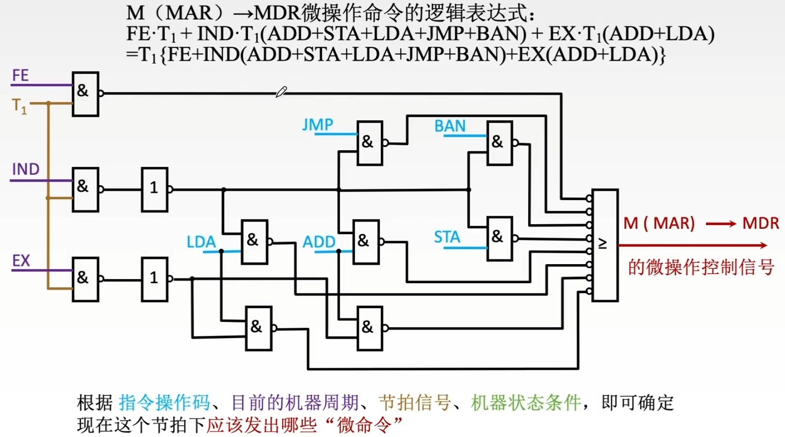
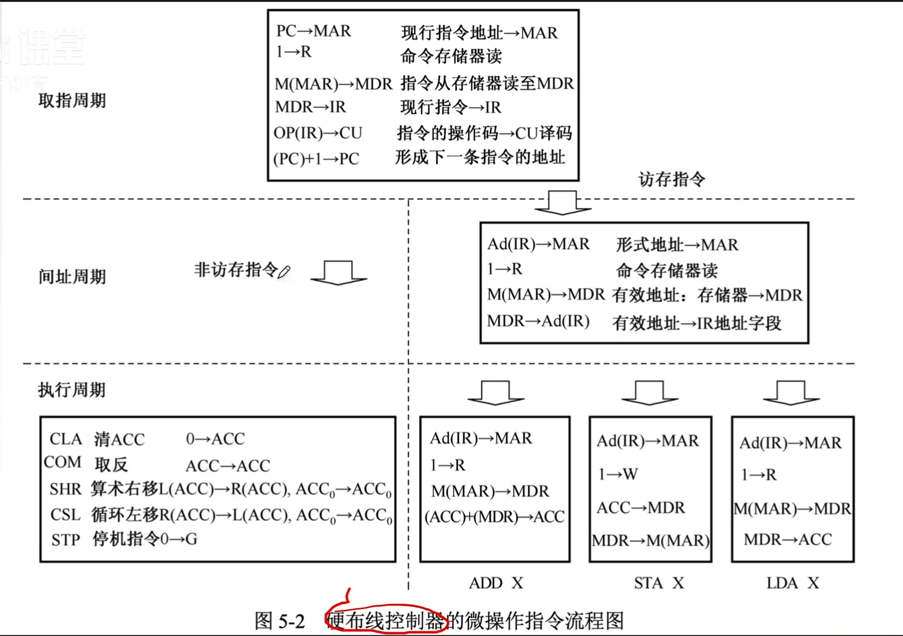
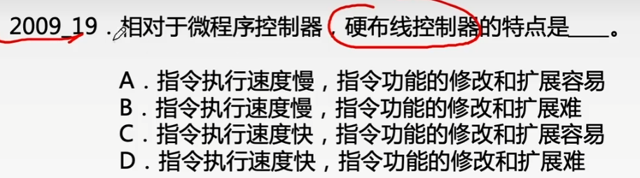
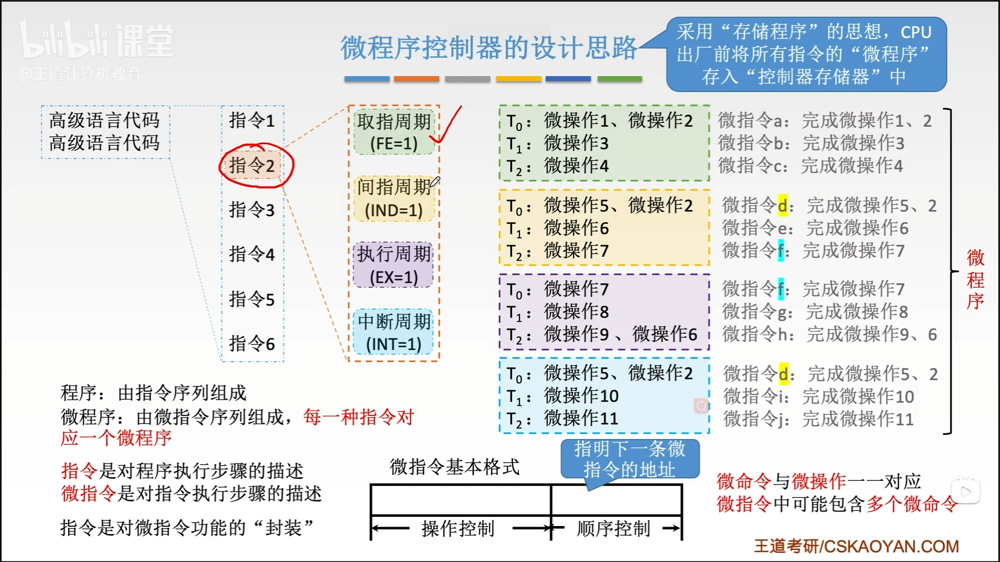
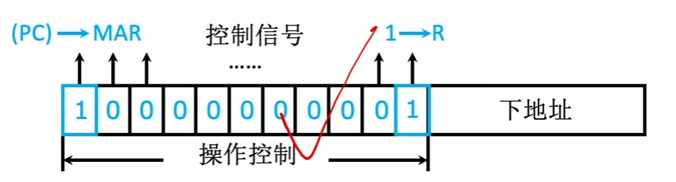
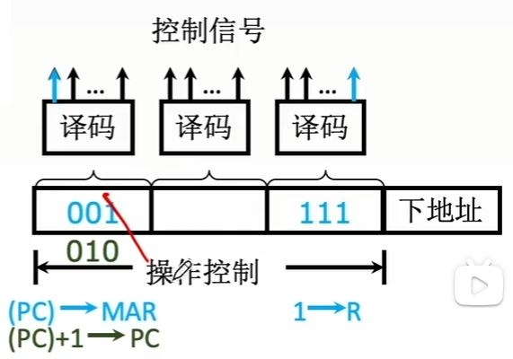
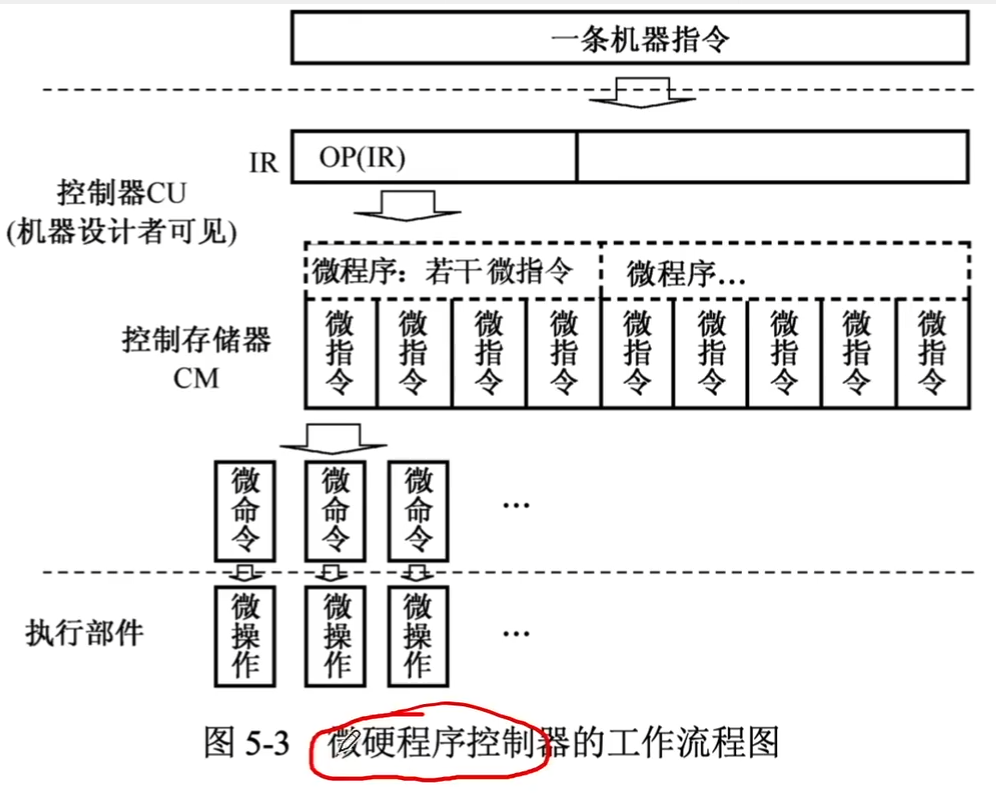

# 控制器的功能和基本原理

### 控制器的结构与分类

硬布线控制器和微程序控制器的设计思想和特点见下表。

| 控制方式     | 设计思想                                                     | 特点                                                         |
| ------------ | ------------------------------------------------------------ | ------------------------------------------------------------ |
| 硬布线控制器 | 微操作控制信号由组合逻辑电路（由门电路与触发器构成的复杂网络）根据当前的指令码状态和时序，即时产生 | 控制器的速度取决于电路延迟，速度快 逻辑线路固定，难以扩充和修改 结构复杂，不规整 通常应用于RISC结构的CPU |
| 微程序控制器 | 采用存储程序的原理，将微操作控制信号以微程序的形式存放在控制存储器中，一条机器指令对应一个微程序，执行指令时读出微程序执行即可 | 每条指令都要从控存中读取，速度较慢 可通过改变控存中的内容进行扩充和修改 结构规整 通常应用于CISC结构的CPU |

### 硬布线控制器

### 微程序控制器的设计思路

### 微指令的编码方式

两种主要编码方式的对比见下表。

| 编码方式 | 直接编码                                                     | 字段直接编码                                                 |
| -------- | ------------------------------------------------------------ | ------------------------------------------------------------ |
| 实现方法 | 微指令的控制字段中每一位都代表一个微指令。设计微指令时，选用或不选用某个微指令，只要将表示该微指令的对应位设置成1或0即可 | 将微指令的微命令字段分成若干小字段，把互斥性微命令组合在同一字段中，把相容性微命令组合在不同的字段中，每个字段独立编码，每种编码代表一个微命令且各字段编码含义单独定义，与其他字段无关 |
| 特点     | 简单、直观； 指令字长过长，n个微指令就要求微指令的操作字段有n位 | 微命令字段分段的原则： 1. 互斥性微命令分在同一段内，相容性微命令分在不同段内 2. 每个小段中包含的信息位不能太多，否则将增加译码线路的复杂性和译码时间 3. 一般每个小段还要留出一个状态，表示本字段不发出任何微命令 |

